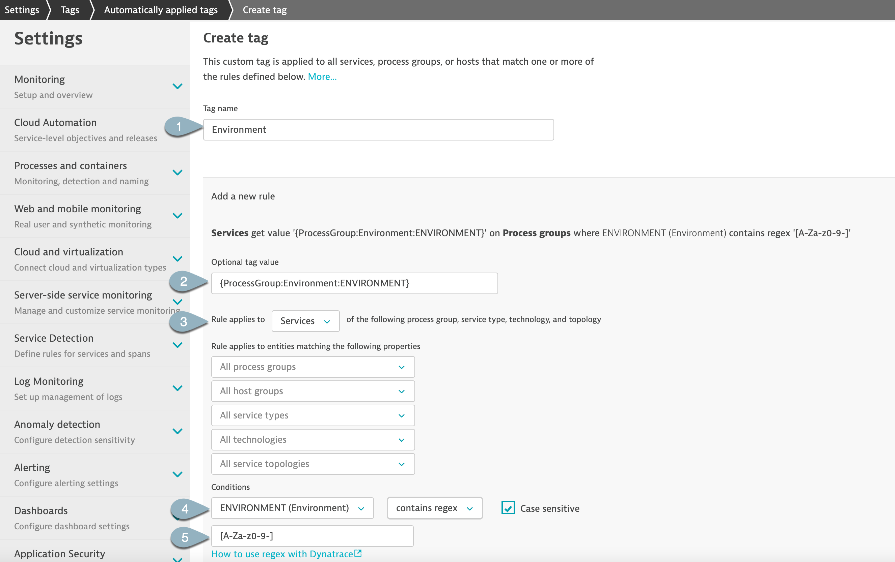
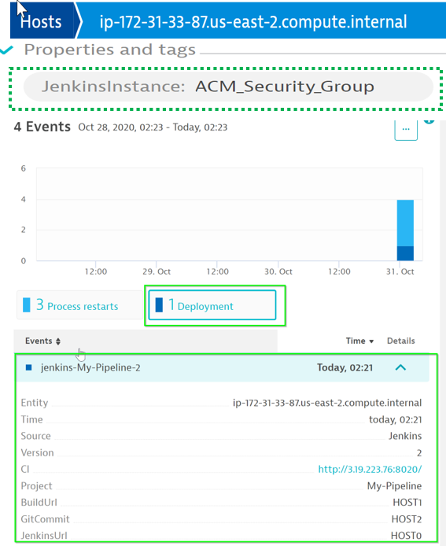
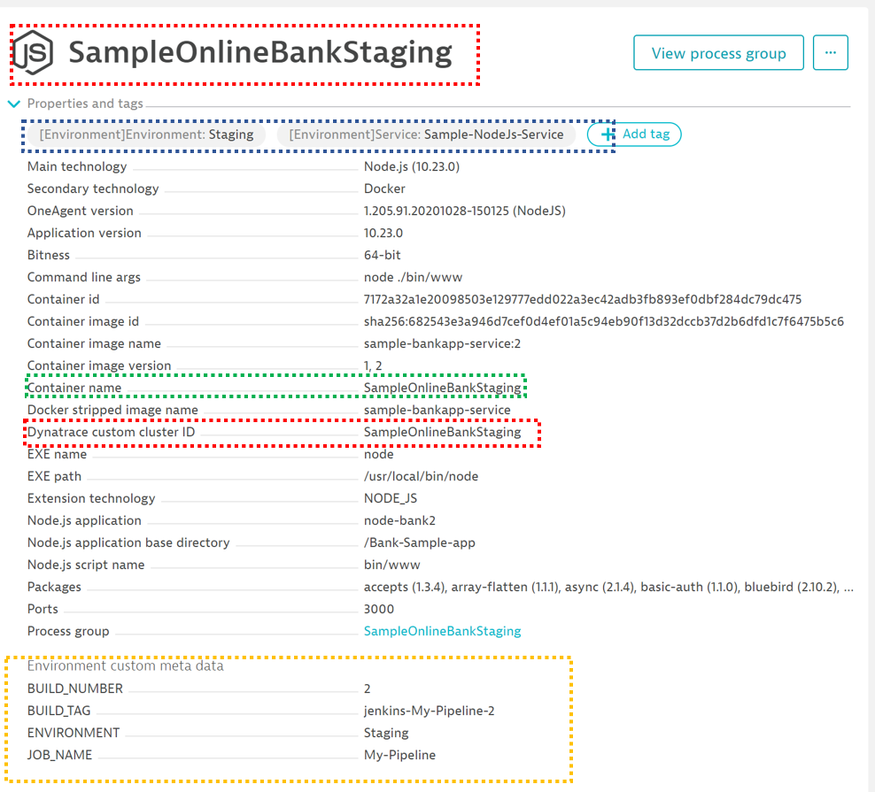
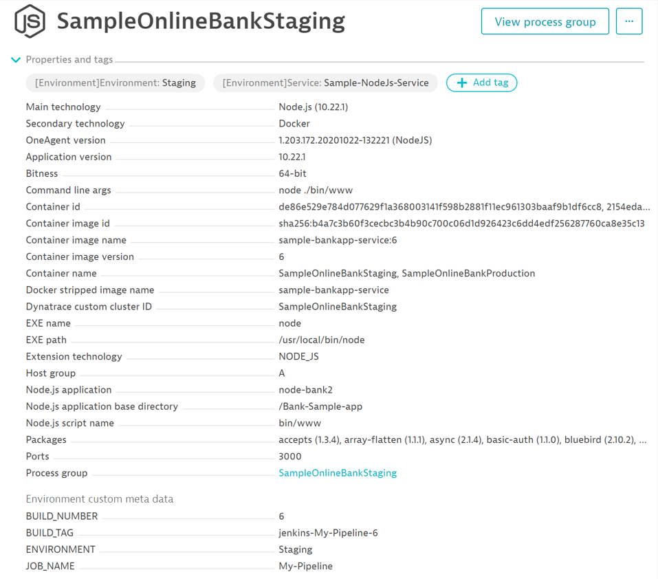

## Create AutoTag rule for Jenkins
### Creating Auto Tags
Within Dynatrace, on the left menu go to Settings > Tags > Automatically applied tags

Use the following:

* Tag name - `JenkinInstance`
* Optional Tag value - `{Ec2Instance:SecurityGroup}`
* Conditions -
* Dropdown **AWS Security Group**
* Dropdown **begins with**
* ***ACM_Security_Group***
* **Check** Case sensitive
* Click on **Save**


Within the Host Properties and tags, **JenkinsInstance tag** will be added


### Creating Tags for Build Stages
Use the following:

* Tag name - `DockerService`
* Rule applies to - Dropdown **Services**
* Optional Tag value - `{ProcessGroup:DetectedName}`
* Conditions -
* Dropdown **Docker container name**
* Dropdown **exists**
* Click on **Save**


Use the following:

* Tag name - `Environment`
* Rule applies to - Dropdown **Services**
* Optional Tag value - `{ProcessGroup:Environment:ENVIRONMENT}`
* Conditions -
* Dropdown **ENVIRONMENT (Environment)**
* Dropdown **exists**
* Click on **Save**



### Build Pipeline in Jenkins
Back in Jenkins, click on **Build Now** for the **My-Pipeline**


### Understanding the Build Pipeline process
Referring to the Jenkins File, the following code handles the **pushing of Jenkins deployment information** into Dynatrace.
```bash
dir ('dynatrace-scripts') {
// push a deployment event on the host with the tag JenkinsInstance created using automatic tagging rule
sh './pushdeployment.sh HOST CONTEXTLESS JenkinsInstance ACM_Security_Group ' +
'${BUILD_TAG} ${BUILD_NUMBER} ${JOB_NAME} ' +
'Jenkins ${JENKINS_URL} ${JOB_URL} ${BUILD_URL} ${GIT_COMMIT}'
```


Referring to the Jenkins File, the following code handles the **pushing of deployment information** into Dynatrace. This step utilizes environment varibles such as ***DT_CLUSTER_ID***, ***DT_TAGS*** and ***DT_CUSTOM_PROP***

```bash
stage('DeployStaging') {
// Lets deploy the previously build container
def app = docker.image("sample-bankapp-service:${BUILD_NUMBER}")
app.run("--network mynetwork --name SampleOnlineBankStaging -p 3000:3000 " +
"-e 'DT_CLUSTER_ID=SampleOnlineBankStaging' " +
"-e 'DT_TAGS=Environment=Staging Service=Sample-NodeJs-Service' " +
"-e 'DT_CUSTOM_PROP=ENVIRONMENT=Staging JOB_NAME=${JOB_NAME} " +
"BUILD_TAG=${BUILD_TAG} BUILD_NUMBER=${BUILD_NUMBER}'")
```


### Review changes in Dynatrace
You can see the changes reflected in **SampleOnlineBankStaging Process View**


You also can see the changes reflected in **node-bank2 Service View**


