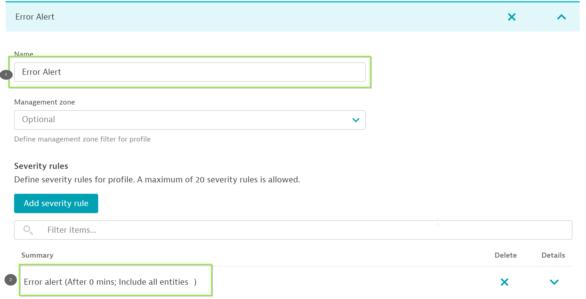

## Integrate Ansible-tower and Dynatrace
In this step, we will integrate ansible-tower with Dynatrace so that in case Dynatrace alerts ansible-tower in event of issues within your application.

### Configure Alerting Profile
Let us further set the Alerting profile so that the problems can be notified to 3rd party like email, slack-integration, etc.
Within your tenant, navigate to "Settings > Alerting > Alerting profiles". Now, add a new alerting profile "Error-Alert" and set the rules as below for
"Error event".

### Problem notification
Once alerting profile has been setup, let us setup the problem notification so that the problem information is relayed to ansible-tower. To do so, within your tenant navigate to **Settings > Integration > Problem Notifications** and click on **Add notification**  and configure the notification as below:
**Ansible Tower job template URL**: URL of "rollback-build" template.
**Username**: admin
**Password**: dynatrace

Now, we have completed the configuration and ready to run the playbook to deploy new build of model-app.

