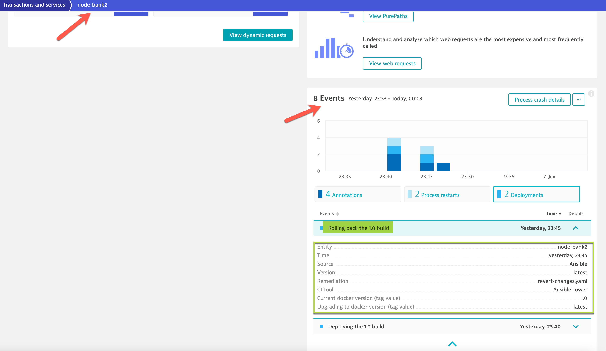
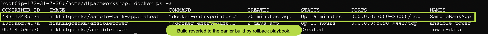
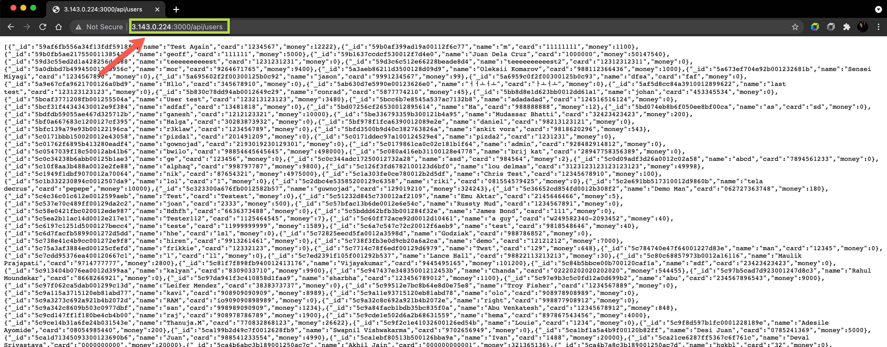
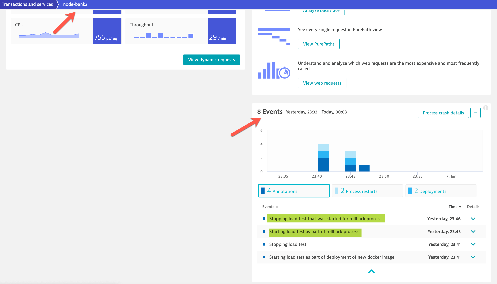
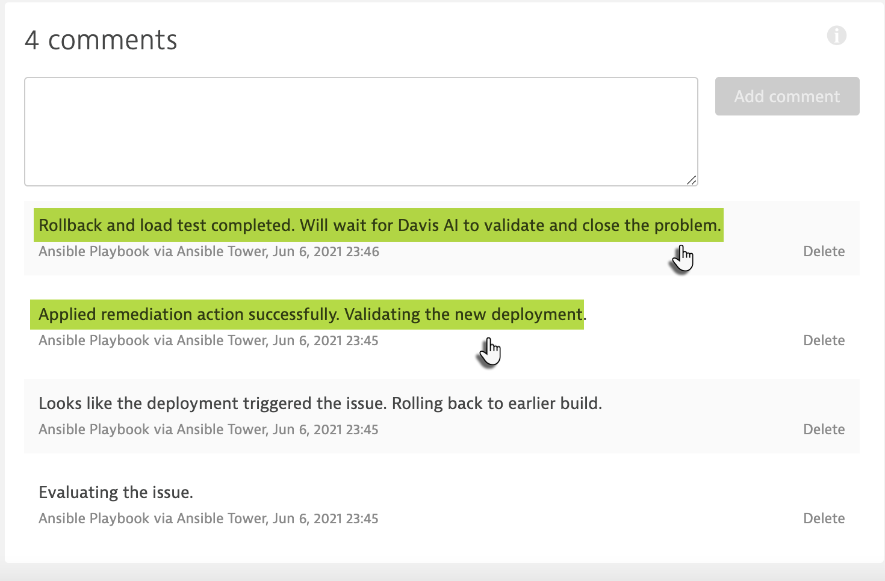

## Rollback to previous working build
The problem notification that we setup up earlier **Error Alert** will invoke the rollback-remediation playbook. Once invoked, the remediation would identify the root-cause and would push the updates on problem card within dynatrace

As the root-cause/events that we pushed in dynatrace indicates the issue is a potential regression and can be seen after latest deployment, the _revert-changes_ playbook will initiate rollback to the earlier working build.

To validate if the build has been rolled back to the earlier working build, connect to the request **/api/users** at http://AWS-IP:3000/api/users and you would identify that the request that had issues is now running as expected.

Finally, as part of the remediation the rollback playbook will fire some requests to validate if the rollback has been successfull.

Once the load test is completed, the playbook would update the problem and let Davis AI validate if the remediation has been succesfull.

