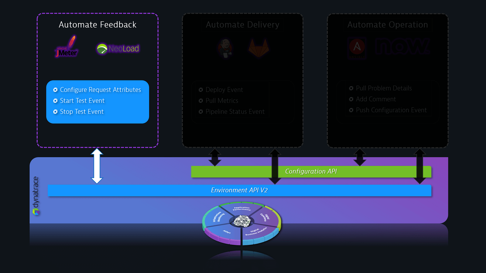

## Introduction
Duration: 1

This lab is the first session of the AIOps Enablement Series. This track focuses on the Automate Feedback, which relates to how you could integate Dynatrace with load testing tools to create **Performance as a service**.

### What You’ll Learn
- Installing Dynatrace OneAgent
- JMeter Performance Testing
- Creating Load Test Request Attributes
- Trigger load with Python Script

<!-- ------------------------ -->
## Introduction
Duration: 1

This lab is the first session of the AIOps Enablement Series. This track focuses on the Automate Feedback, which relates to how you could integate Dynatrace with load testing tools to create **Performance as a service**.

### What You’ll Learn
- Installing Dynatrace OneAgent
- JMeter Performance Testing
- Creating Load Test Request Attributes
- Trigger load with Python Script

<!-- ------------------------ -->
## Introduction
Duration: 1

This lab is the first session of the AIOps Enablement Series. This track focuses on the Automate Feedback, which relates to how you could integate Dynatrace with load testing tools to create **Performance as a service**.

### What You’ll Learn
- Installing Dynatrace OneAgent
- JMeter Performance Testing
- Creating Load Test Request Attributes
- Trigger load with Python Script

<!-- ------------------------ -->
