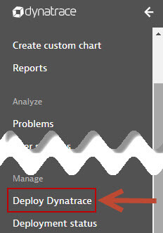
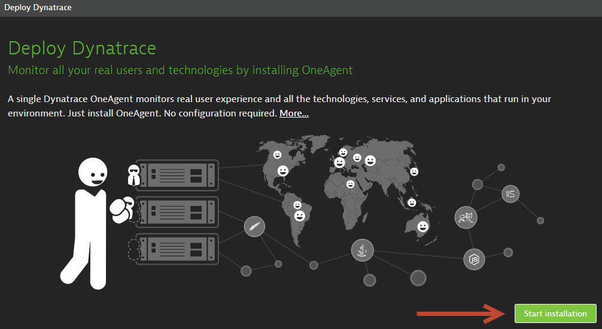
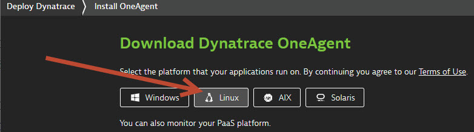
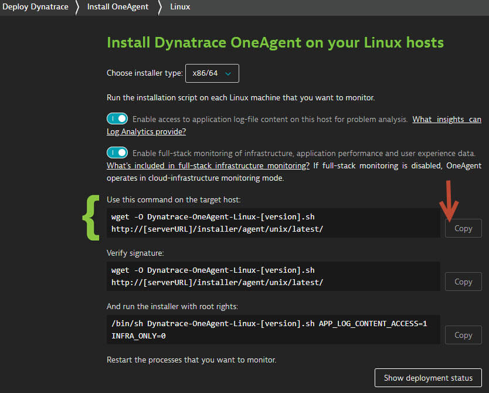
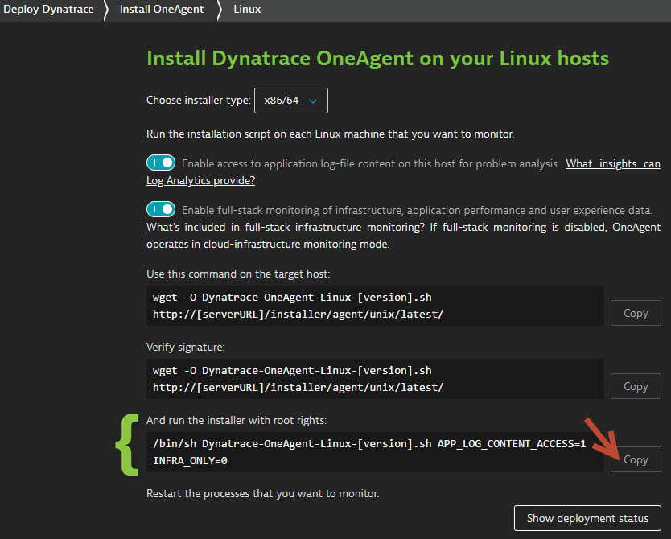

## OneAgent Installation
Duration: 10

In this exercise, we will deploy the OneAgent to a Linux instance and let the OneAgent discover what is running in that instance.

### Download the OneAgent

Use PuTTy (Windows) or Terminal (Mac), ssh into the instance (IP address using the your PEM Key)

Open your browser and access the Dynatrace URL.

Select Deploy Dynatrace from the navigation menu.



Click the Start installation button and select Linux.






Choose the installer type from the drop-down list (we'll use the default x86/64).
Use the Linux shell script installer on any Linux system that's supported by Dynatrace, regardless of the packaging system your distribution depends on.

**Copy** the command provided in the "Use this command on the target host" text field. **Paste** the command into your terminal window and execute it.



Example:

```bash
$  wget  -O Dynatrace-OneAgent-Linux-1.171.252.sh <follow screen shot above>
--2019-08-07 10:17:45--  https://<URL>
Resolving <URL>... <IP>
Connecting to <URL> | <IP>|:443... connected.
HTTP request sent, awaiting response... 200 OK
Length: 139134801 (133M) [application/octet-stream]
Saving to: ‘Dynatrace-OneAgent-Linux-1.171.252.sh’

100%[======================================>] 139,134,801 84.3MB/s   in 1.6s

2019-08-07 10:17:47 (84.3 MB/s) - ‘Dynatrace-OneAgent-Linux-1.171.252.sh’ saved [139134801/139134801]

$
```

### Execute the installation script

(Optional) Once the download is complete, you can verify the signature by copying the command from the "Verify signature" text field, then pasting the command into your terminal window and executing it. Make sure your system is up to date, especially SSL and related certificate libraries.

**Copy** the command that's provided in the text box "And run the installer with root rights" text field.



**Paste** the command into your terminal window and execute it. You’ll need to make the script executable before you can run it.

**Note that you’ll need root access.**  You can use sudo to run the installation script. To do this, type the following command into the directory where you downloaded the installation script.

Example:

```bash
$ sudo /bin/sh Dynatrace-OneAgent-Linux-1.171.252.sh
10:21:42 Checking root privileges...
10:21:42 OK
10:21:42 Installation started ...
...
10:22:14 Starting agents...
10:22:14 oneagent service started
10:22:14 Checking if agent is connected to the server...
10:22:16 Dynatrace OneAgent has successfully connected to Dynatrace Cluster Node. After completing Dynatrace OneAgent installation on this machine, please return to your browser to complete the remainder of the installation.
$

```

<!-- ------------------------ -->
## OneAgent Installation
Duration: 10

In this exercise, we will deploy the OneAgent to a Linux instance and let the OneAgent discover what is running in that instance.

### Download the OneAgent

Use PuTTy (Windows) or Terminal (Mac), ssh into the instance (IP address using the your PEM Key)

Open your browser and access the Dynatrace URL.

Select Deploy Dynatrace from the navigation menu.


Click the Start installation button and select Linux.


Choose the installer type from the drop-down list (we'll use the default x86/64).
Use the Linux shell script installer on any Linux system that's supported by Dynatrace, regardless of the packaging system your distribution depends on.

**Copy** the command provided in the "Use this command on the target host" text field. **Paste** the command into your terminal window and execute it.


Example:

```bash
$  wget  -O Dynatrace-OneAgent-Linux-1.171.252.sh <follow screen shot above>
--2019-08-07 10:17:45--  https://<URL>
Resolving <URL>... <IP>
Connecting to <URL> | <IP>|:443... connected.
HTTP request sent, awaiting response... 200 OK
Length: 139134801 (133M) [application/octet-stream]
Saving to: ‘Dynatrace-OneAgent-Linux-1.171.252.sh’

100%[======================================>] 139,134,801 84.3MB/s   in 1.6s

2019-08-07 10:17:47 (84.3 MB/s) - ‘Dynatrace-OneAgent-Linux-1.171.252.sh’ saved [139134801/139134801]

$
```

### Execute the installation script

(Optional) Once the download is complete, you can verify the signature by copying the command from the "Verify signature" text field, then pasting the command into your terminal window and executing it. Make sure your system is up to date, especially SSL and related certificate libraries.

**Copy** the command that's provided in the text box "And run the installer with root rights" text field.


**Paste** the command into your terminal window and execute it. You’ll need to make the script executable before you can run it.

**Note that you’ll need root access.**  You can use sudo to run the installation script. To do this, type the following command into the directory where you downloaded the installation script.

Example:

```bash
$ sudo /bin/sh Dynatrace-OneAgent-Linux-1.171.252.sh
10:21:42 Checking root privileges...
10:21:42 OK
10:21:42 Installation started ...
...
10:22:14 Starting agents...
10:22:14 oneagent service started
10:22:14 Checking if agent is connected to the server...
10:22:16 Dynatrace OneAgent has successfully connected to Dynatrace Cluster Node. After completing Dynatrace OneAgent installation on this machine, please return to your browser to complete the remainder of the installation.
$

```

<!-- ------------------------ -->
## OneAgent Installation
Duration: 10

In this exercise, we will deploy the OneAgent to a Linux instance and let the OneAgent discover what is running in that instance.

### Download the OneAgent

Use PuTTy (Windows) or Terminal (Mac), ssh into the instance (IP address using the your PEM Key)

Open your browser and access the Dynatrace URL.

Select Deploy Dynatrace from the navigation menu.


Click the Start installation button and select Linux.


Choose the installer type from the drop-down list (we'll use the default x86/64).
Use the Linux shell script installer on any Linux system that's supported by Dynatrace, regardless of the packaging system your distribution depends on.

**Copy** the command provided in the "Use this command on the target host" text field. **Paste** the command into your terminal window and execute it.


Example:

```bash
$  wget  -O Dynatrace-OneAgent-Linux-1.171.252.sh <follow screen shot above>
--2019-08-07 10:17:45--  https://<URL>
Resolving <URL>... <IP>
Connecting to <URL> | <IP>|:443... connected.
HTTP request sent, awaiting response... 200 OK
Length: 139134801 (133M) [application/octet-stream]
Saving to: ‘Dynatrace-OneAgent-Linux-1.171.252.sh’

100%[======================================>] 139,134,801 84.3MB/s   in 1.6s

2019-08-07 10:17:47 (84.3 MB/s) - ‘Dynatrace-OneAgent-Linux-1.171.252.sh’ saved [139134801/139134801]

$
```

### Execute the installation script

(Optional) Once the download is complete, you can verify the signature by copying the command from the "Verify signature" text field, then pasting the command into your terminal window and executing it. Make sure your system is up to date, especially SSL and related certificate libraries.

**Copy** the command that's provided in the text box "And run the installer with root rights" text field.


**Paste** the command into your terminal window and execute it. You’ll need to make the script executable before you can run it.

**Note that you’ll need root access.**  You can use sudo to run the installation script. To do this, type the following command into the directory where you downloaded the installation script.

Example:

```bash
$ sudo /bin/sh Dynatrace-OneAgent-Linux-1.171.252.sh
10:21:42 Checking root privileges...
10:21:42 OK
10:21:42 Installation started ...
...
10:22:14 Starting agents...
10:22:14 oneagent service started
10:22:14 Checking if agent is connected to the server...
10:22:16 Dynatrace OneAgent has successfully connected to Dynatrace Cluster Node. After completing Dynatrace OneAgent installation on this machine, please return to your browser to complete the remainder of the installation.
$

```

<!-- ------------------------ -->
