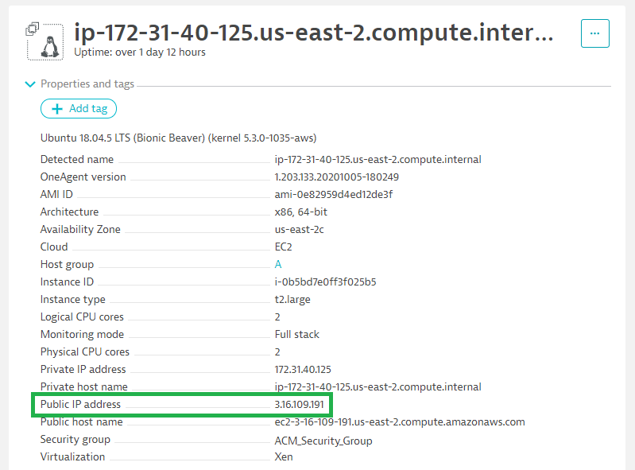
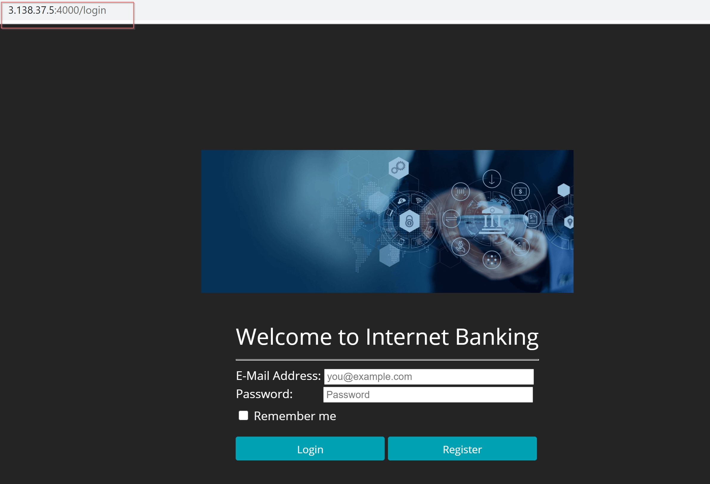
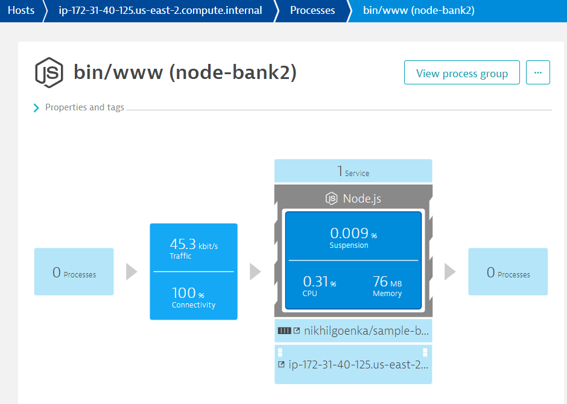

## Access Sample Banking Application
Duration: 10

Within your Host View, dropdown the **Properties and Tags** and you will get a list of various metadata associated with the host created. Locate the **Public IP Address** and copy its value.

Open up your **web browser** and access the sample app with `<IP address>:4000/login`

### Login to Sample Bank App

Access the banking App with the **either** of the below credentials

* Username: **guestuser1@mybank.com**
* Password: **GuestUser12@**

**OR**

* Username: **guestuser2@mybank.com**
* Password: **GuestUser12@**

### Automatic Service Detection

As OneAgent automatically monitors your host, changes are reflected in real-time. Back in your Process screen, you will find the process updated with services.

<!-- ------------------------ -->
## Access Sample Banking Application
Duration: 10

Within your Host View, dropdown the **Properties and Tags** and you will get a list of various metadata associated with the host created. Locate the **Public IP Address** and copy its value.

Open up your **web browser** and access the sample app with `<IP address>:4000/login`

### Login to Sample Bank App

Access the banking App with the **either** of the below credentials

* Username: **guestuser1@mybank.com**
* Password: **GuestUser12@**

**OR**

* Username: **guestuser2@mybank.com**
* Password: **GuestUser12@**

### Automatic Service Detection

As OneAgent automatically monitors your host, changes are reflected in real-time. Back in your Process screen, you will find the process updated with services.

<!-- ------------------------ -->
## Access Sample Banking Application
Duration: 10

Within your Host View, dropdown the **Properties and Tags** and you will get a list of various metadata associated with the host created. Locate the **Public IP Address** and copy its value.

Open up your **web browser** and access the sample app with `<IP address>:4000/login`

### Login to Sample Bank App

Access the banking App with the **either** of the below credentials

* Username: **guestuser1@mybank.com**
* Password: **GuestUser12@**

**OR**

* Username: **guestuser2@mybank.com**
* Password: **GuestUser12@**

### Automatic Service Detection

As OneAgent automatically monitors your host, changes are reflected in real-time. Back in your Process screen, you will find the process updated with services.

<!-- ------------------------ -->
