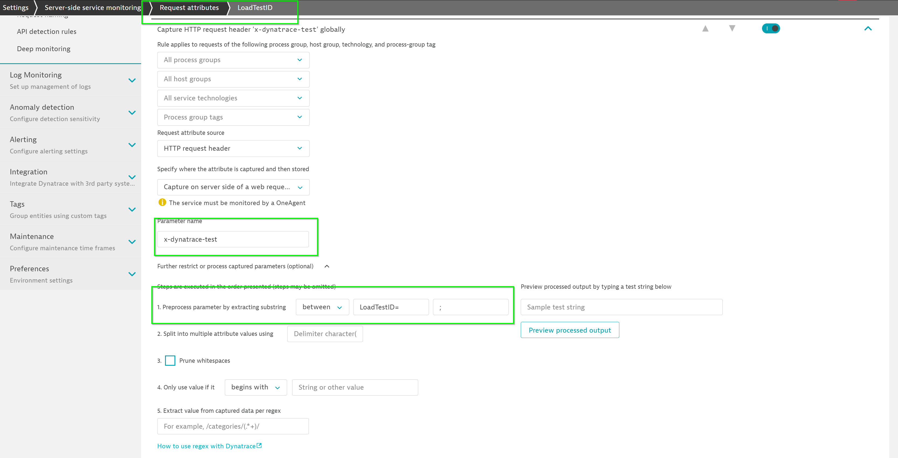
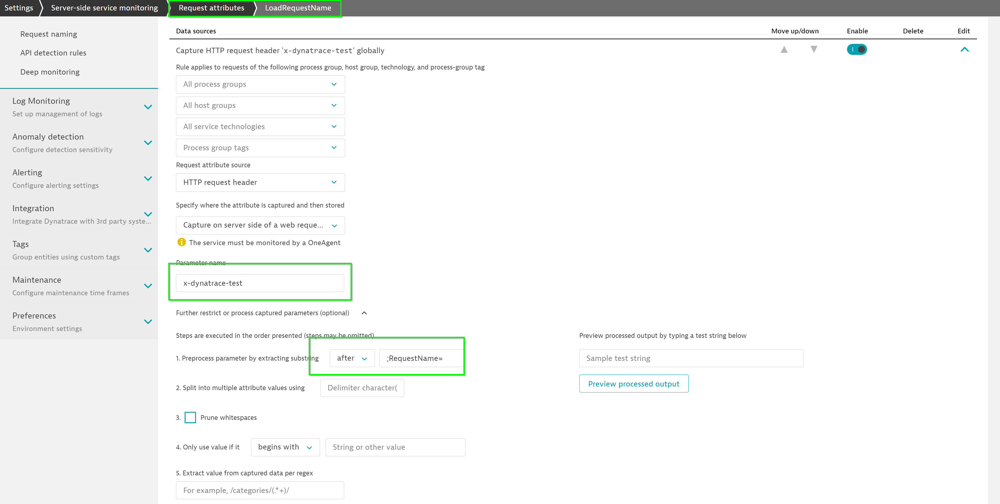
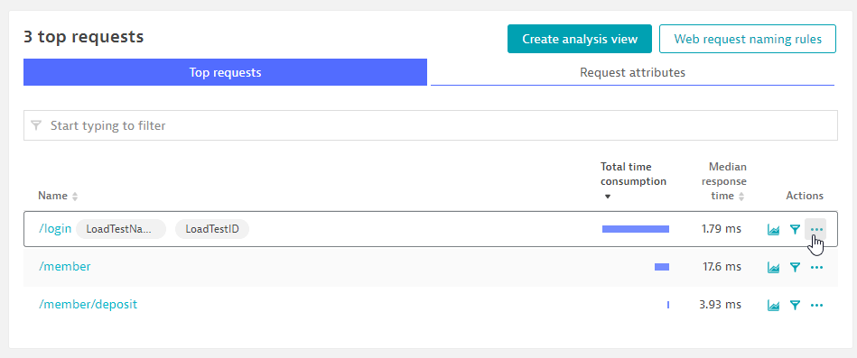

## Defining Request Attributes
Duration: 10

You can use any (or multiple) HTTP headers or HTTP parameters to pass context information.
The extraction rules can be configured via **Settings > Server-side service monitoring > Request attributes.**

The header x-dynatrace-test is used in the following examples with the following set of key/value pairs for the header:

|    |           |
|----|-----------|
| **Code**  |**Description**   |
| **VU**  |   Virtual User ID of the unique user who sent the request.      |
| **SI**  |   Source ID identifies the product that triggered the request (JMeter, LoadRunner, Neotys, or other)     |
| **TSN**   |   Test Step Name is a logical test step within your load testing script (for example, Login or Add to cart.     |
| **LSN** |   Load Script Name - name of the load testing script. This groups a set of test steps that make up a multi-step transaction (for example, an online purchase).      |
| **LTN**  |   The Load Test Name uniquely identifies a test execution (for example, 6h Load Test – June 25)     |
| **PC**  |   Page Context provides information about the document that is loaded in the currently processed page.     |


### Setup Request Attributes

Go to **Settings > Server-side service monitoring > Request Attributes**

Click on **Define a new request attribute** and use the following:

* Request attribute name – **LoadTestID**
* Click on **Add new data source**
* Request attribute source – **HTTP Request Header**
* Parameter name - `x-dynatrace-test`
* **Expand out** Further restrict or process captured parameters (optional)
* Preprocess parameter by extracting substring **between** (dropdown) and  `LoadTestID=` in **1st field** and `;` in **2nd field**
* Click on **Save**



Click on **Define a new request attribute** and use the following:

* Request attribute name – **LoadTestName**
* Click on **Add new data source**
* Request attribute source – **HTTP Request header**
* Parameter name - `x-dynatrace-test`
* **Expand out** Further restrict or process captured parameters (optional)
* Preprocess parameter by extracting substring **after** (dropdown) and  `;RequestName=` in field
* Click on **Save**



### Simulate load from JMeter
Using the .JMX load from the local folder, access the simulate the requests with the local .JMX file

To **run load test using JMeter**, the following format is used:

**jmeter -n -t [jmx file] -l [results file]**
*  -n indicates nonGUI mode
*  -t JMX test plan that you plan to run
*  -l logfile where the execution would be logged.

To run the **Test-Plan** available in **/home/ubuntu/apache-jmeter-5.2.1/bin**, execute the below command:

```bash
$ cd /home/ubuntu/apache-jmeter-5.2.1/bin
$ ./jmeter -n -t /home/ubuntu/ACMD1Workshop/additional_resources/app_docker/scripts/Smoke-test-Jmeter.jmx -l output.log
```

### Exploring Dynatrace

Once you have triggered your load, you can also see **login requests** appearing within your **node-bank2** service.



<!-- ------------------------ -->
## Defining Request Attributes
Duration: 10

You can use any (or multiple) HTTP headers or HTTP parameters to pass context information.
The extraction rules can be configured via **Settings > Server-side service monitoring > Request attributes.**

The header x-dynatrace-test is used in the following examples with the following set of key/value pairs for the header:

|    |           |
|----|-----------|
| **Code**  |**Description**   |
| **VU**  |   Virtual User ID of the unique user who sent the request.      |
| **SI**  |   Source ID identifies the product that triggered the request (JMeter, LoadRunner, Neotys, or other)     |
| **TSN**   |   Test Step Name is a logical test step within your load testing script (for example, Login or Add to cart.     |
| **LSN** |   Load Script Name - name of the load testing script. This groups a set of test steps that make up a multi-step transaction (for example, an online purchase).      |
| **LTN**  |   The Load Test Name uniquely identifies a test execution (for example, 6h Load Test – June 25)     |
| **PC**  |   Page Context provides information about the document that is loaded in the currently processed page.     |


### Setup Request Attributes

Go to **Settings > Server-side service monitoring > Request Attributes**

Click on **Define a new request attribute** and use the following:

* Request attribute name – **LoadTestID**
* Click on **Add new data source**
* Request attribute source – **HTTP Request Header**
* Parameter name - `x-dynatrace-test`
* **Expand out** Further restrict or process captured parameters (optional)
* Preprocess parameter by extracting substring **between** (dropdown) and  `LoadTestID=` in **1st field** and `;` in **2nd field**
* Click on **Save**


Click on **Define a new request attribute** and use the following:

* Request attribute name – **LoadTestName**
* Click on **Add new data source**
* Request attribute source – **HTTP Request header**
* Parameter name - `x-dynatrace-test`
* **Expand out** Further restrict or process captured parameters (optional)
* Preprocess parameter by extracting substring **after** (dropdown) and  `;RequestName=` in field
* Click on **Save**


### Simulate load from JMeter
Using the .JMX load from the local folder, access the simulate the requests with the local .JMX file

To **run load test using JMeter**, the following format is used:

**jmeter -n -t [jmx file] -l [results file]**
*  -n indicates nonGUI mode
*  -t JMX test plan that you plan to run
*  -l logfile where the execution would be logged.

To run the **Test-Plan** available in **/home/ubuntu/apache-jmeter-5.2.1/bin**, execute the below command:

```bash
$ cd /home/ubuntu/apache-jmeter-5.2.1/bin
$ ./jmeter -n -t /home/ubuntu/ACMD1Workshop/additional_resources/app_docker/scripts/Smoke-test-Jmeter.jmx -l output.log
```

### Exploring Dynatrace

Once you have triggered your load, you can also see **login requests** appearing within your **node-bank2** service.


<!-- ------------------------ -->
## Defining Request Attributes
Duration: 10

You can use any (or multiple) HTTP headers or HTTP parameters to pass context information.
The extraction rules can be configured via **Settings > Server-side service monitoring > Request attributes.**

The header x-dynatrace-test is used in the following examples with the following set of key/value pairs for the header:

|    |           |
|----|-----------|
| **Code**  |**Description**   |
| **VU**  |   Virtual User ID of the unique user who sent the request.      |
| **SI**  |   Source ID identifies the product that triggered the request (JMeter, LoadRunner, Neotys, or other)     |
| **TSN**   |   Test Step Name is a logical test step within your load testing script (for example, Login or Add to cart.     |
| **LSN** |   Load Script Name - name of the load testing script. This groups a set of test steps that make up a multi-step transaction (for example, an online purchase).      |
| **LTN**  |   The Load Test Name uniquely identifies a test execution (for example, 6h Load Test – June 25)     |
| **PC**  |   Page Context provides information about the document that is loaded in the currently processed page.     |


### Setup Request Attributes

Go to **Settings > Server-side service monitoring > Request Attributes**

Click on **Define a new request attribute** and use the following:

* Request attribute name – **LoadTestID**
* Click on **Add new data source**
* Request attribute source – **HTTP Request Header**
* Parameter name - `x-dynatrace-test`
* **Expand out** Further restrict or process captured parameters (optional)
* Preprocess parameter by extracting substring **between** (dropdown) and  `LoadTestID=` in **1st field** and `;` in **2nd field**
* Click on **Save**


Click on **Define a new request attribute** and use the following:

* Request attribute name – **LoadTestName**
* Click on **Add new data source**
* Request attribute source – **HTTP Request header**
* Parameter name - `x-dynatrace-test`
* **Expand out** Further restrict or process captured parameters (optional)
* Preprocess parameter by extracting substring **after** (dropdown) and  `;RequestName=` in field
* Click on **Save**


### Simulate load from JMeter
Using the .JMX load from the local folder, access the simulate the requests with the local .JMX file

To **run load test using JMeter**, the following format is used:

**jmeter -n -t [jmx file] -l [results file]**
*  -n indicates nonGUI mode
*  -t JMX test plan that you plan to run
*  -l logfile where the execution would be logged.

To run the **Test-Plan** available in **/home/ubuntu/apache-jmeter-5.2.1/bin**, execute the below command:

```bash
$ cd /home/ubuntu/apache-jmeter-5.2.1/bin
$ ./jmeter -n -t /home/ubuntu/ACMD1Workshop/additional_resources/app_docker/scripts/Smoke-test-Jmeter.jmx -l output.log
```

### Exploring Dynatrace

Once you have triggered your load, you can also see **login requests** appearing within your **node-bank2** service.


<!-- ------------------------ -->
