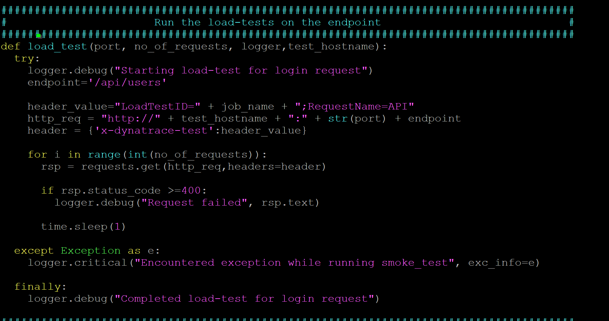

## Trigger load with Python Script
Duration: 10

Dynatrace's platform allows event information to be ingested via various means. If you are using a load test tool like jMeter, the jmx script above should apply for most. Alternatively, you can also send events in via a Python script. Below is an example of using that.

Run the command below to trigger the script

```bash
$ cd /home/ubuntu/ACMD1Workshop/additional_resources/app_docker/scripts/
$ python3 smoke-test.py
```



<!-- ------------------------ -->


## Trigger load with Python Script
Duration: 10

Dynatrace's platform allows event information to be ingested via various means. If you are using a load test tool like jMeter, the jmx script above should apply for most. Alternatively, you can also send events in via a Python script. Below is an example of using that.

Run the command below to trigger the script

```bash
$ cd /home/ubuntu/ACMD1Workshop/additional_resources/app_docker/scripts/
$ python3 smoke-test.py
```


<!-- ------------------------ -->


## Trigger load with Python Script
Duration: 10

Dynatrace's platform allows event information to be ingested via various means. If you are using a load test tool like jMeter, the jmx script above should apply for most. Alternatively, you can also send events in via a Python script. Below is an example of using that.

Run the command below to trigger the script

```bash
$ cd /home/ubuntu/ACMD1Workshop/additional_resources/app_docker/scripts/
$ python3 smoke-test.py
```


<!-- ------------------------ -->


