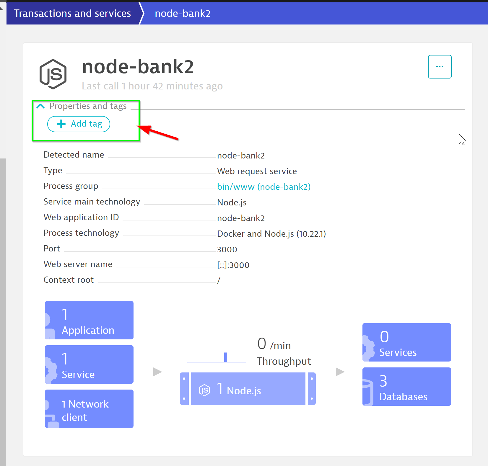
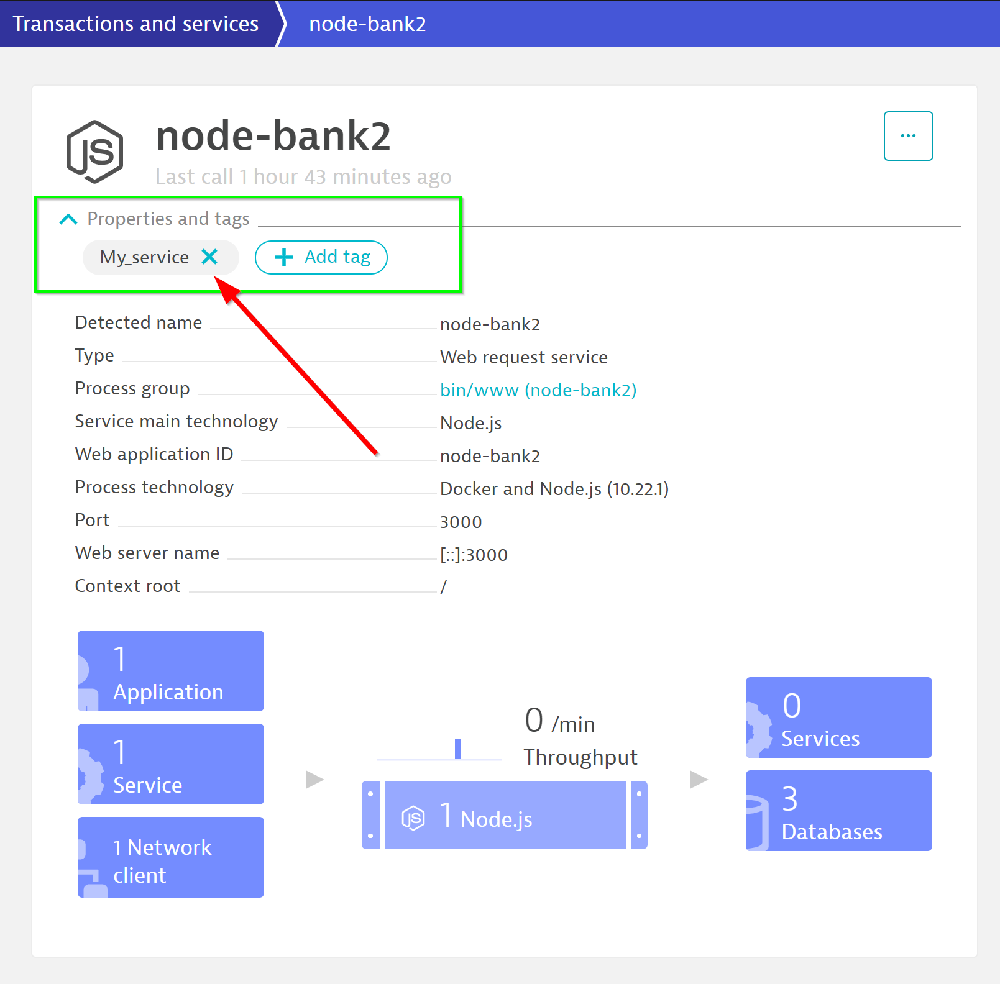
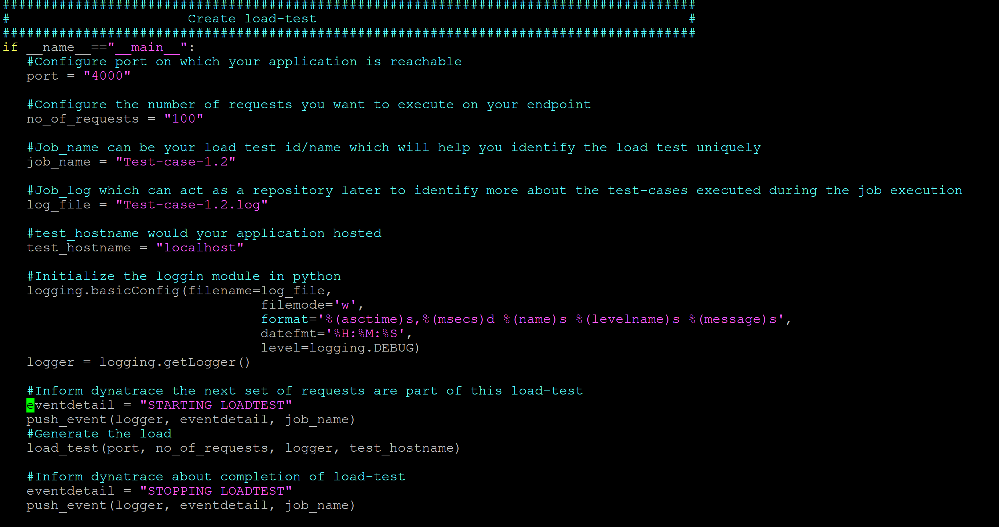
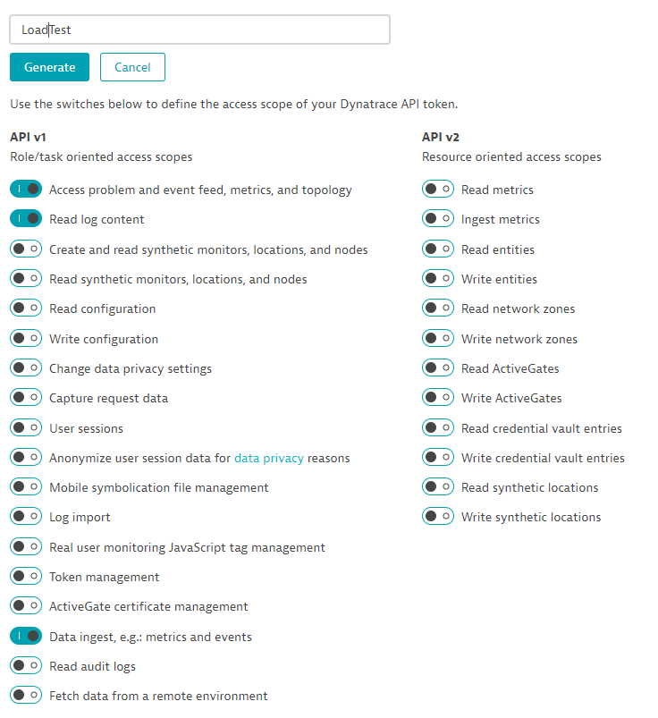
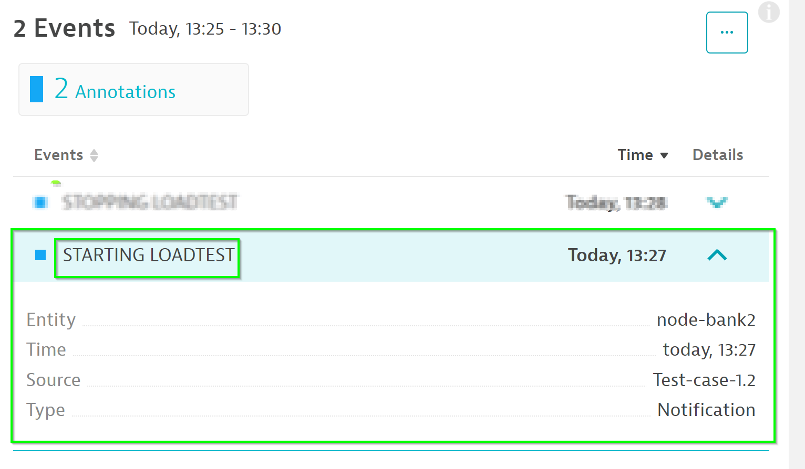
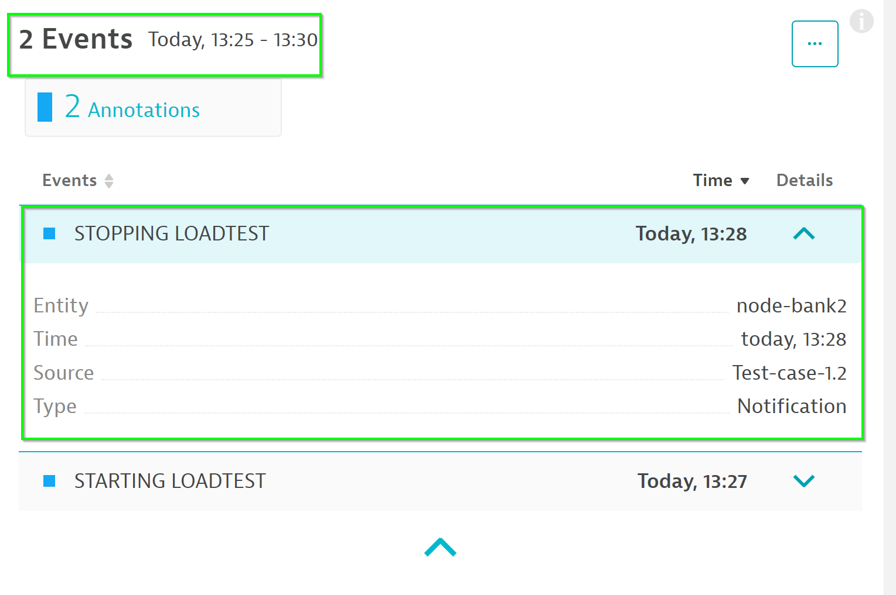

## Tag-based Analysis of Requests
Duration: 15

By integrating Dynatrace into your existing load testing process, you can stop broken builds in your delivery pipeline earlier. Tagging is a powerful mechanism and should be used carefully and in a meaningful way. To guide you towards this end, we provide you with specific recommendations and [best practices](https://www.dynatrace.com/support/help/how-to-use-dynatrace/tags-and-metadata/).

### Defining a Unique Entity



In Dynatrace, on the left menu bar, go to **Transactions and services > node-bank2** and follow the steps below:

- Dropdown **Properties and tags**
- Click on **Add tag**
- Name the new Tag `My_service`



Official Dynatrace documentation could be found [here](https://www.dynatrace.com/support/help/how-to-use-dynatrace/tags-and-metadata/setup/how-to-define-tags/)

### Trigger Load with Python script

As per the last lab we have written a Python script to automate the load tests for JMeter. We will now edit it to **push events** into Dynatrace. Within the shell terminal, run the following command to edit the Python script.

```bash
$ cd /home/ubuntu/ACM1Workshop/additional_resources/app_docker/scripts/
$ vim smoke-test.py
```
Within the text editor, scroll to the bottom. **Uncomment** the script so as to match the below.

```bash
#Inform dynatrace the next set of requests are part of this load-test
eventdetail = "STARTING LOADTEST"
push_event(logger, eventdetail, job_name)
#Generate the load
load_test(port, no_of_requests, logger, test_hostname)

#Inform dynatrace about completion of load-test
eventdetail = "STOPPING LOADTEST"
push_event(logger, eventdetail, job_name)

logging.shutdown()
```

**Screenshot of edited script**


### Replacing Dynatrace Variables

Within the middle section of the script, append the values of **DT_TENANT** and **DT_TOKEN**

To get your **DT_TENANT**, go to the Web Browser and extract the URL path as per below.

**EXAMPLE URL**
https://mou612.managed-sprint.dynalabs.io/e/**DT-TENANT**/


To get your **DT_TOKEN**, go to **Settings > Integration > Dynatrace API > Generate Token** and follow the below:

- Create a token with **LoadTest**
- Toggle **Data ingest, eg: metrics and events**
- Click on **Generate**
- Clck on **Copy**



Back in your shell terminal, replace the **DT_TENANT** and **DT_TOKEN**. Your script should look like the below.


**Save the text editing session** with command `:wq`

Run the script with command `$ python3 smoke-test.py`

### Check Load Test Events

The script will append load test events within Dynatrace which will add additional insights for our DAVIS AI to use.

Note the **Start events** and **Stop events**





<!-- ------------------------ -->
## Tag-based Analysis of Requests
Duration: 15

By integrating Dynatrace into your existing load testing process, you can stop broken builds in your delivery pipeline earlier. Tagging is a powerful mechanism and should be used carefully and in a meaningful way. To guide you towards this end, we provide you with specific recommendations and [best practices](https://www.dynatrace.com/support/help/how-to-use-dynatrace/tags-and-metadata/).

### Defining a Unique Entity


In Dynatrace, on the left menu bar, go to **Transactions and services > node-bank2** and follow the steps below:

- Dropdown **Properties and tags**
- Click on **Add tag**
- Name the new Tag `My_service`


Official Dynatrace documentation could be found [here](https://www.dynatrace.com/support/help/how-to-use-dynatrace/tags-and-metadata/setup/how-to-define-tags/)

### Trigger Load with Python script

As per the last lab we have written a Python script to automate the load tests for JMeter. We will now edit it to **push events** into Dynatrace. Within the shell terminal, run the following command to edit the Python script.

```bash
$ cd /home/ubuntu/ACM1Workshop/additional_resources/app_docker/scripts/
$ vim smoke-test.py
```
Within the text editor, scroll to the bottom. **Uncomment** the script so as to match the below.

```bash
#Inform dynatrace the next set of requests are part of this load-test
eventdetail = "STARTING LOADTEST"
push_event(logger, eventdetail, job_name)
#Generate the load
load_test(port, no_of_requests, logger, test_hostname)

#Inform dynatrace about completion of load-test
eventdetail = "STOPPING LOADTEST"
push_event(logger, eventdetail, job_name)

logging.shutdown()
```

**Screenshot of edited script**


### Replacing Dynatrace Variables

Within the middle section of the script, append the values of **DT_TENANT** and **DT_TOKEN**

To get your **DT_TENANT**, go to the Web Browser and extract the URL path as per below.

**EXAMPLE URL**
https://mou612.managed-sprint.dynalabs.io/e/**DT-TENANT**/


To get your **DT_TOKEN**, go to **Settings > Integration > Dynatrace API > Generate Token** and follow the below:

- Create a token with **LoadTest**
- Toggle **Data ingest, eg: metrics and events**
- Click on **Generate**
- Clck on **Copy**


Back in your shell terminal, replace the **DT_TENANT** and **DT_TOKEN**. Your script should look like the below.


**Save the text editing session** with command `:wq`

Run the script with command `$ python3 smoke-test.py`

### Check Load Test Events

The script will append load test events within Dynatrace which will add additional insights for our DAVIS AI to use.

Note the **Start events** and **Stop events**


<!-- ------------------------ -->
