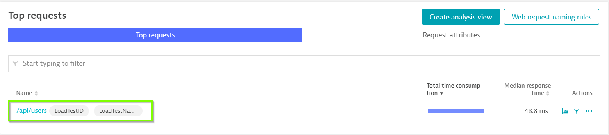
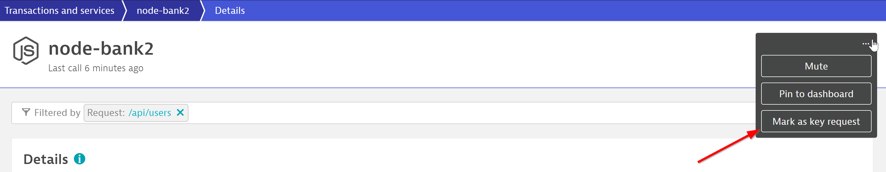
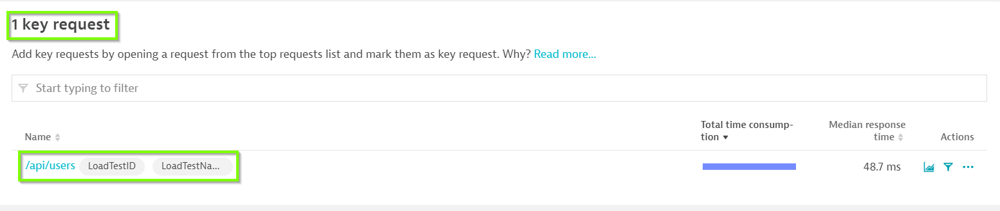
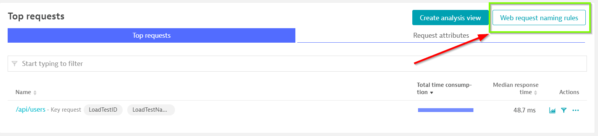
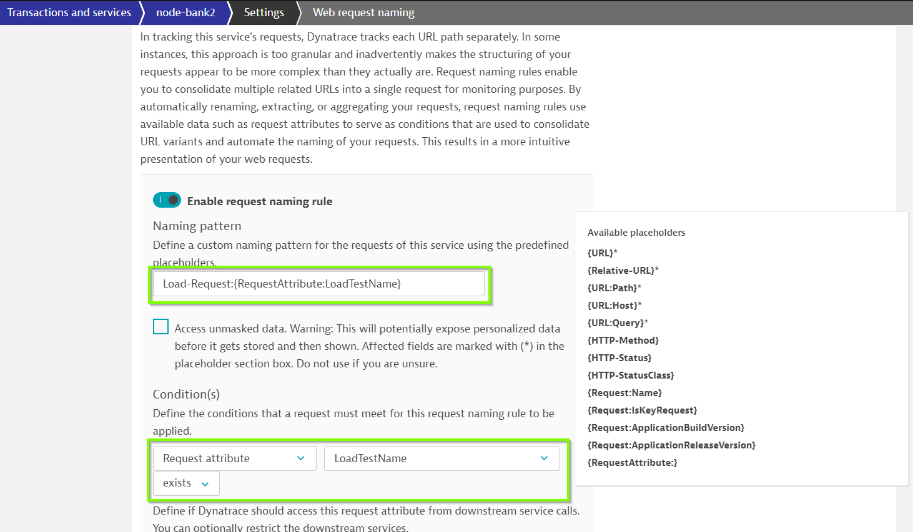
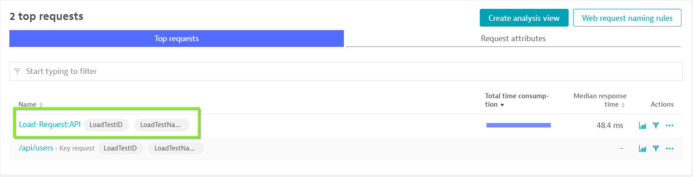

## Configuring Loadtest Requests
Duration: 15

### Mark Requests as Key Requests

In Dynatrace, on the left menu bar, go to **Transactions and services > node-bank2**

Click on **View dynamic requests** and use **/api/users** within the filter bar

Note that the Top requests has now been filtered with /api/users

Click on the **...** button on the top right and choose **Mark as key request**

Notice that the /api/users has been marked as a key request.

### Web Requests Naming Rules

Dynatrace automatically provides names, but they don’t enable you to quickly identify where an application or service belongs to. To achieve this, it's recommended that you use service naming rules and process group naming rules. This can be done in Dynatrace using metadata imported from the monitored applications.

You can use Dynatrace Naming Rules to differentiate requests

- Click on **Web Request naming rules**
- Click on **Add rule** undesr Request naming rules
- Use `Load-Request:{RequestAttribute:LoadTestName}` under Naming Pattern
- Choose **Request attribute** `LoadTestName` **exists** under Condition(s)
- Click on **Save**

With the naming rule now applied, you would see a newly created request.

### Populate requests

Within the SSH Terminal, run the Python script command again `$ python3 smoke-test.py` to populate requests.

<!-- ------------------------ -->
## Configuring Loadtest Requests
Duration: 15

### Mark Requests as Key Requests

In Dynatrace, on the left menu bar, go to **Transactions and services > node-bank2**

Click on **View dynamic requests** and use **/api/users** within the filter bar

Note that the Top requests has now been filtered with /api/users

Click on the **...** button on the top right and choose **Mark as key request**

Notice that the /api/users has been marked as a key request.

### Web Requests Naming Rules

Dynatrace automatically provides names, but they don’t enable you to quickly identify where an application or service belongs to. To achieve this, it's recommended that you use service naming rules and process group naming rules. This can be done in Dynatrace using metadata imported from the monitored applications.

You can use Dynatrace Naming Rules to differentiate requests

- Click on **Web Request naming rules**
- Click on **Add rule** undesr Request naming rules
- Use `Load-Request:{RequestAttribute:LoadTestName}` under Naming Pattern
- Choose **Request attribute** `LoadTestName` **exists** under Condition(s)
- Click on **Save**

With the naming rule now applied, you would see a newly created request.

### Populate requests

Within the SSH Terminal, run the Python script command again `$ python3 smoke-test.py` to populate requests.

<!-- ------------------------ -->
