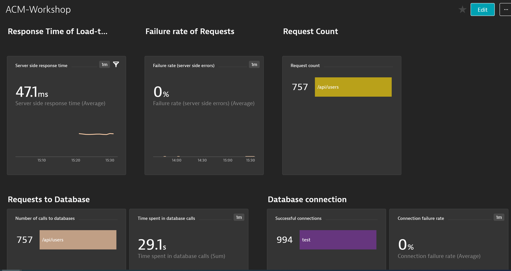
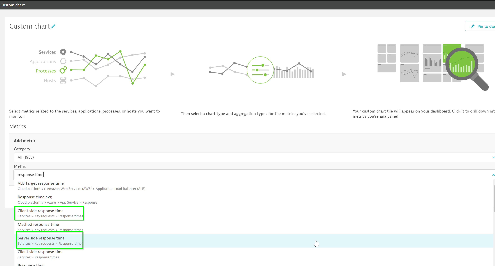
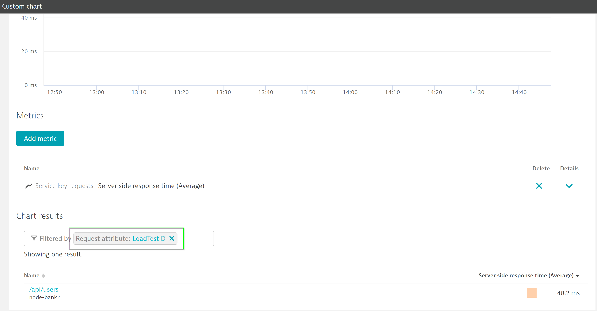

## Creating Dashboards for Load Tests
Duration: 10

Dynatrace provides versatile dashboarding and charting mechanisms. You can create dashboards to reflect load test performance.

### Creating custom charts

In Dynatrace, on the left menu bar, go to **Create custom chart**

Choose and chart **Client side response time** and **Server side response time** metrics

You can filter on **LoadTestID** and chart only requests with that attribute.

<!-- ------------------------ -->

## Creating Dashboards for Load Tests
Duration: 10

Dynatrace provides versatile dashboarding and charting mechanisms. You can create dashboards to reflect load test performance.

### Creating custom charts

In Dynatrace, on the left menu bar, go to **Create custom chart**

Choose and chart **Client side response time** and **Server side response time** metrics

You can filter on **LoadTestID** and chart only requests with that attribute.

<!-- ------------------------ -->

