## Setting up Jenkins
### Insalling Docker Pipeline Plugin
Once you login, you will see the screen as below. Click on "Install suggested plugins" as below:
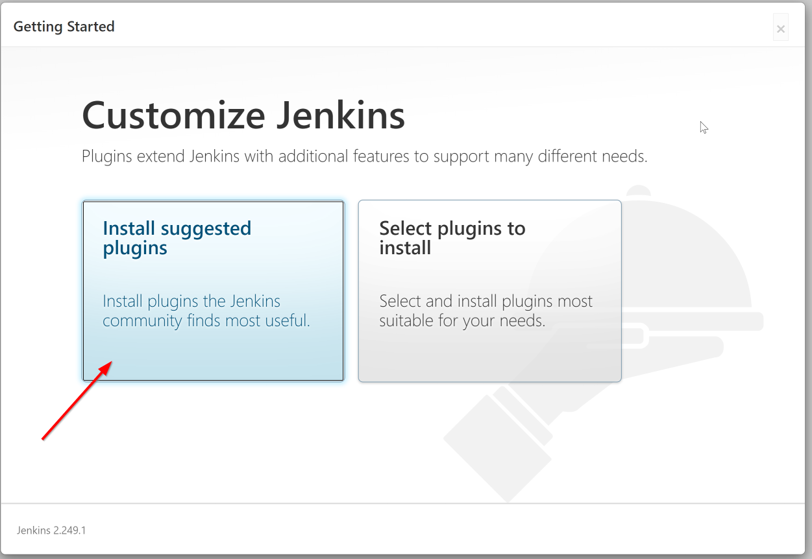
Further, add an admin user with username "admin" and password "dynatrace"

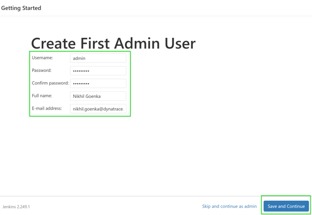
* Click on **Manage Jenkins** on the left menu

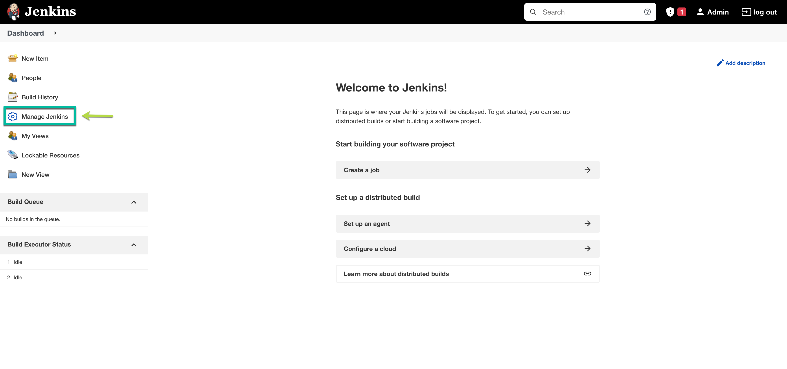
* Click on **Manage Plugins** as highlighted below:

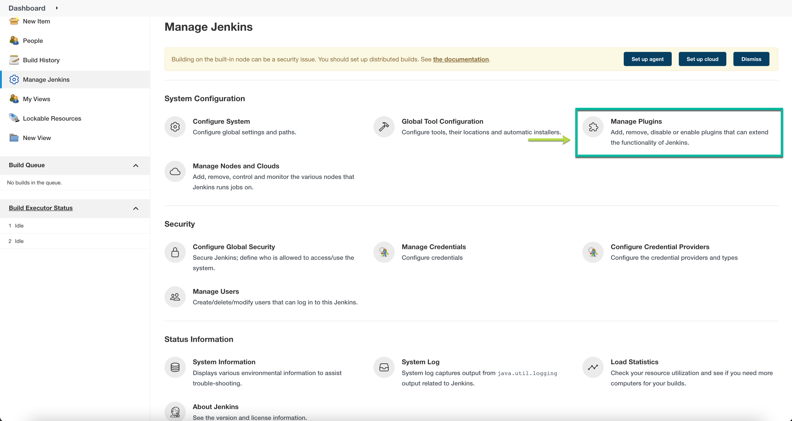

Now, click on **Available plugins** and input docker in the **search bar**
1. Select **Docker Pipeline**
2. Click on **Install without restart**

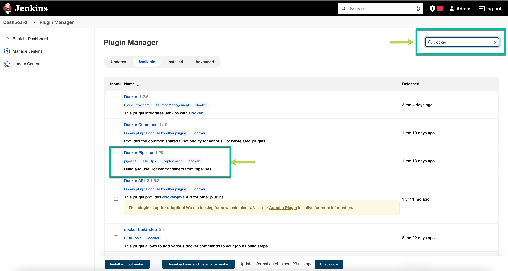

### Configure Environment Variables
Within Jenkins, click on **Manage Jenkins** > **Configure System**
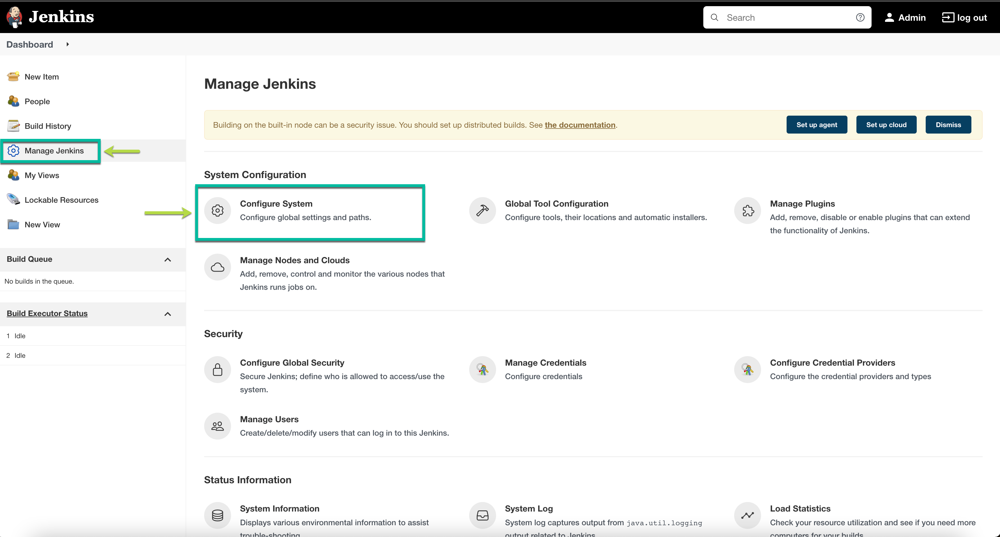

* Look for **environment variables** as below:
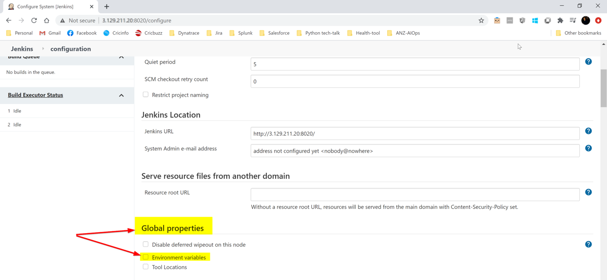
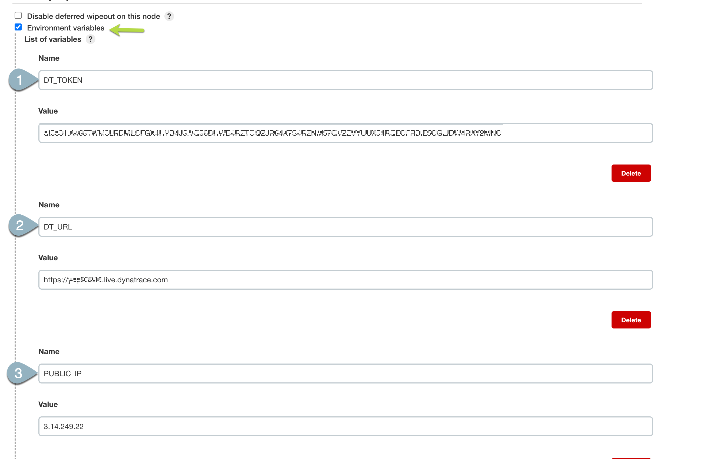

* Add the following environment variables:
1. **DT_URL** with value *https://mou612.managed-sprint.dynalabs.io/e/{environmentid}*
2. **DT_TOKEN**
3. **PUBLIC_IP**

To get your ***DT_TENANT***, go to the Web Browser and extract the URL path as per below.

To generate your DT_TOKEN, go to Settings > Access Tokens and follow the below:
1. Create a token with **LoadTest**
2. Toggle **Data ingest**, eg: **metrics and events**
3. Toggle **Create and read synthetic monitors**
4. Also, toggle **read slo, write slo, problem feed**
5. Click on **Generate**
6. Clck on **Copy**
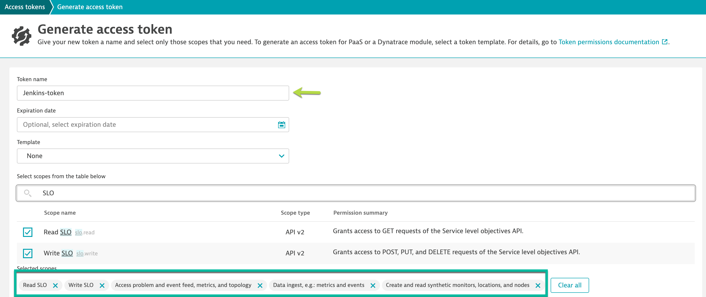

### Configure Jenkins Pipeline
* Click on "New Item" on the left side:

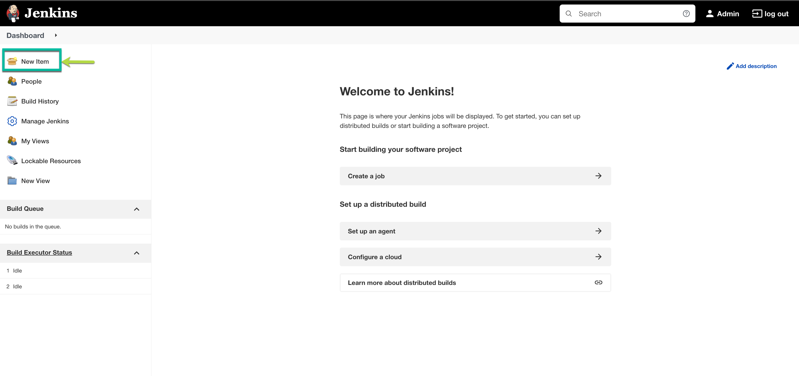
* Add a pipeline as per below:
* Item name - ***My Pipeline***
* Choose **Pipeline**
* Click on **OK**

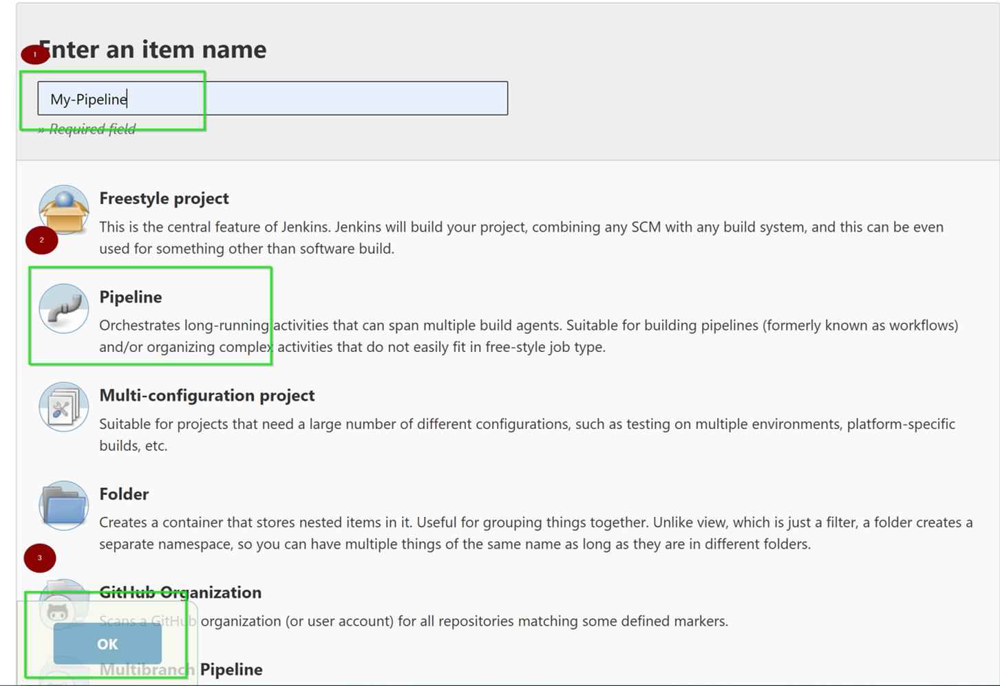

* Use the pipeline definitions as per below:
* Definition - Dropdown **Pipeline script from SCM**
* SCM - Dropdown **Git**
* Repository URL - ***https://github.com/nikhilgoenkatech/JenkinsBankApp/***
* Click on **OK**

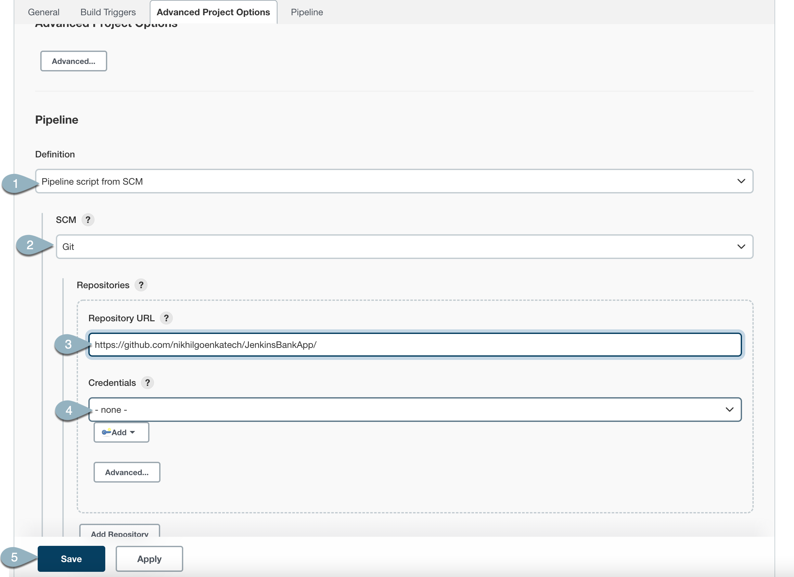

<!-- ------------------------ -->
