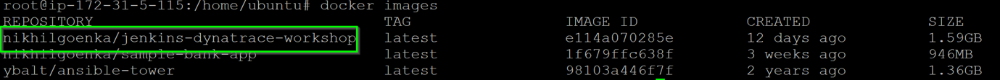
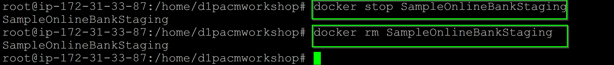
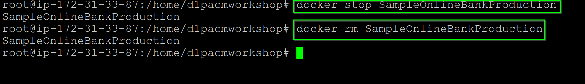
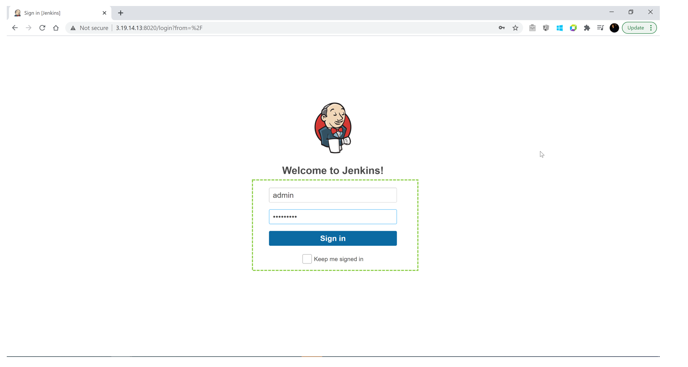
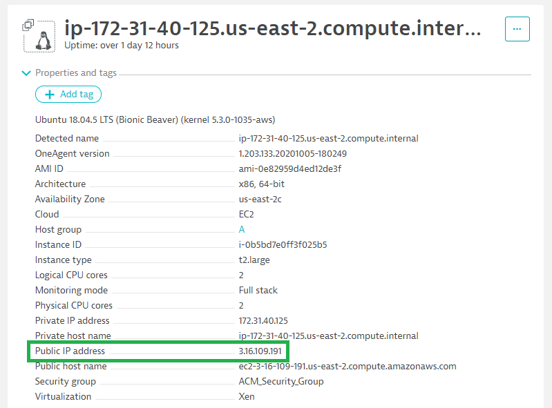
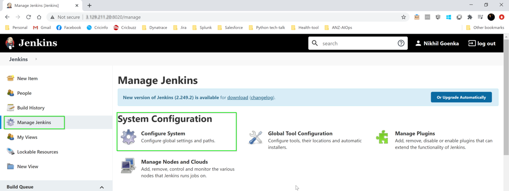
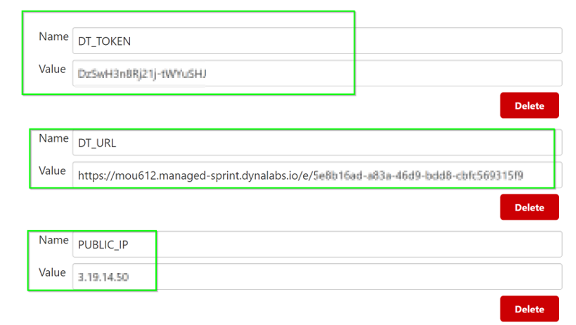

## Prerequisites/Preconfiguration
Negative
: Note that this lab is part of the larger session - AIOps Hands On Workshop Series. Please refer also to the last session Automate Delivery Sesssion 1

Log back into your Dynatrace environment and check if OneAgent is still running.

On your left navigation, select **Hosts** and you should still see a monitored EC2 host.

### Check if OneAgent is running
Log back into your Dynatrace environment and check if OneAgent is still running.

On your left navigation, select **Hosts** and you should still see a monitored EC2 host.

### Running Jenkins in Docker
Negative
:Before you start the Jenkins docker, please remove the existing Jenkins-docker as below with this command
`docker rm Jenkins-Dynatrace`

The Jenkins docker would already be present in your ubuntu instances and can be seen with "docker images"

To start the Jenkins docker, execute `docker run -d --network mynetwork --name Jenkins-Dynatrace -p 8020:8080 -v /var/jenkins:/var/jenkins_home -v /var/run/docker.sock:/var/run/docker.sock nikhilgoenka/jenkins-dynatrace-workshop`. In our last session, we mounted the docker data in host-volume ***'/var/jenkins'***, so our pipeline and other jenkins data would be restored from that directory.

### Stop/Remove all sample-bank-apps
Verify if you have any old docker(s) for sample-bank-app in your environment using `docker ps -a`

If output of above command shows any docker with name "SampleOnlineBankStaging"; remove them by executing `docker stop SampleOnlineBankStaging` followed by `docker rm SampleOnlineBankStaging`

Similarly, if you have any production dockers, remove them by executing `docker stop SampleOnlineBankProduction` followed by `docker rm SampleOnlineBankProduction`

### Login into Jenkins
Login into Jenkins through **web browser** and access the Jenkins URL via `:8020` with username ***admin*** and password ***dynatrace***

### Configure Environment Variables
As AWS instance was restarted, Public IP-address may have changed, so look for the **Properties and Tags** on dynatrace>Hosts and you will get a list of various metadata associated with the host created. Locate the **Public IP Address** and copy its value.

Further, change the value of environment variable created earlier to reflect the new IP-address, as below:

Within Jenkins, click on **Manage Jenkins** > **Configure System**

* Look for **environment variables** as per image below:
* Modify the following environment variables:
* ***PUBLIC_IP***

<!-- ----------------------- -->
