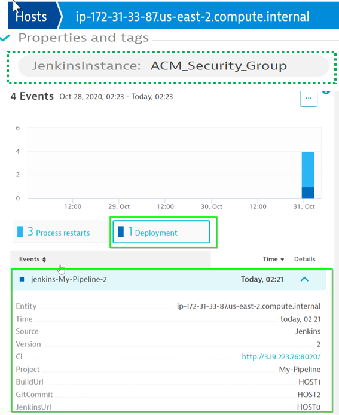
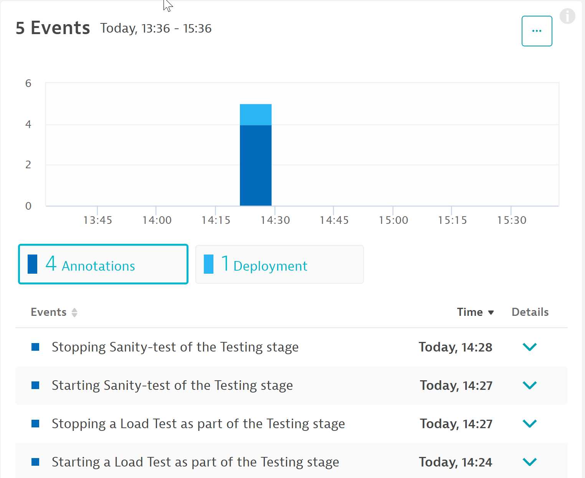
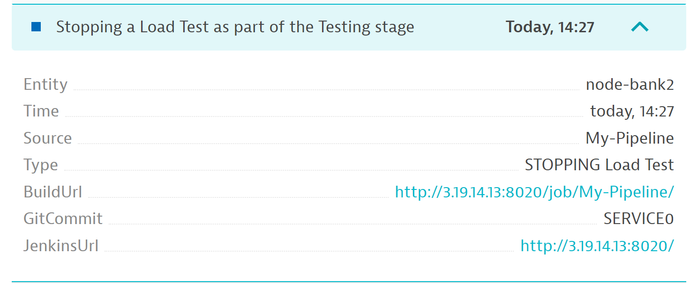

## Decoding steps in each stage
In Jenkins, Click on **individual stages > Logs** to view details involved in that step.

### Understanding the tags in more detail
Referring to the Jenkins File, the following code handles the **pushing of Jenkins deployment information** into Dynatrace.
```bash
dir ('dynatrace-scripts') {
// push a deployment event on the host with the tag JenkinsInstance created using automatic tagging rule
sh './pushdeployment.sh HOST CONTEXTLESS JenkinsInstance ACM_Security_Group ' +
'${BUILD_TAG} ${BUILD_NUMBER} ${JOB_NAME} ' +
'Jenkins ${JENKINS_URL} ${JOB_URL} ${BUILD_URL} ${GIT_COMMIT}'
```

Referring to the Jenkins File, the following code handles the **pushing of deployment information** into Dynatrace. This step utilizes environment varibles such as ***DT_CLUSTER_ID***, ***DT_TAGS*** and ***DT_CUSTOM_PROP***
```bash
stage('DeployStaging') {
// Lets deploy the previously build container
def app = docker.image("sample-bankapp-service:${BUILD_NUMBER}")
app.run("--network mynetwork --name SampleOnlineBankStaging -p 3000:3000 " +
"-e 'DT_CLUSTER_ID=SampleOnlineBankStaging' " +
"-e 'DT_TAGS=Environment=Staging Service=Sample-NodeJs-Service' " +
"-e 'DT_CUSTOM_PROP=ENVIRONMENT=Staging JOB_NAME=${JOB_NAME} " +
"BUILD_TAG=${BUILD_TAG} BUILD_NUMBER=${BUILD_NUMBER}'")
```


### Review changes in Dynatrace
You can see the changes reflected in **SampleOnlineBankStaging Process View**

You also can see the changes reflected in **node-bank2 Service View**


### Automate/Continuous Feedback from Dynatrace
```bash
stage('Testing') {
// lets push an event to dynatrace that indicates that we START a load test
dir ('dynatrace-scripts') {
sh './pushevent.sh SERVICE CONTEXTLESS DockerService SampleOnlineBankStaging ' +
'"STARTING Load Test" ${JOB_NAME} "Starting a Load Test as part of the Testing stage"' +
' ${JENKINS_URL} ${JOB_URL} ${BUILD_URL} ${GIT_COMMIT}'
}

// lets run some test scripts
dir ('sample-bank-app-service-tests') {
// start load test - simulating traffic for Staging enviornment on port 3000

sh "rm -f stagingloadtest.log stagingloadtestcontrol.txt"
sh "python3 smoke-test.py 3000 200 ${BUILD_NUMBER} stagingloadtest.log ${PUBLIC_IP} SampleOnlineBankStaging"
archiveArtifacts artifacts: 'stagingloadtest.log', fingerprint: true
}

// lets push an event to dynatrace that indicates that we STOP a load test
dir ('dynatrace-scripts') {
sh './pushevent.sh SERVICE CONTEXTLESS DockerService SampleOnlineBankStaging '+
'"STOPPING Load Test" ${JOB_NAME} "Stopping a Load Test as part of the Testing stage" '+
'${JENKINS_URL} ${JOB_URL} ${BUILD_URL} ${GIT_COMMIT}'
}
```


Positive
:Davis would ingest and analyse the data which would further help in identifying probable root-cause and thereby, helping the backend teams to a quicker resolution.

### Automate UI tests using Synthetic browsers
```bash
// Create a sample synthetic monitor so as to check the UI functionlity
sh './synthetic-monitor.sh Staging '+  '${JOB_NAME} ${BUILD_NUMBER}'
```
The script would ***leverage API to create a synthetic browser*** and ***perform the different user-actions***. To view the synthetic browser, navigate to **Synthetic within Dynatrace**.

In an event of any issues with UI funcitonality, DT would automtically trigger a problem, thereby ***halting the erroneous build to be shipped to production***.

### Dashboard creation
Leveraging the dashboard API, a dashboard is generated with information of the **health metrics** of **hosts/services/requests** invoked duringJenkins pipeline. These can be used to give a quick sneak peek of any issues to the operation/devOps team.
```bash
// Create a sample dashboard for the staging stage
sh './create-dashboard.sh Staging '+  '${JOB_NAME} ${BUILD_NUMBER}'
```


<!-- ----------------------- -->
