## Configure Ansible
Login into your ansible docker using credentials "admin" and password "dynatrace".
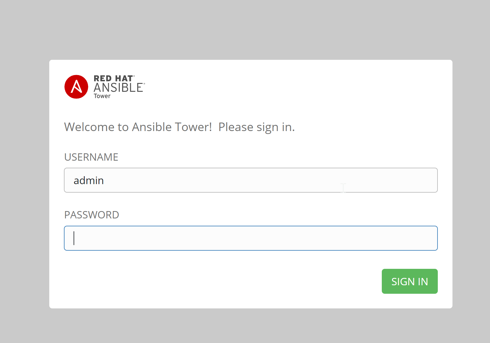

Import the license by clicking on "Browse" and uploading the license that was earlier shared with you in email.
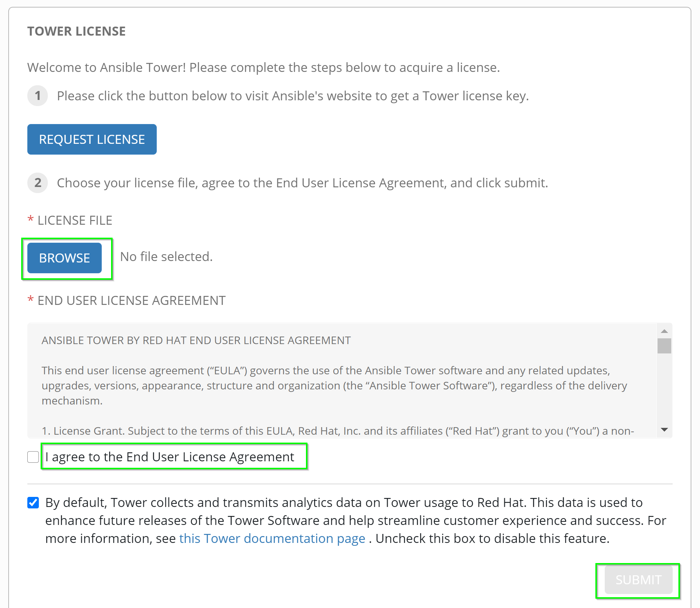

### Setting up inventory
Now, create the inventory by clicking on **Inventory** in the left-side as seen below:
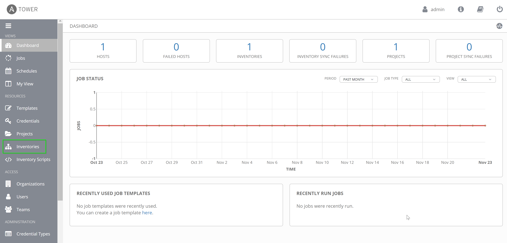

  
That would open the page displaying the existing inventories. Delete the existing inventory for a clearer view before adding one as seen below:
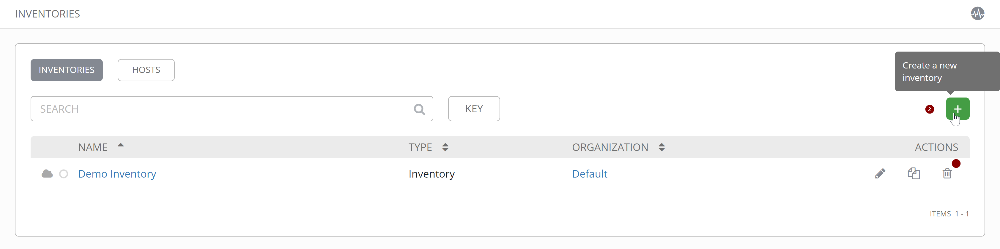
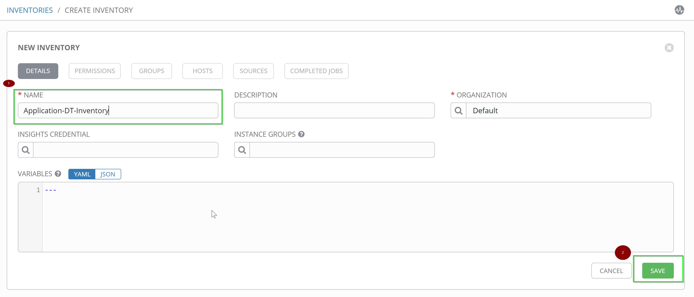

Negative:
Inventories consists of all the hosts that you plan to run the playbook on. So, inventories act as the repository of the hosts.

Once you add the inventory, you will get an option to **add hosts** for that inventory. Add the host by navigating to the "Hosts" tab.
The host can be added with host-name=<AWS-IP> and description as "Application-Docker-Server".
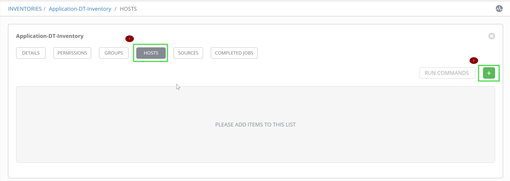
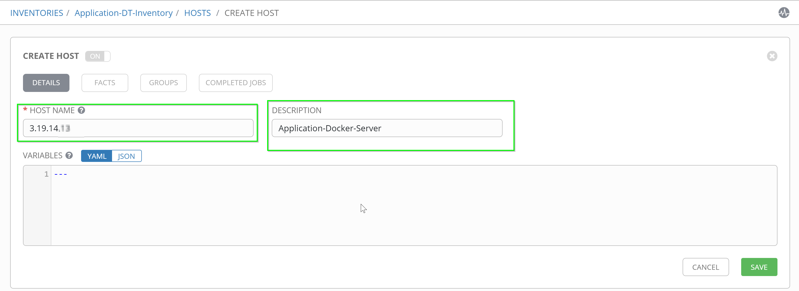

### Setting up Project
Similarly, let us add a **project**. Project is a collection of ansible playbooks. To add/edit projects, click on "Projects". Start by deleting the existing "Demo Project" for a cleaner view, followed by clicking on "+" and "Project" to add your projects.
**Project-name**: `Application-playbooks`
**SCM Type**: Git
**SCM URL**: `https://github.com/nikhilgoenkatech/AIOPSAnsibleBankPlaybooks`

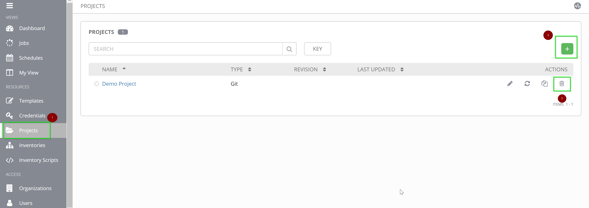

### Setting up Credentials
With the hosts and playbooks added, now add the credentials that ansible will use in order to connect to the configured hosts and run the playbook from projects. Navigate to **Credentials** as shown below.
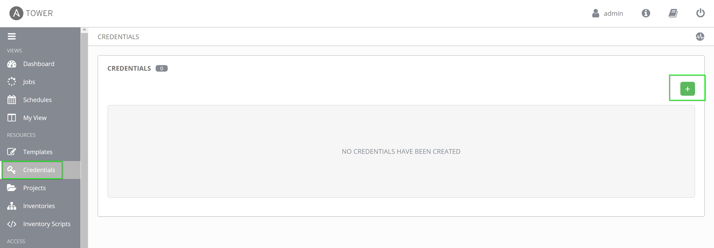

Delete the existing `Demo Credentials` and further, add credentials for your AWS host.
**Name**: Application-servers
**Credential Type**: Machine
**Username**: `d1pacmworkshop`
**Password**: `dynatrace`
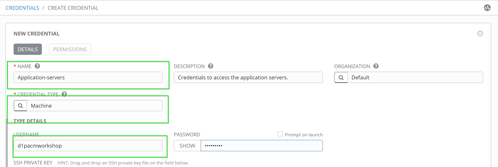

### Setting up Templates
Add a template by navigating to **Templates** on the left-hand side and configure as below:

**Name**: Process-unavailable
**Inventory**: Application-DT-inventory
**Project**: Application-playbooks
**Playbook**: process-restart.yaml

Add the extra variables as below:
**tenanturl**: <your-tenant-url>
**dttoken**: <your-token>
**dtcommentapiurl**: <your-dynatrace-url>/api/v1/problem/details/{{pid}}/comments?Api-Token={{dttoken}}
**dtdeploymentapiurl**: <your-dynatrace-url>/api/v1/events?Api-Token={{dttoken}}
**my_ip**: <your-aws-instance-ip>

Positive:
Replace tenant-url with `https://xxx.live.dynatrace.com/` for SaaS where for managed, change to `https://managed.server/e/{environment-id}`
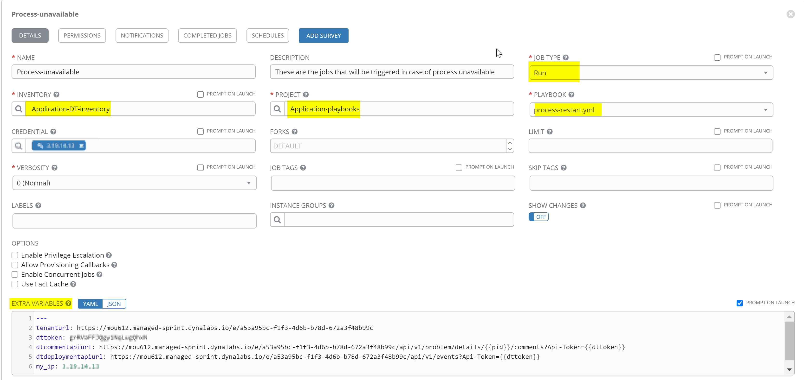

