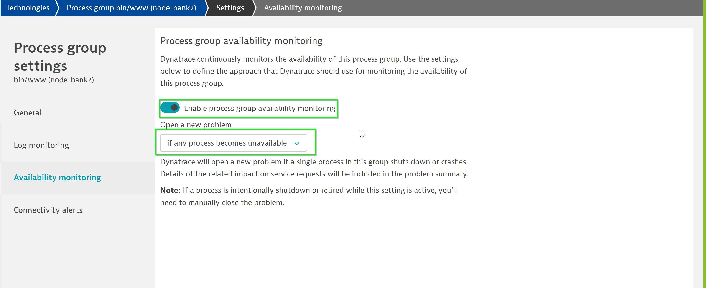
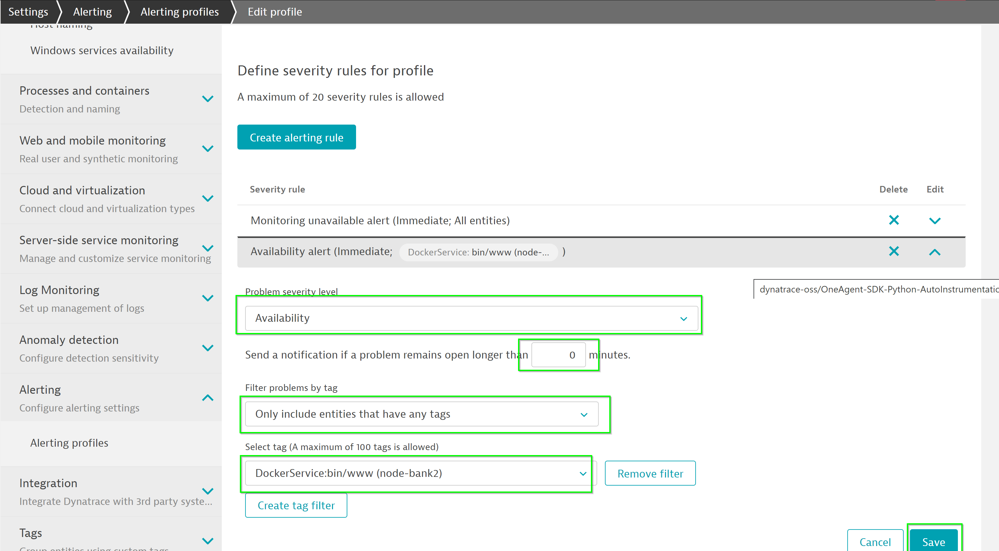
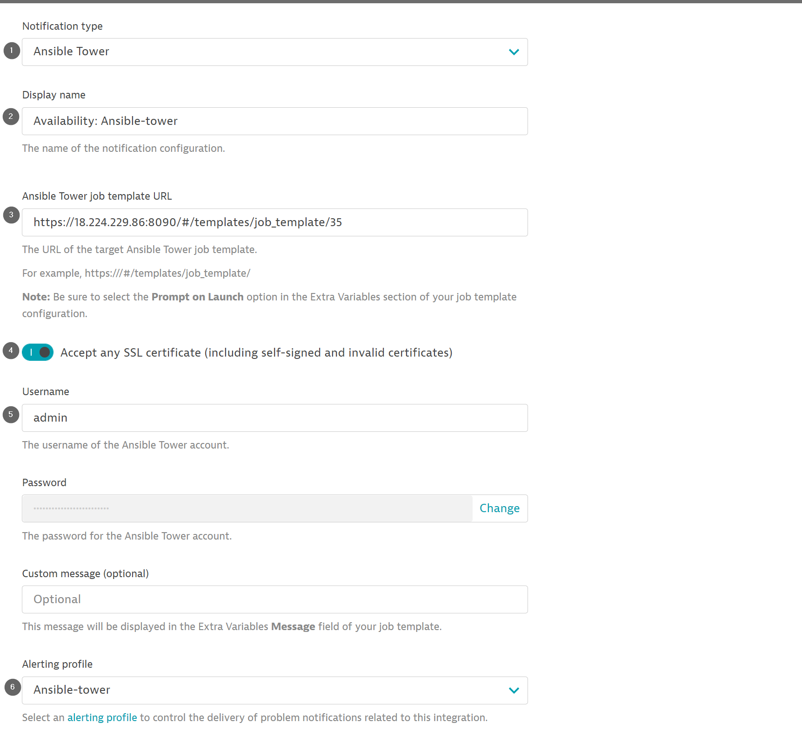

## Integrate Ansible-tower and Dynatrace

### Availability alert
Enable the **availability alert** for the NodeJS process. Within dynatrace-tenant, navigate to **Technologies > NodeJS Process-Group > Settings > Availability monitoring ** and toggle the "Enable process group availability monitoring" as below:

### Configure Alerting Profile
Let us further set the Alerting profile so that the problems can be notified to 3rd party like email, slack-integration, etc.
Within your tenant, navigate to "Settings > Alerting > Alerting profiles". Now, add a new alerting profile "Ansible-playbook" and set the rules as below for
"Availability event".

### Problem notification
Once alerting profile is setup, let us setup the problem notification so that the problem information is relayed to ansible-tower. To do so, within your tenant navigate to Settings > Integration > Problem Notifications and click on **+Set up notifications**

Configure the notification as below:
**Ansible Tower job template URL**: URL of template added in step(11)
**Username**: admin
**Password**: dynatrace

