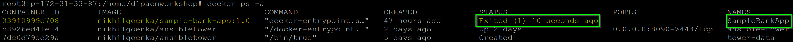
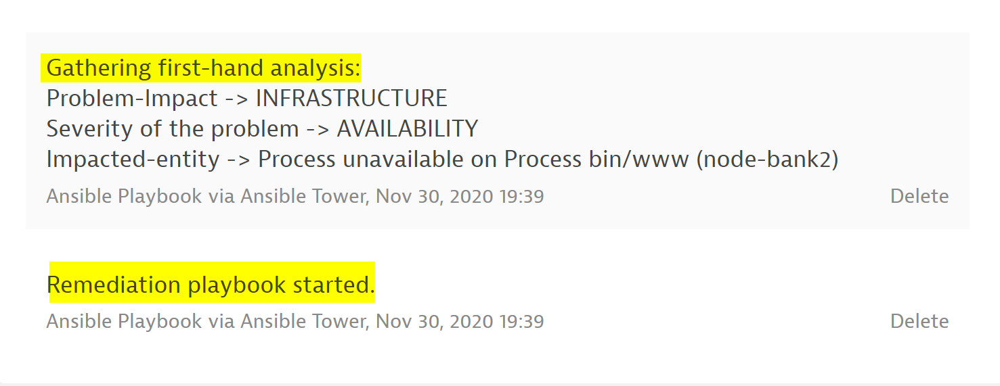
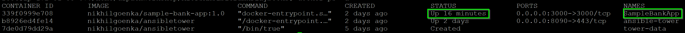
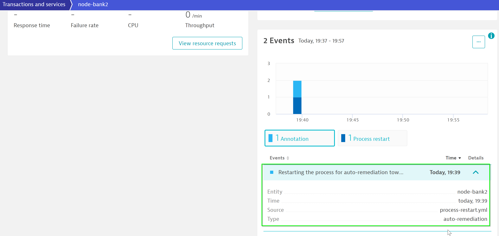
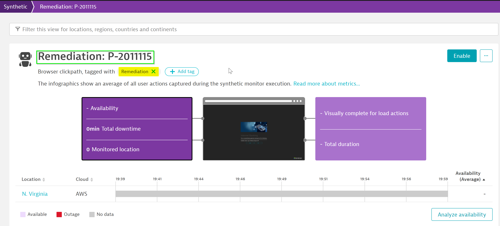
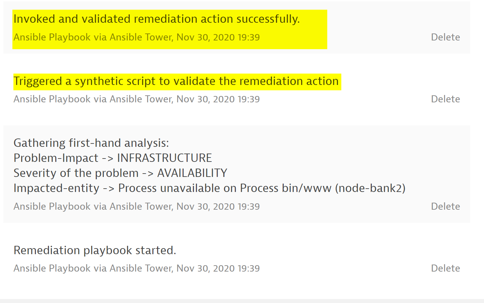

## Stimulate the issue that triggers auto-remediation endpoint
Now, within your browser go to http://<MACHINE-IP>:3000/login and log-in with incorrect credentials. This would crash the docker in the backend resulting in the service no longer available.

This would create a problem in Dynatrace and as per the problem-notification set, it would trigger a notification to template and trigger the playbook automatically.

### Initial analysis
The remediation would perform initial analysis on the problem like the problem-type, severity, collecting logs and push these as comments on the problem.

### Auto-remediation
Further, it would start the docker that has crashed due to incorrect logging and push a deployment event on the service:

### Validating the auto-remediation
Next, the playbook will create a synthetic monitor and run the user-actions on it to validate if the application is up entirely and there are no issues.

### Complete auto-remediation
Once completed, it would push the information in DT indicating that the remediation has been completed succesfully.

Positive:
