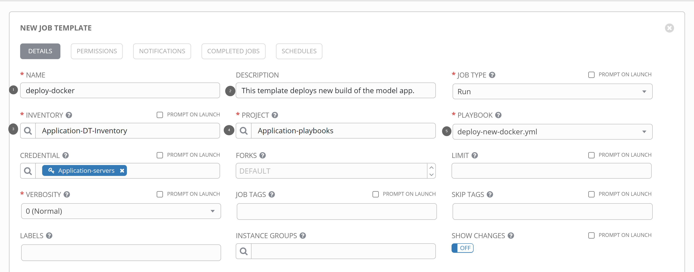
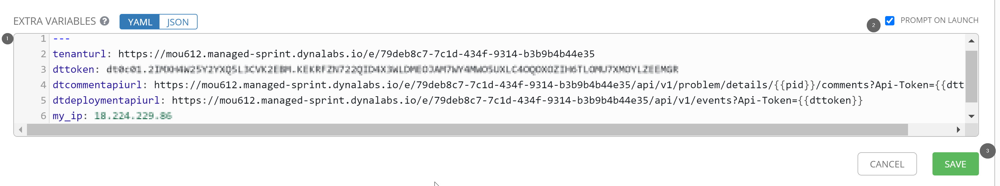
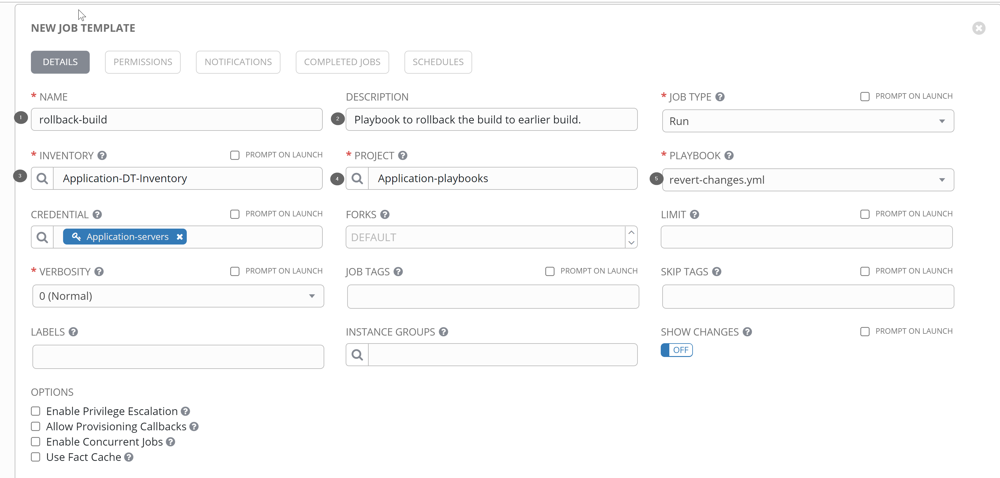
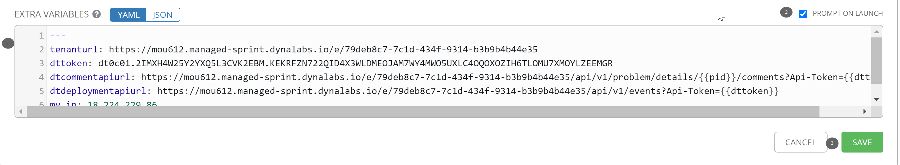

## Configure Ansible
In this step, we will configure ansible to load playbook that will deploy (upgrade) the application to the latest build.

### Setup a playbook to install latest docker image of the application
Let us add the playbook that will help us to upgrade the application.

#### Add ansible job-templates:
In this step, we will add the following two templates -
1. **Deploy-docker**: Deploy docker would deploy newer build of the model-app, push events to Dynatrace and run a sanity test post deployment.
1. **Rollback-build**: A playbook to revert back to earlier build should the newer build run into any issues.

#### Add Template for deploy-docker:
To do so, navigate to **Templates** on the left-hand side of Ansible Tower homepage. Add a new template with the below configuration:
1. **Name**: deploy-docker
1. **Description**: This template deploys new build of the model app
1. **Inventory**: Application-DT-inventory
1. **Project**: Application-playbooks
1. **Playbook**: deploy-new-docker.yaml

Further, add the following variables under **Environment Variables**
**tenanturl**: your-tenant-url
**dttoken**: your-token
**dtcommentapiurl**: your-dynatrace-url/api/v1/problem/details/{{pid}}/comments?Api-Token={{dttoken}}
**dtdeploymentapiurl**: your-dynatrace-url/api/v1/events?Api-Token={{dttoken}}
**my_ip**: my-aws-ip

Lastly, select checkbox **Prompt on Launch** before saving the template

#### Add Template for rollback-build
While we have added the playbook to automatically upgrade the application, let us also add playbook to rollback in case the upgrade run into any issues. To do so, follow the steps as below:

Within your ansible-tower homepage, navigate to **Templates** on the left-hand side and add a new template with the below configuration:
1. **Name**: rollback-build
1. **Description**: Playbook to rollback the build to earlier build.
1. **Inventory**: Application-DT-inventory
1. **Project**: Application-playbooks
1. **Playbook**: revert-changes.yaml

Further, add the following variables under **Environment Variables**
**tenanturl**: your-tenant-url
**dttoken**: your-token
**dtcommentapiurl**: your-dynatrace-url/api/v1/problem/details/{{pid}}/comments?Api-Token={{dttoken}}
**dtdeploymentapiurl**: your-dynatrace-url/api/v1/events?Api-Token={{dttoken}}
**my_ip**: 1.1.1.1

Lastly, select checkbox **Prompt on Launch** before saving the template

Positive
: Replace tenant-url with `https://xxx.live.dynatrace.com/` for SaaS whereas for managed, change to `https://managed.server/e/{environment-id}`

**NOTE**:
The Playbook inventory had been setup earlier, if not configured please set it up as below:
**Project-name**: `Application-playbooks`
**SCM Type**: Git
**SCM URL**: `https://github.com/nikhilgoenkatech/AIOPSAnsibleBankPlaybooks`

This brings the end of our configuration within Ansible-tower. Let us stitch Dynatrace and Ansible-tower.

