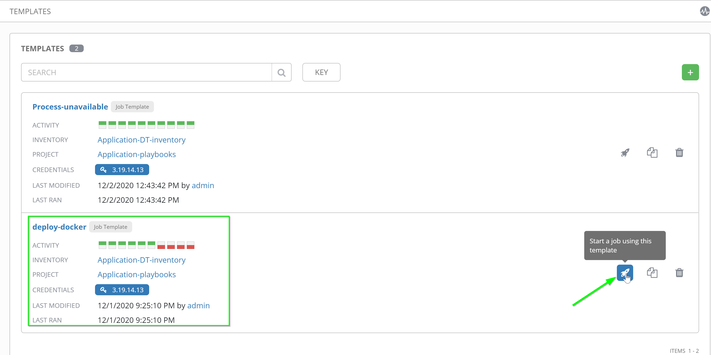
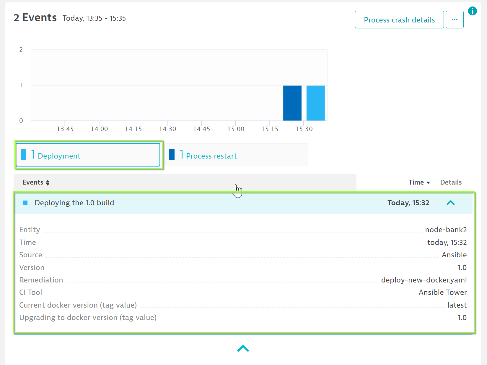
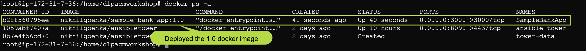
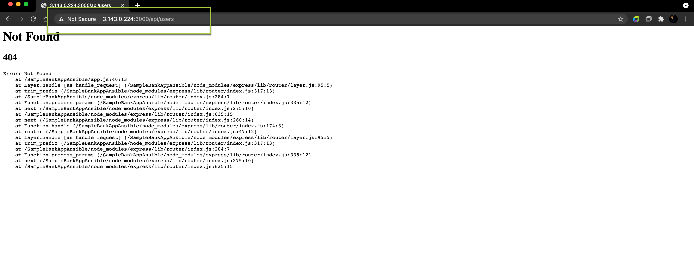
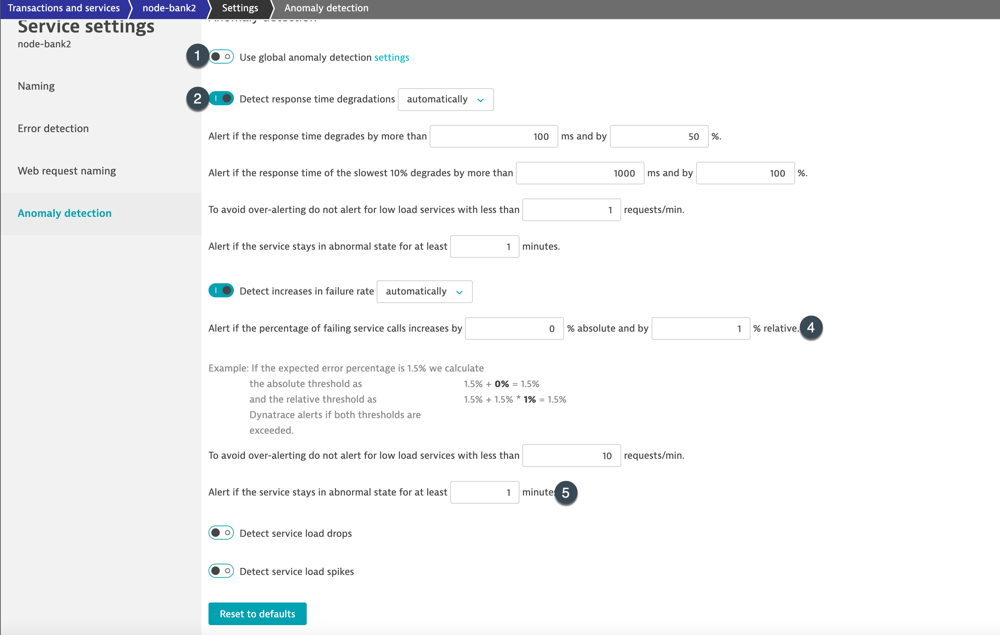
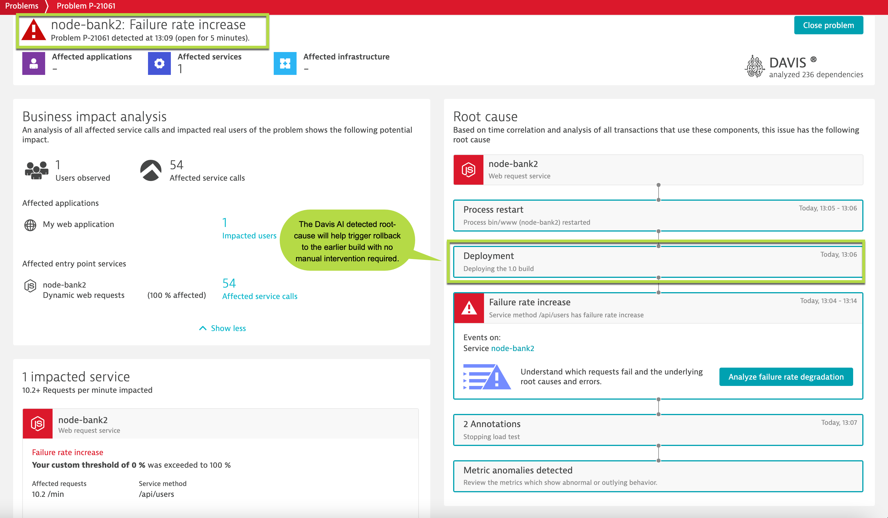

## Trigger new build
To do so, navigate to **Templates** and click on **Start a job using this template** next to "deploy-docker" template as seen below:

Once the *deploy-new-docker* playbook has executed completely, you will be able to see a deployment event in Dynatrace. To find the deployment event, navigate to **Transactions & Services>node-bank** and view the **events** on the right side of the screen as below:

Within EC2, we can validate the current running version of the SampleBankApp is 1.0 by issuing `docker ps -a`

In the newer build, **/api/users** request is broken (which we have marked earlier as a key-request)

Positive
: In case you do not have enough data in your setup for Davis AI to identify the baseline, we can modify the anomaly detection for our service similar as below:

As part of the deployment process, the playbook would trigger some load on the request and identify they are failing. As there are failures which breaches the automatic baseline and Davis AI has not seen before, it would detect the anomaly and trigger an alert.

