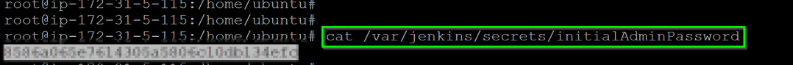

## Preconfiguration Setup

### OneAgent installation

In this step, we will deploy the OneAgent to a Linux instance and let the OneAgent discover what is running in that instance.

### Download OneAgent

Negative
: Use PuTTy (Windows), PowerShell (Windows) or Terminal (Mac), ssh into the instance (IP address using the your PEM Key)

1. Open your browser and access the Dynatrace URL.

1. Select **Deploy Dynatrace** from the navigation menu.


1. It opens up **Dynatrace Hub** and from there, we will need to select "Back to Deploy Dynatrace".


1. Click the **Start installation** button and select **Linux**.


1. Choose the installer type from the drop-down list (we'll use the default x86/64). Use the Linux shell script installer on any Linux system that's supported by Dynatrace, regardless of the packaging system your distribution depends on.

1. **Copy** the command provided in the "Use this command on the target host" text field. **Paste** the command into your terminal window and execute it.


Positive
: Example


### Execute the installation script

(Optional) Once the download is complete, you can verify the signature by copying the command from the *"Verify signature"* text field, then pasting the command into your terminal window and executing it. Make sure your system is up to date, especially SSL and related certificate libraries.

**Copy** the command that's provided in the text box "And run the installer with root rights" text field.


Paste the command into your terminal window and execute it. You will need to make the script executable before you can run it.

Note that you will need root access. You can use sudo to run the installation script. To do this, type the following command into the directory where you downloaded the installation script.

Positive
: Example


### Retriving Jenkins Password
In this step, we will setup the Jenkins pipeline
The initial password can be retrieved as
```
$ cat /var/jenkins/secrets/initialAdminPassword
```


With the retrieved password, access the Jenkins URL via your web browser.

Within your Host View, dropdown the **Properties and Tags** and you will get a list of various metadata associated with the host created. Locate the **Public IP Address** and copy its value.


Open up your **web browser** and access the Jenkins URL via `http://AWS-PUBLIC-IP:8020`

