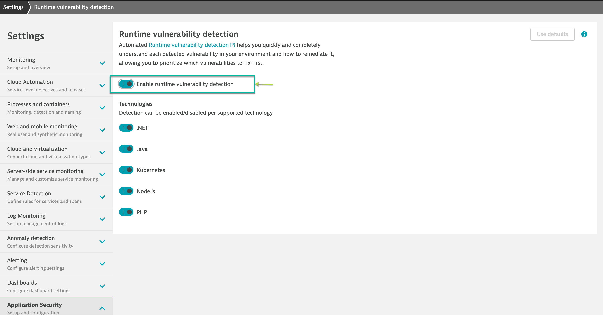
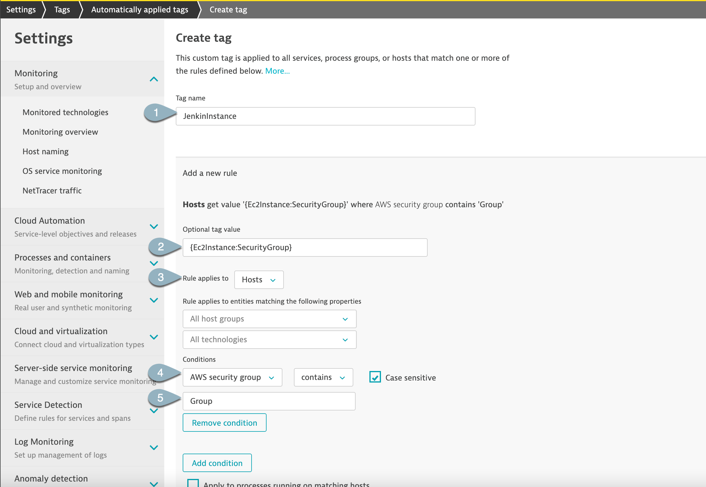
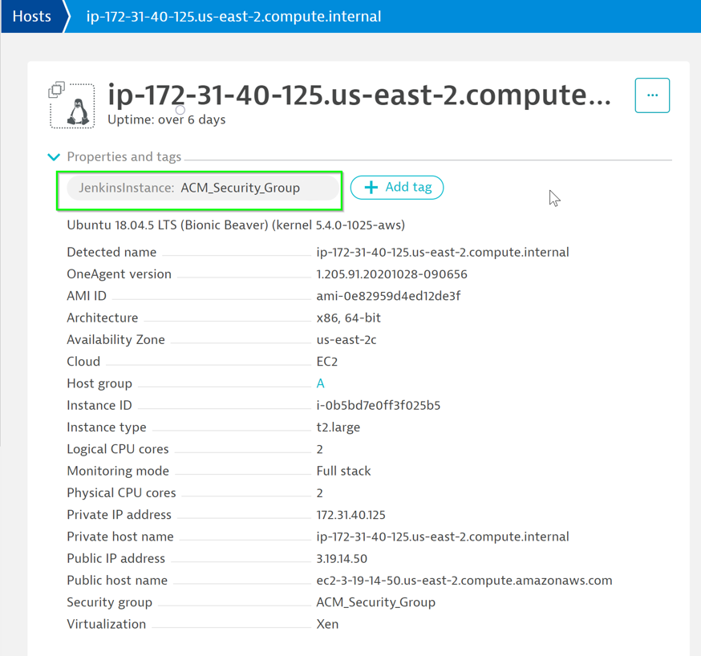
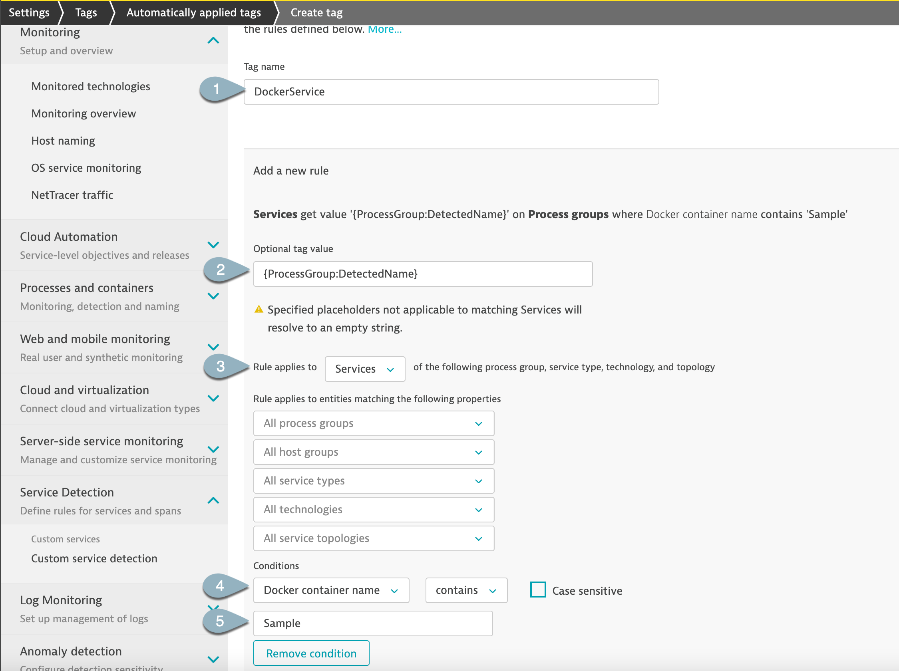
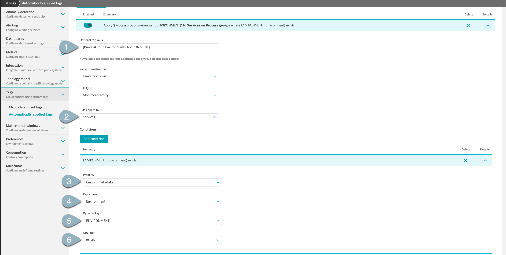

## Configure Dynatrace for integration with Jenkins
In this step, we will setup tagging rules to integrate Jenkins and Dynatrace. The tags will additionally help to limit the Jenkins events to the particular set of entities.

### Enable Security Vulnerability detection
Within Dynatrace, on the left menu go to **Settings > Application Security > "Runtime vulnerability detection"** and toggle **Enable runtime vulnerability detection**

### Creating Auto Tags
Within Dynatrace, on the left menu go to Settings > Tags > Automatically applied tags

Use the following:

* Tag name - `JenkinInstance`
* Optional Tag value - `{Ec2Instance:SecurityGroup}`
* Conditions -
* Dropdown **AWS Security Group**
* Dropdown **contains**
* ***Group***
* **Check** Case sensitive
* Click on **Save**

Within the Host Properties and tags, **JenkinsInstance tag** will be added

### Creating Tags for Build Stages
Use the following:
* Tag name - `DockerService`
* Rule applies to - Dropdown **Services**
* Optional Tag value - `{ProcessGroup:DetectedName}`
* Conditions -
* Dropdown **Docker container name**
* Dropdown **exists**
* Click on **Save**

Use the following:

* Tag name - `Environment`
* Rule applies to - Dropdown **Services**
* Optional Tag value - `{ProcessGroup:Environment:ENVIRONMENT}`
* Conditions -
* Dropdown **Custom Metadata**
* Dropdown **Key Source >> Environment** >> **Dynamic Key  >> ENVIRONMENT** >> **Operator >> exists**
* Click on **Save**

