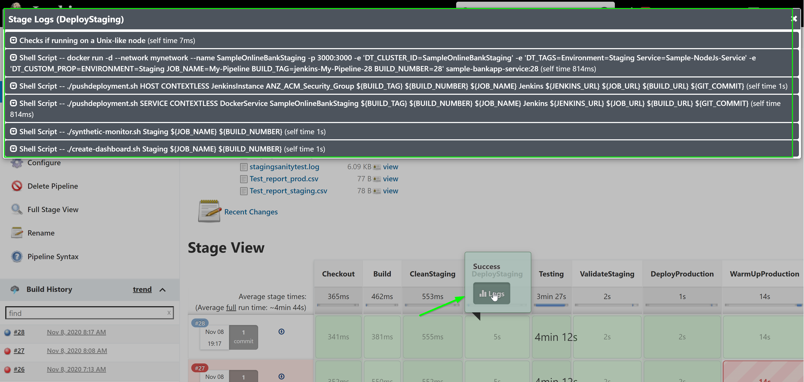
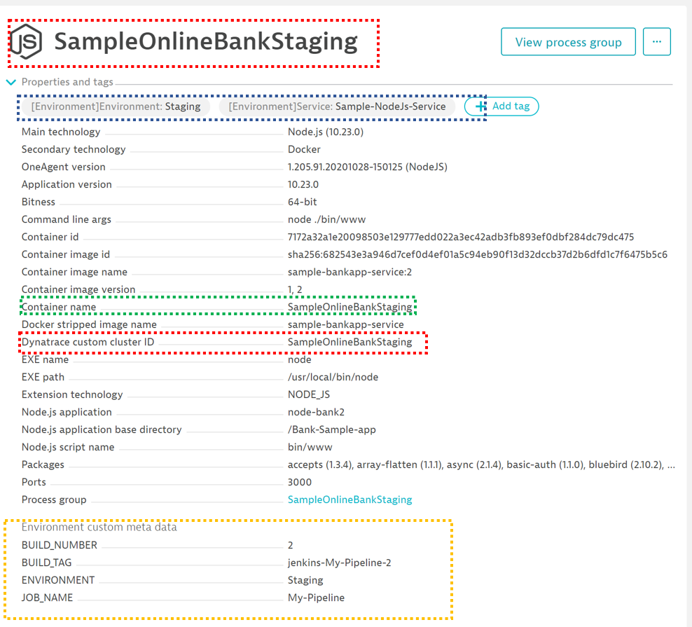
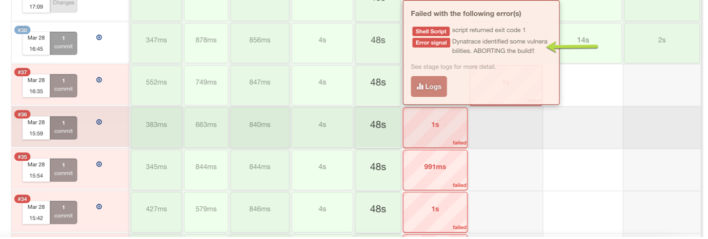
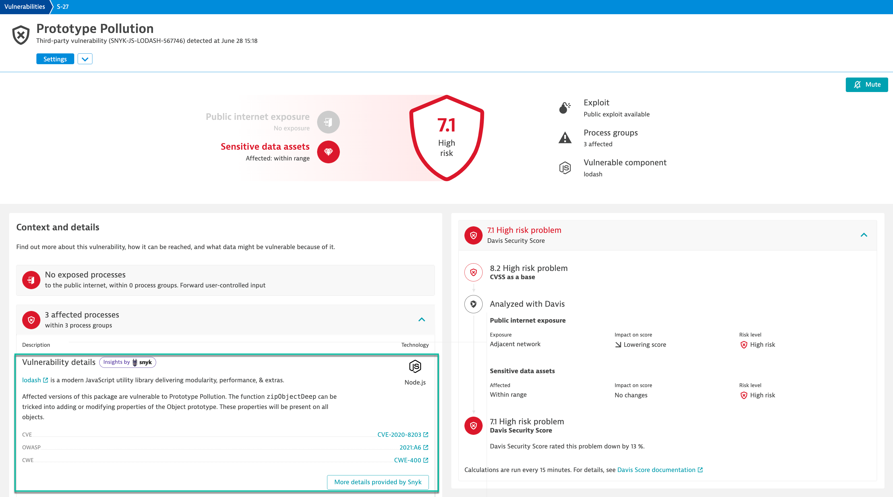
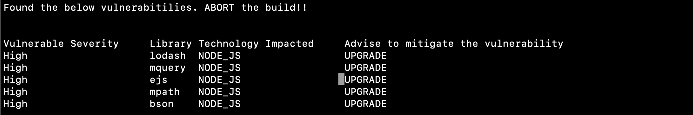
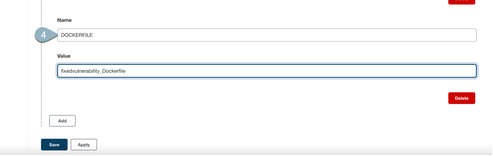
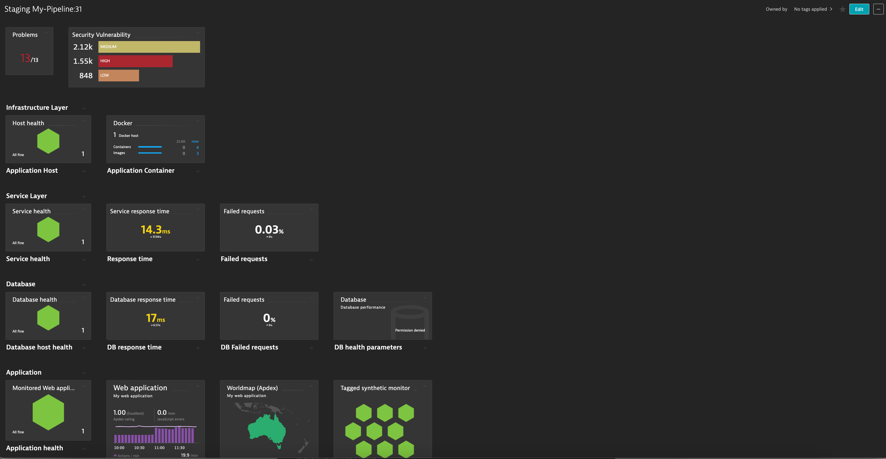

## Jenkins Build
In this step, we will trigger Jenkins Pipeline to create a build.

### Trigger a new Jenkins-build
Now as we have completed pre-requisities, we will trigger the build. To do so, within Jenkins, navigate to **Homepage** and click on **Build Now** as seen below


<!-- ----------------------- -->
### Decoding steps in each stage
In Jenkins, Click on **individual stages > Logs** to view details involved in that step.


### Understanding the tags in more detail
Referring to the Jenkins File, the following code handles the **pushing of Jenkins deployment information** into Dynatrace.
```bash
dir ('dynatrace-scripts') {
// push a deployment event on the host with the tag JenkinsInstance created using automatic tagging rule
sh './pushdeployment.sh HOST CONTEXTLESS JenkinsInstance ACM_Security_Group ' +
'${BUILD_TAG} ${BUILD_NUMBER} ${JOB_NAME} ' +
'Jenkins ${JENKINS_URL} ${JOB_URL} ${BUILD_URL} ${GIT_COMMIT}'
```

Referring to the Jenkins File, the following code handles the **pushing of deployment information** into Dynatrace. This step utilizes environment varibles such as ***DT_CLUSTER_ID***, ***DT_TAGS*** and ***DT_CUSTOM_PROP***
```bash
stage('DeployStaging') {
// Lets deploy the previously build container
def app = docker.image("sample-bankapp-service:${BUILD_NUMBER}")
app.run("--network mynetwork --name SampleOnlineBankStaging -p 3000:3000 " +
"-e 'DT_CLUSTER_ID=SampleOnlineBankStaging' " +
"-e 'DT_TAGS=Environment=Staging Service=Sample-NodeJs-Service' " +
"-e 'DT_CUSTOM_PROP=ENVIRONMENT=Staging JOB_NAME=${JOB_NAME} " +
"BUILD_TAG=${BUILD_TAG} BUILD_NUMBER=${BUILD_NUMBER}'")
```


### Review changes in Dynatrace
You can see the changes reflected in **SampleOnlineBankStaging Process View**

You also can see the changes reflected in **node-bank2 Service View**


### Automate/Continuous Feedback from Dynatrace
```bash
stage('Testing') {
// lets push an event to dynatrace that indicates that we START a load test
dir ('dynatrace-scripts') {
sh './pushevent.sh SERVICE CONTEXTLESS DockerService SampleOnlineBankStaging ' +
'"STARTING Load Test" ${JOB_NAME} "Starting a Load Test as part of the Testing stage"' +
' ${JENKINS_URL} ${JOB_URL} ${BUILD_URL} ${GIT_COMMIT}'
}

// lets run some test scripts
dir ('sample-bank-app-service-tests') {
// start load test - simulating traffic for Staging enviornment on port 3000

sh "rm -f stagingloadtest.log stagingloadtestcontrol.txt"
sh "python3 smoke-test.py 3000 200 ${BUILD_NUMBER} stagingloadtest.log ${PUBLIC_IP} SampleOnlineBankStaging"
archiveArtifacts artifacts: 'stagingloadtest.log', fingerprint: true
}

// lets push an event to dynatrace that indicates that we STOP a load test
dir ('dynatrace-scripts') {
sh './pushevent.sh SERVICE CONTEXTLESS DockerService SampleOnlineBankStaging '+
'"STOPPING Load Test" ${JOB_NAME} "Stopping a Load Test as part of the Testing stage" '+
'${JENKINS_URL} ${JOB_URL} ${BUILD_URL} ${GIT_COMMIT}'
}
```


Positive
:Davis would ingest and analyse the data which would further help in identifying probable root-cause and thereby, helping the backend teams to a quicker resolution.

### Build failure
After the load test, Dynatrace would check for any problems be it vulnerability or related to services health. Should there be an issue, the build would fail.


We will leverage API to fetch the vulnerabilities and depending on the outcome of the API call, we will proceed with the build.
```
stage('ValidateStaging') {
dir ('dynatrace-scripts') {
try {
// Check if there are vulnerabilities identified by DT
DYNATRACE_SEC_PROBLEM_COUNT = 0
DYNATRACE_SEC_PROBLEM_COUNT = sh 'python3 checkforvulnerability.py ${DT_URL} ${DT_TOKEN} [Environment]Environment:Staging 7.5'
} catch (Exception e) {
if (DYNATRACE_SEC_PROBLEM_COUNT) {
echo "Here I am.. "
error("Dynatrace identified some vulnerabilities. ABORTING the build!!")
currentBuild.result = 'ABORTED'
sh "exit ${DYNATRACE_SEC_PROBLEM_COUNT}"
}
echo "In here"
}
archiveArtifacts artifacts: 'securityVulnerabilityReport.txt', fingerprint: true
```

In this case, Dynatrace highlights critical vulnerabilities with one of the services 'node-bank'. It helps to drill down there is a particular library `lodash` which has vulnerability and is affecting 3 processes, thereby, aborting the build.



Now to identify the fix, we will use davisSecurityAdvisor API. This API would help identify the root-cause and the fix for a vulnerability.


So, let us upgrade the affected libraries and re-build our docker. In our case, we will use another Dockerfile that upgrades two of the affected libraries `lodash` and `nodejs`.


In order our pipeline build the docker using the modified Dockerfile, let us modify **environment variables** within Jenkins by navigating to **Manage Jenkins** > **Configure System**
Variable Name: **DOCKERFILE**
Value: **fixedvulnerability_Dockerfile**


From Jenkins, now we can **trigger the build** again.


### Dashboard creation
Leveraging the dashboard API, a dashboard is generated with information of the **health metrics**, **SLOs**, **Security Vulnerability** of **hosts/services/requests** invoked during Jenkins pipeline. These can be used to give a quick sneak peek of any issues to the operation/devOps team.
```bash
// Create a sample dashboard for the Application Security Automation.
sh './create-dashboard.sh Staging '+  '${JOB_NAME} ${BUILD_NUMBER}'
```



Similarly, during the build process we spun a synthetic monitor that will monitor the availability and performance of the deployed applications as experienced by different customers around the world and around the clock.
```bash
// Create a sample synthetic monitor so as to check the UI functionality
sh './synthetic-monitor.sh Staging '+  '${JOB_NAME} ${BUILD_NUMBER}' + ' 3000'
```


<!-- ----------------------- -->
