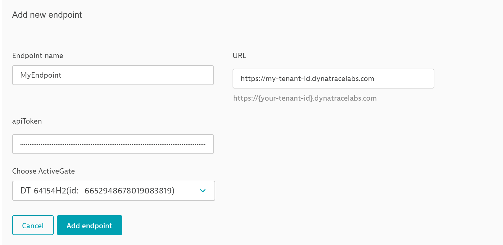
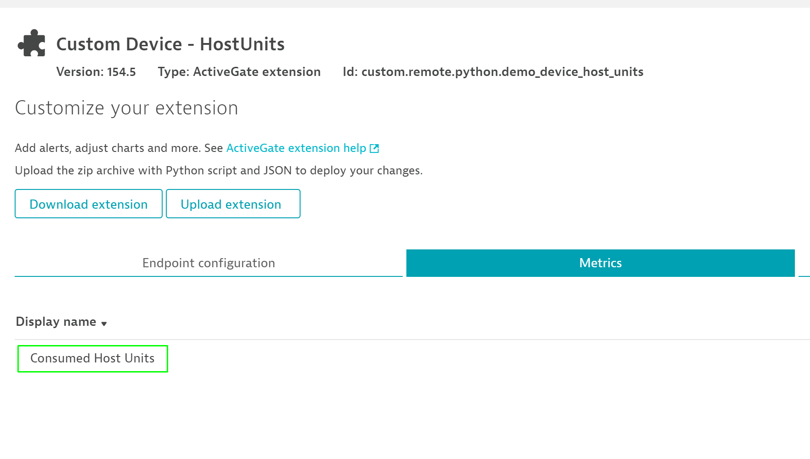
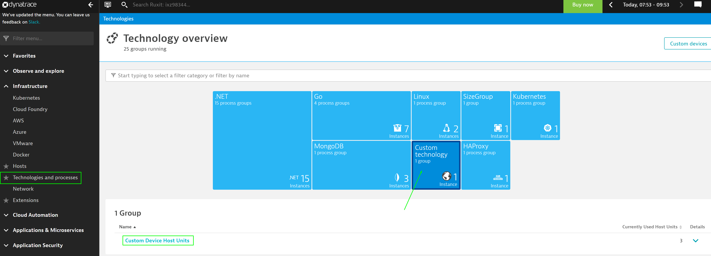
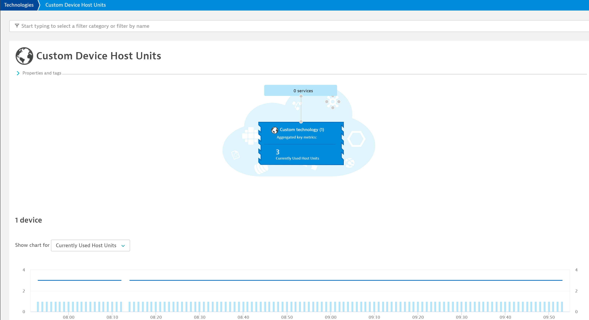

## Configuration

Now that the Custom Device is running you can go and see the metrics from your custom device.

1. Go to **Settings > Monitoring > Monitored technologies > Custom extensions**, find your extension and click on it.

2. Now it is time to add a new endpoint. Just come up with a name and enter the same URL as in the JSON file, select your Active gate host and click **Add endpoint**.
1. Enter your tenant URL according to the hint displayed underneath, as well as your previously created API-Token

3. See the available metrics under `Metrics` (next to `Endpoint configuration`).

4. Go to **Technologies and processes**, find your Custom Device by looking for the technology you specified in the ``python`` file ( in this example **Custom technology**) and click on it. The name of your group will pop up below, please also click on that. Wow! Now you can look at charts - they become more interesting over time as a greater period of time will be measured.

This is what the metrics look like for the example custom device:

