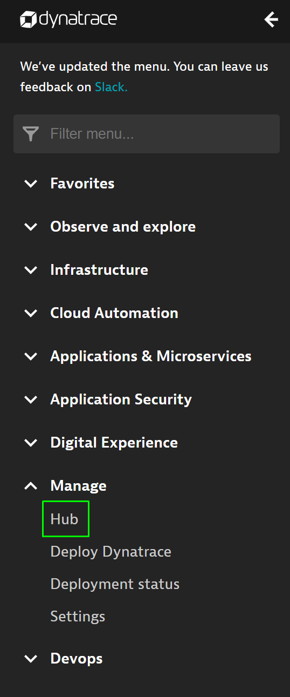
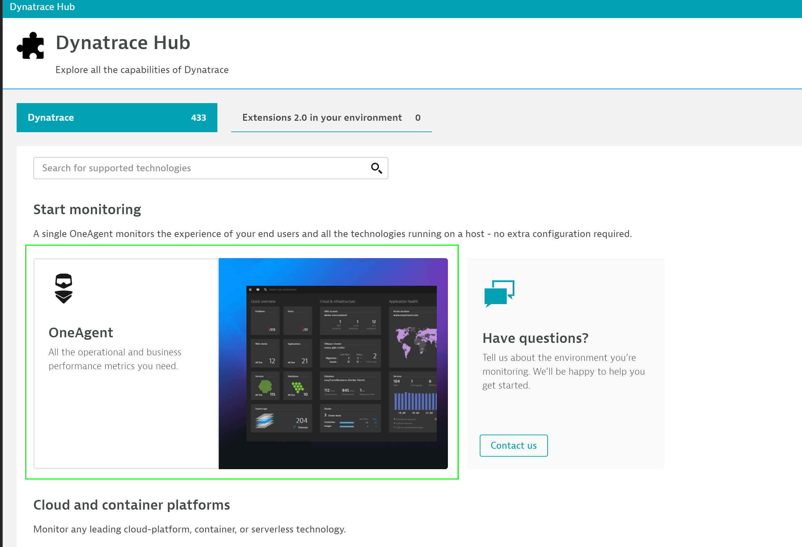
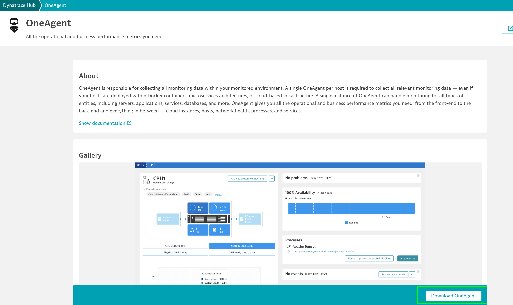
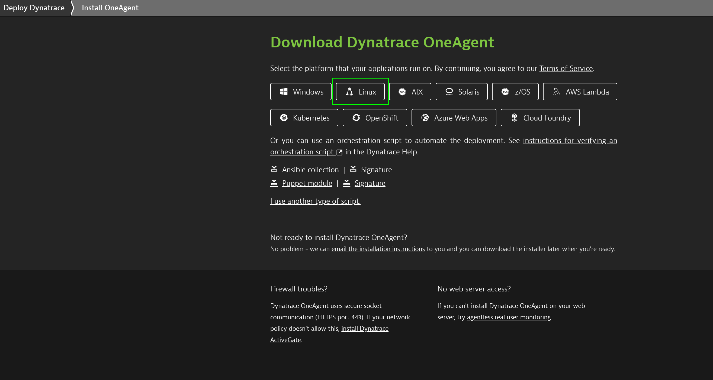
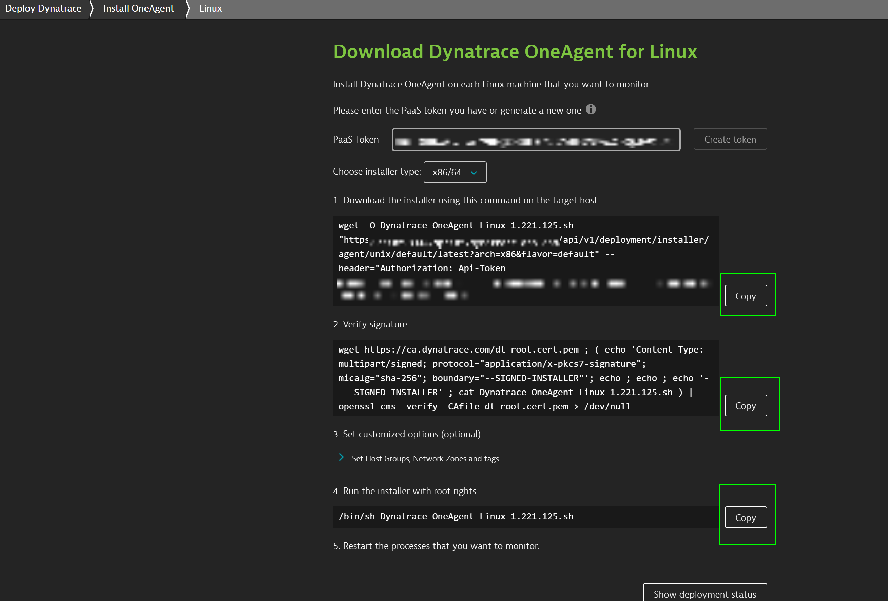

## OneAgent installation
Duration: 00:20:00

In this step, we will install the OneAgent.

Install the oneAgent so that the extension can report the metrics to Dynatrace

1. Within your tenant, select **Dynatrace Hub** from the navigation menu.



2. Click on the **OneAgent** field.



3. Click on **Download OneAgent** in the bottom right.



1. Choose your Operating System (x in this case) and create a new PaaS token, if you don't already have one. Than, simply copy the commands each and execute them.





6. Connect to your AWS instance by using the following credentials:

```bash
Username: dynatrace
Password: dynatrace
```

Now, become the root user by running `sudo su`

Positive
: Password is **dynatrace**

Further, let us start the application. In order to start the application, follow the steps as below:
Navigate to /home/ubuntu/mongo-extension folder by executing the following commands:

```bash
cd /home/ubuntu/mongo-extension
nohup npm start &
```


