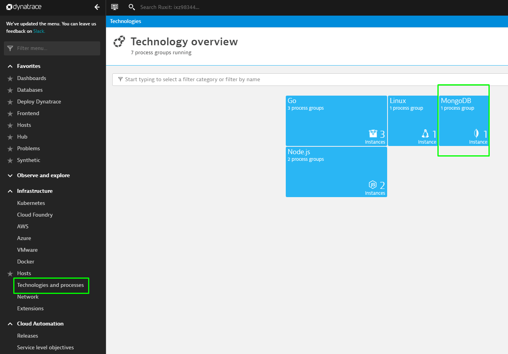
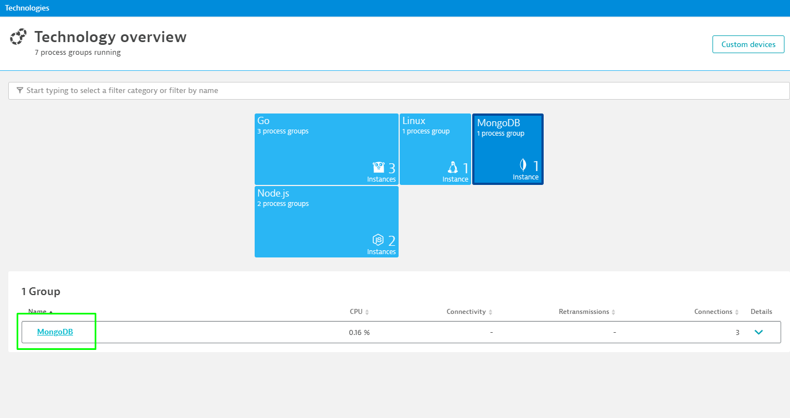
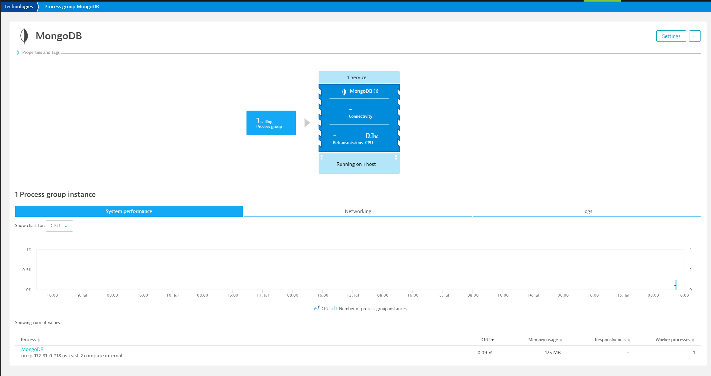
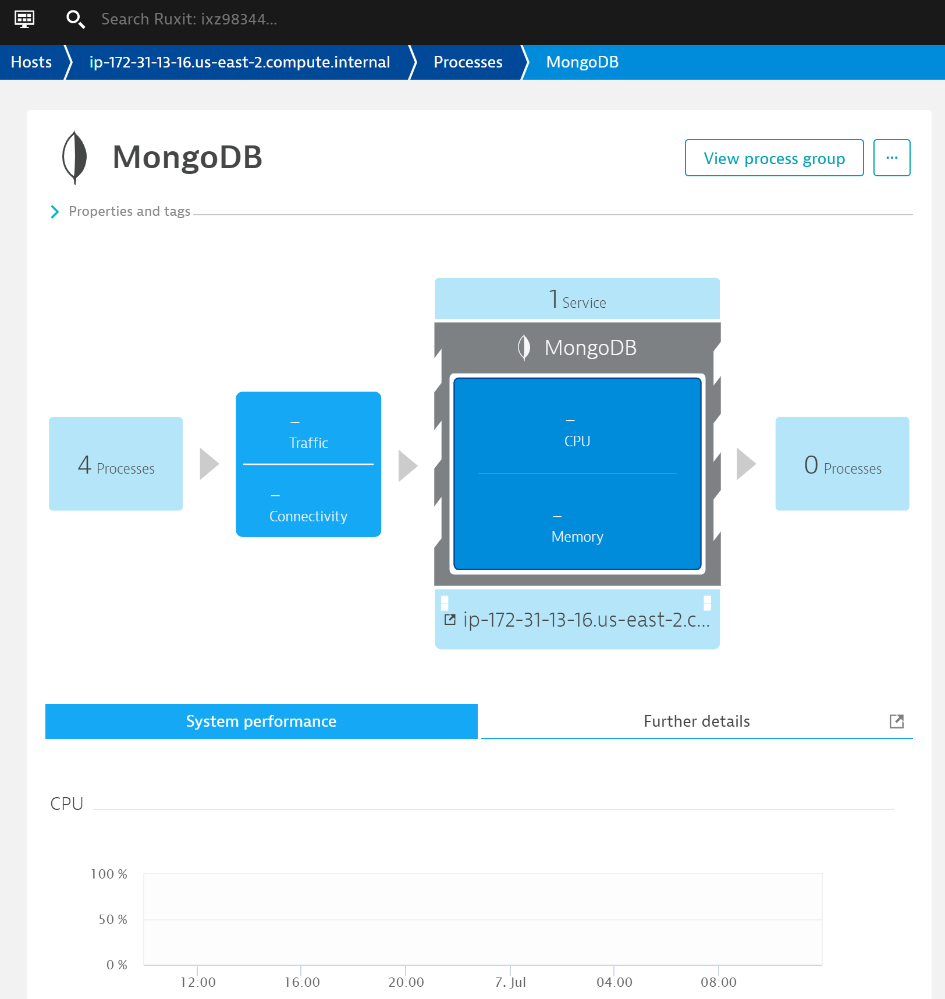
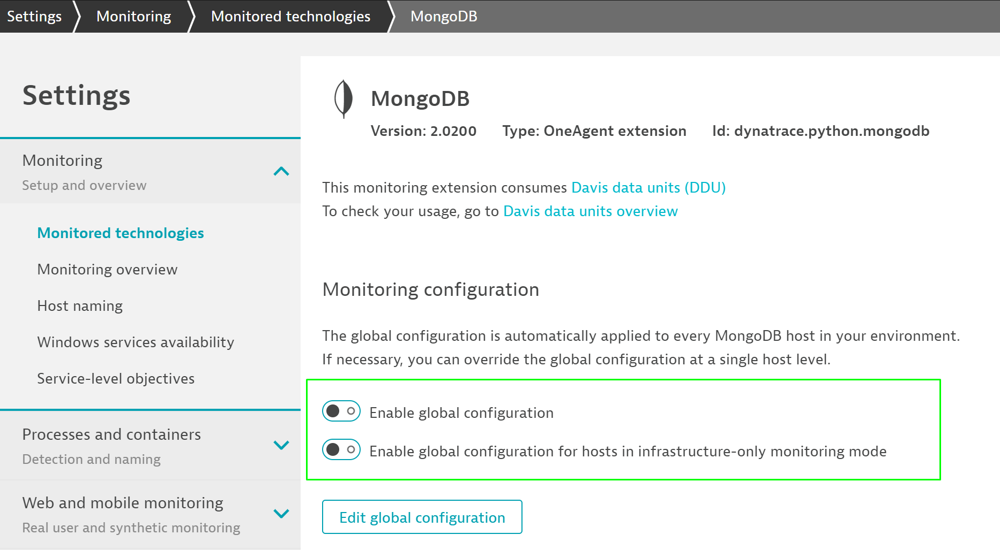

## Pre-requisites
Duration: 00:10:00

In this step, we will see the metrics that are pulled by dynatrace once you have the application running and made some calls to the database.

Dynatrace automatically identifies the services and database calls once you have installed oneAgent on your server. Let us explore the view that Dynatrace provides out-of-the-box for technology. We can use MongoDB as one of the example.

All the databases for your environment/management-zone are captured under the **Databases** menu option

That's already very helpful if you want to know how your database is performing, but there is more.

If we want to dive deeper, we can click on MongoDb and select the process group that has been created automatically.

This earlier view provides all the metrics that have resulted by the service calls to mongo-db and other critical health/technology metrics that are useful for running mongodb. However, you can extend the metrics by writing your own extension.

The process is also monitored, and that's where our extension is going to be reporting data to.

In the next steps, we will take a look on how to create and install an extension for MongoDB.

You need to disable the built-in extension that is already implemented in the OneAgent in order to get your own extension running.

To do that, go to **Settings / Monitored technologies** and look for the MongoDB entry. Click on the pen on the right to edit the configuration. You can easily enable this if you want to get this extension back running.

<!-- ------------------------ -->
