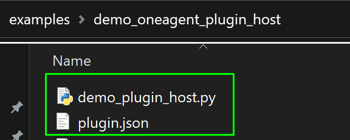
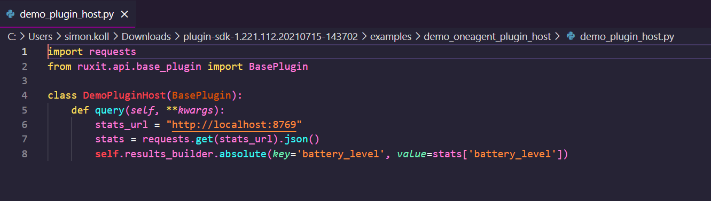
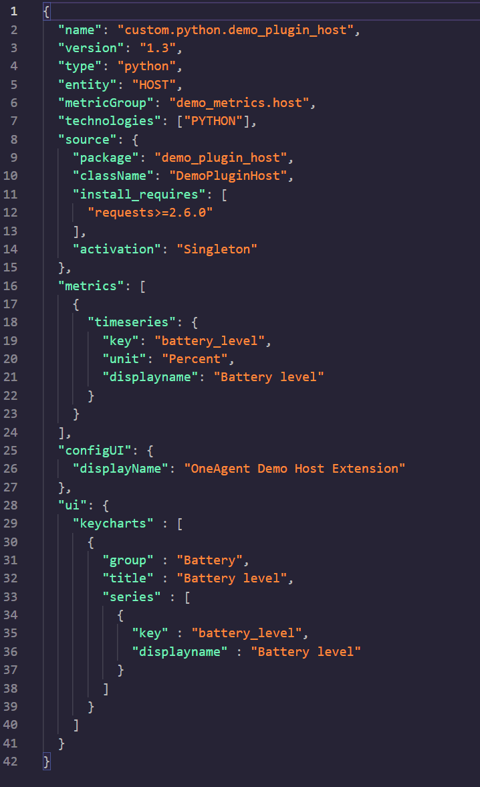

## Look at a example extension

In this step, we will take a look at what the examples look like

Before we start writing our own extension, let us look at a sample extension that is available.

In the folder, there are a few things to note

- The `docs` folder contains the [extension development guide](https://dynatrace.github.io/plugin-sdk/readme.html)
- The `examples` folder contains a few pre-written extensions that can help you build your own one
- Last but not least, you will find a `.whl` file, which is a common format in the python world for an installation file

Go into `examples` and choose one of the folders. For example, the `demo_oneagent_plugin_host`.

What are we looking at here?

Any extension would constitute of the following files:

- A `.py` file, which is where we are going to code our extension
- A `plugin.json` file, that contains 4 main config blocks: metadata, metrics, visualization, and configuration

Positive
: The other files are sample data and not part of the code that is required to be implemented as part of your extension




### Explore .py file



Creating any extension would involve the following functions:

1. Collect data - Identify the process where the extension would pull data from.
2. Send data - Define the metrics that you plan to populate using the extension
3. Data configuration - The configuration to visualize the metrics pulled using extension.

We use some libraries from BasePlugin class, so make sure you import the BasePlugin line as below:
```pyhton
from ruxit.apt.base_plugin import BasePlugin
```
### Collect Data

Under collect data, help identify the process endpoint where you will pull data from as below.
```pyhton
stats_url= "http://localhost:876
```

### Send Data

```python
self.results_builder.absolute(key='battery_level', value=stats['battery_level'])
```

In the above line, `battery_level` is the metrics for which you are populating the data and `value` is the value of that metric at that time.

Now, it gets really interesting:

```pyhton
self.results_builder.absolute(key='battery_level', value=stats['battery_level'])
```

### Configure the visualization
In this section, you can define the configuration to visualize the data.

The `key` is what you want the metric to be named, and the ``value`` is what is going to be displayed in the graph.

There are different versions of this function, so please check out the [documentation](https://dynatrace.github.io/plugin-sdk/_apidoc/ruxit.api.html#module-ruxit.api.results_builder) for further details.


Next, the ``plugin.json`` file:




Let us split the file into various sections as per their functionalities.

```json
{
"name": "custom.python.demo_plugin_host",
"version": "1.3",
"type": "python",
"entity": "HOST",
"metricGroup": "demo_metrics.host",
"technologies": ["PYTHON"],
```
The above section contains the metadata for your extension. Details of the important configurable are as below:
- **version**: This is the release or version details of your extension.
- **name**: the name of the extension and is customizable.
- **metricGroup**: the group where the extension would report the collected metrics to.

```json
"source": {
"package": "demo_plugin_host",
"className": "DemoPluginHost",
```

The value of **ClassName** has to be the same as you named the class in your python script, since OneAgent will look for this package while trying to retrieve data.

```json
"metrics": [
{
"timeseries": {
"key": "battery_level",
"unit": "Percent",
"displayname": "Battery level"
}
}
],
```
Here, we are defining what metrics we want to send to Dynatrace. You can specify here what name the metric should have internally, as well as the name that is going to be displayed in Dynatrace.

The above defines the visualization metrics for the extension as below:
- **key**: The internal name of the metrics that Dynatrace would create an entry for in its own database.
- **unit**: Mention the different units available.
- **displayName**: Display name on the screen.

```json
"configUI": {
"displayName": "OneAgent Demo Host Extension"
},
```
The `configUI:` part is where you can define the name that the custom extension will have in the Custom Extensions section.

```json
"ui": {
"keycharts" : [
{
"group" : "Battery",
"title" : "Battery level",
"series" : [
{
"key" : "battery_level",
"displayname" : "Battery level"
}
]
}
]
}
```
This part of the JSON defines how metrics are charted on each Process page.

If there is something specific you want to take a deeper look into, visit [the documentation](https://dynatrace.github.io/plugin-sdk/apidoc.html), as there you can see what part of the files you definitely need and what is optional


