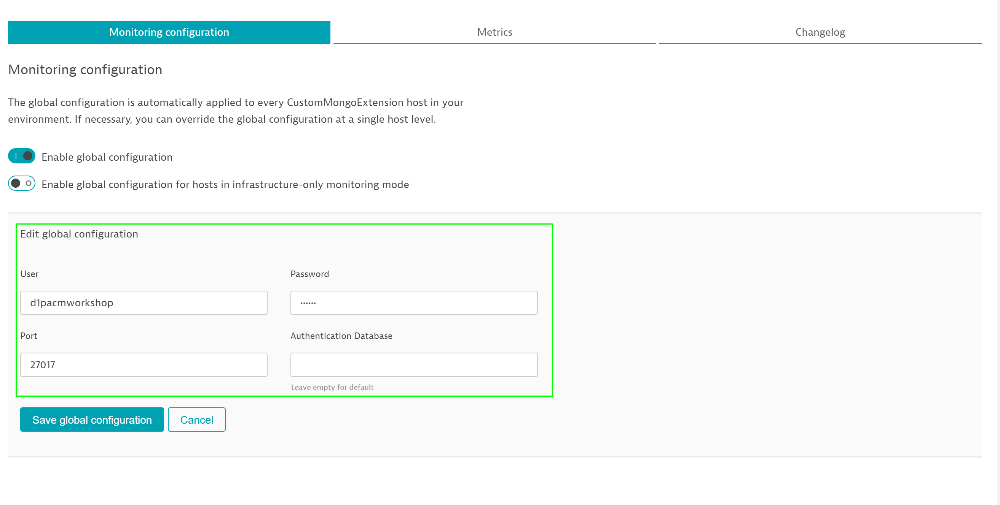

## Build, upload and configure
Duration: 00:45:00

In this step, we will build our extension, upload it and configure it.

### Build

In order to upload the extension to your environment, you first have to build it.

Make sure you are in the folder with your `.py` and `.json` file.

Than, run `plugin_sdk build_plugin --no_upload`

The output will look something like this :

```bash
Starting oneagent_build_plugin
Validating plugin.json against schema
Plugin data: Plugin name=custom.python.custom_mongo_extension, version=3.0.02
...
========================================
Plugin deployed successfully into /opt/dynatrace/oneagent/plugin_deployment/custom.python.custom_mongo_extension
Plugin archive available at /opt/dynatrace/oneagent/plugin_deployment/custom.python.custom_mongo_extension.zip
========================================
```

This will automatically build the extension and copy the built version to the plugin deployment folder.

In this tutorial we assume that OneAgent is running on the machine where we develop and build the plugin as well as the monitored technology is running on this host so this step may be skipped.

In real-life scenarios we assume that the plugin development and building is prepared on a developer's machine and when the plugin is ready it has to be deployed to all production machines or at least the one where monitored technology is running. This is achieved by manual unpacking the built plugin zip file to plugin_deployment directory which is a sub-directory of OneAgent, depending on the operating system, but for is in Linux it is located in `/opt/dynatrace/oneagent/plugin_deployment`

The `.zip` that has been generated and is now located in the this folder is what we need to upload to Dynatrace.

In your environment, go to **Settings / Custom extensions / Upload extension** and upload the `.zip` folder.


In this case, you have to enter the database credentials in order for the extension to work.
This will be indicated yellow.

You can change these credentials anytime by clicking on **Edit global configuration**.



After the connection to the database has finished, your hosts will be displayed as **monitored correctly**.


<!-- ------------------------ -->
