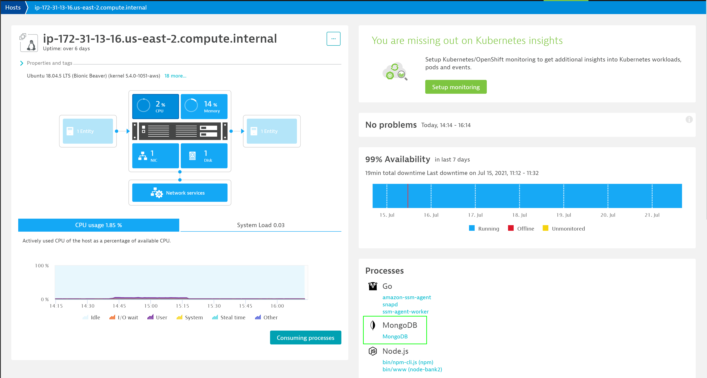
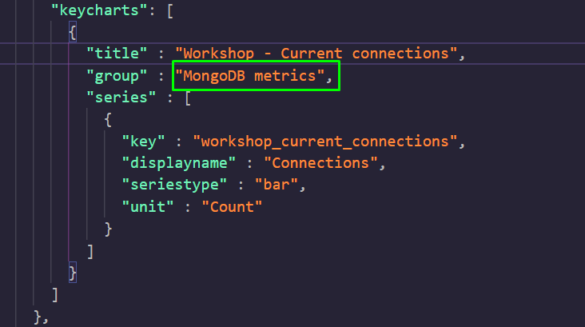
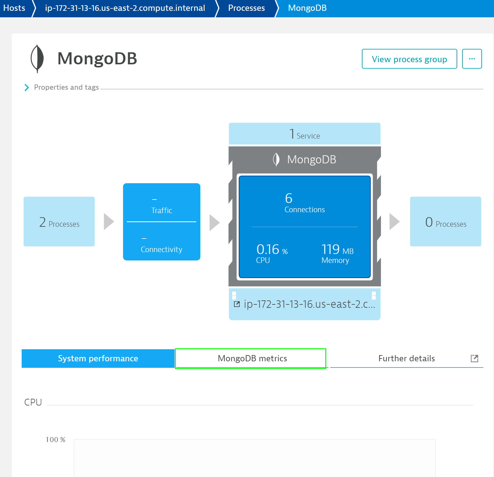
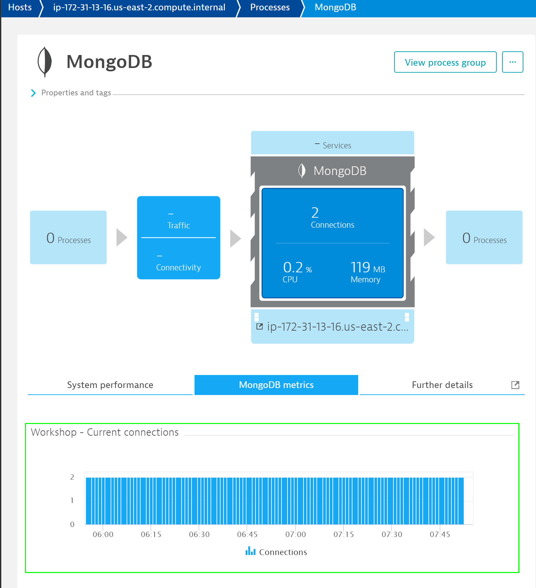

## What's new?
Duration: 00:15:00

### Where to find the new metrics

So, now that we have installed our extension, we want to see it working.

To do that, you have to go to **Hosts** and select the one or one of the hosts. Then, select the process that is submitting data, e.g. **MongoDB**.

Now, there is a tab called **MongoDB metrics**, or however you named it in the `plugin.json`

If you click on this tab, there are you custom metrics that your extension gathered:

<!-- ------------------------ -->
