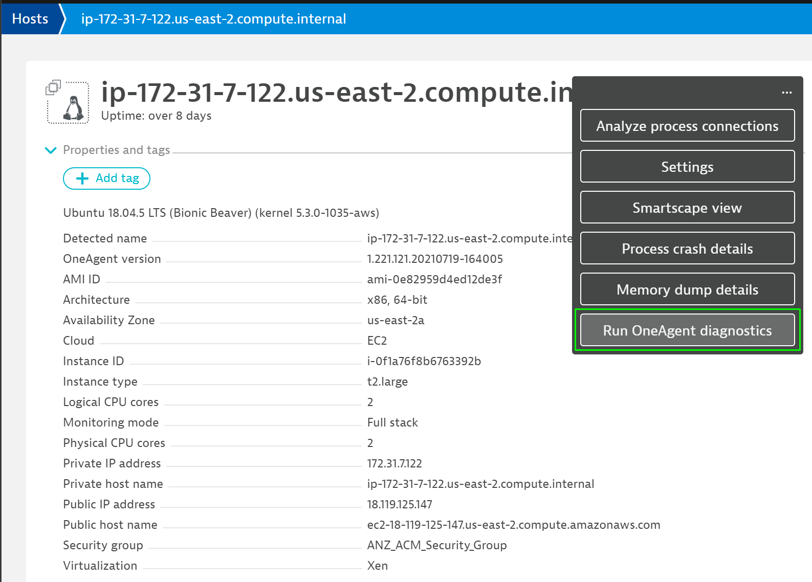
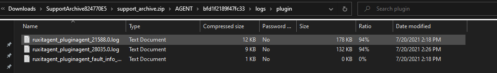

## Troubleshooting
In this step, we will take a look at what you can do if the extension is not working correctly.
### What to do when something is not working correctly

First, check if the name of you python file and the name in the ``.json`` file are both correct.

Another step you should take after deploying the extension on the host is to restart the OneAgent to reload the installed extensions.

Also, it is advisable to restart the database if the custom metrics are not showing up.

If still nothing is showing up, you can backup anything that is in the  `/opt/dynatrace/oneagent/plugin_deployment`, and re-deploy every extension  by itself to make sure they don't conflict each other.
Again, restart your OneAgent before re-deploying.

Another way would be to check the OneAgent logs if there are any **severe** anomalies. To do that, go to the host where you installed the extension and click on the three dots and click on **Run OneAgent diagnostics**

There, you can describe the issue you are facing and click on **Start analysis**.

After a short time, you can clock on **Refresh** and download the folder that contains the logs.
In there, go into a folder that located on a path that looks something like this: **SupportArchive824770E5.zip / support_archive / AGENT / bfd1f2189f47fc33 / logs / plugin**.

Sort by **Date modified** to get the latest log and scroll all the way down to the bottom.

