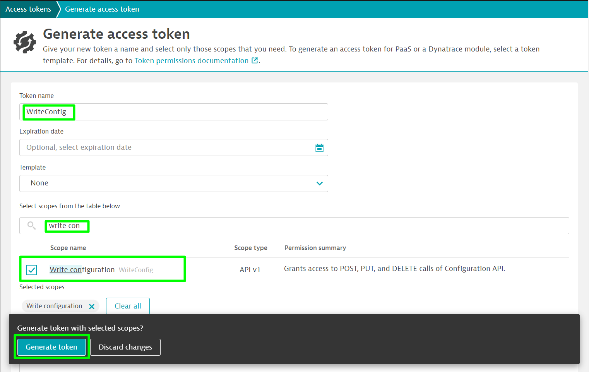
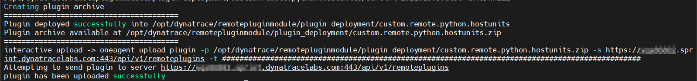

## Build and Upload
In this step, we will build and deploy the extension.

### Generate Extension Upload Token
To upload the extension we first need to generate a token with **WriteConfig** permissions.
We will follow the same steps as before, the only difference being that of using the **WriteConfig** permissions.



Save that token somewhere safe as we will use it in the following step.

### Build the plugin
To build the plugin, navigate to the folder with python and JSON file that was created for the extension and run the following commands:
```
$ sudo su
$ plugin_sdk build_plugin --token {token}
```

This will create, build and upload the extension and the details of the plugin archive would be displayed as below.


Other Options you can run with the plugin_sdk can be found by running plugin_sdk --help or plugin_sdk build_plugin --help


