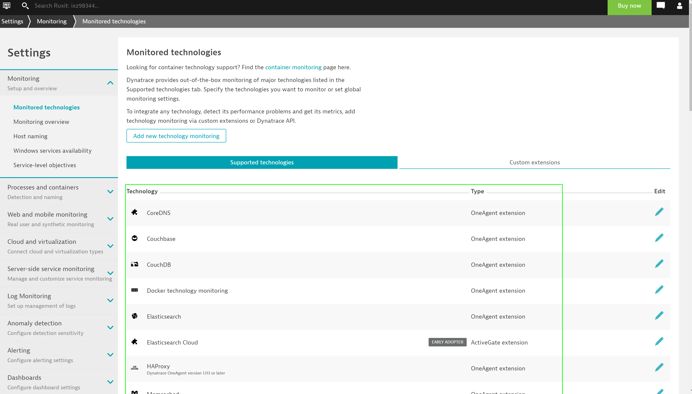
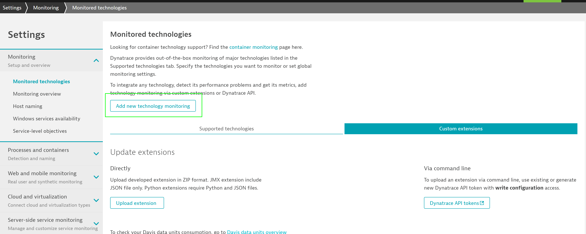
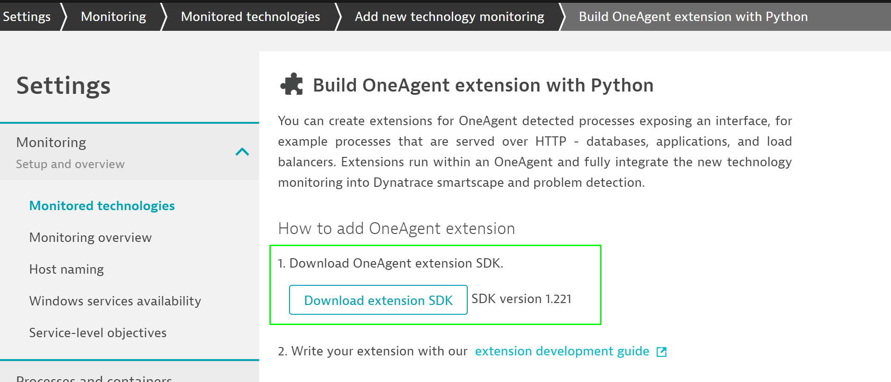

## The PluginSDK
Duration: 00:10:00

In this step, we will take a look at the PluginSDK that is needed to code your extensions.

#### What is the Plugin SDK and what do we need it for?

The Plugin SDK is crucial when it comes to creating your own extensions.
It contains a few example extensions that can be modified to your needs, as well as a script that lets you easily compile, build, or upload the extension to your environment. Lets have a look on how to create your own MongoDB extension:

#### Download the SDK

Within your tenant, navigate to **Settings** menu option
Dynatrace bundles some extensions by default - this view will provide overview of all the extensions that are available for you to use.

To upload your customized extension, navigate to **Custom Extensions** and click on **Add new technology monitoring**.

On the right, click on **Add OneAgent Extension**, and than on **Download extension SDK**.

Additional information on build extensions can be found in our documentation [here](https://dynatrace.github.io/plugin-sdk/readme.html)

Once the extension is downloaded, extract the downloaded .zip folder.

#### Install the SDK

One of the important pre-requisites for extension to work is to make sure you are using the same OS and Python version as that of the host where you would deploy the extension to. This is required as some Python libraries use natively compiled code.

To install the PluginSDK, `cd` into the folder that you downloaded and run

`pip3 install plugin-sdk-your.version.number`

To verify the installation was successful, run `plugin_sdk`

Positive
: Close your bash and reopen it if the command is not found

