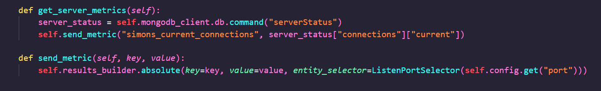

## Examine the files
Duration: 00:50:00

In this file, we will take a look at what our new files contain.

### List of Learnings
- what is new in the python file
- what is new in the JSON file

### The python file

Lets look at the `custom_mongo_extension.py` file:

First thing to notice is the connection to the MongoDB database, as well as the call of the method that gathers data for us. Let's look at this one:



```python
self.mongob_client.db.command("serverStatus")
```
Here, the extension executes the command to gather data from the database.

To send this to Dynatrace, we need the `send_metric` function.


There are different versions of this, so please check out the [documentation](https://dynatrace.github.io/plugin-sdk/_apidoc/ruxit.api.html#module-ruxit.api.results_builder) for further details.


### The JSON file

What is new in the JSON file?

We can specify properties in the JSON file, like this:

```json
"properties" : [
{
"key" : "port",
"type" :  "String",
"defaultValue" : "27017"
},
{
"key" : "auth_user",
"type" :  "String",
"defaultValue" : "******"
},
{
"key" : "auth_password",
"type" :  "Password",
"defaultValue" : "******"
},
{
"key" : "auth_db",
"type": "String",
"defaultValue":  ""
}
]
```
These attributes can be used in your extension by using :

```python
self.config.get("<attribute_name>")
```
If you want to configure these properties after uploading the extension to Dynatrace, you can use the `properties` attribute in the `configUI` section:

```json
"configUI" :{
"displayName": "CustomMongoExtension",
"properties" : [
{ "key" : "auth_user", "displayName": "User", "displayOrder": 1 },
{ "key" : "auth_password", "displayName": "Password", "displayOrder": 2 },
{ "key" : "port", "displayName": "Port", "displayOrder": 3 },
{ "key" : "auth_db", "displayName": "Authentication Database", "displayOrder": 4, "displayHint": "Leave empty for default" }
]
},
```
By defining this, you are able to specify e.g. a different database user on a specific host, or a different port as well a authentication database if one host is equipped with it.


In this case, we can get the user, the password, the port and optionally the authentication database.


Let's continue by uploading the extension and building it.

<!-- ------------------------ -->
