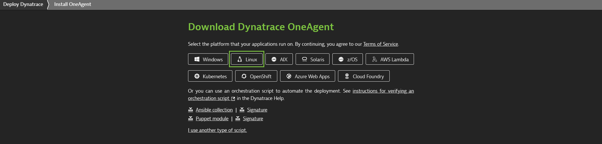
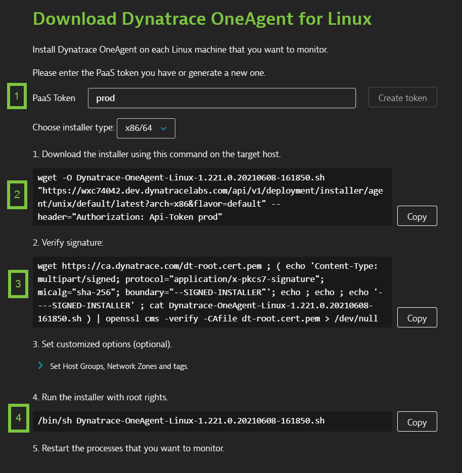
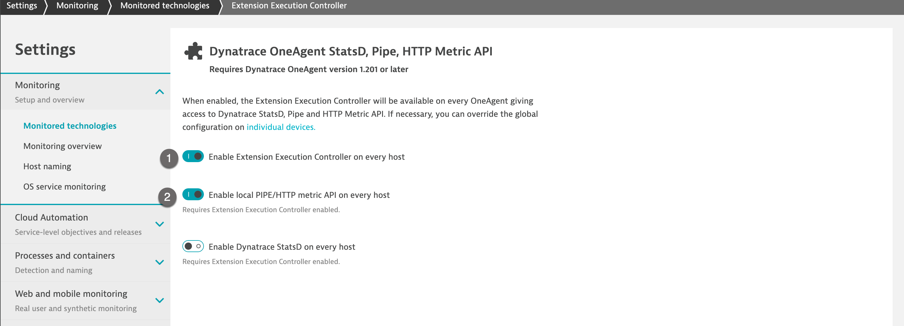
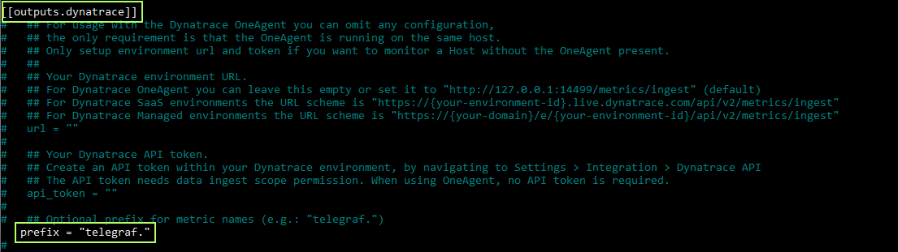

## Telegraf configuration with OneAgent
In this step, we will install oneagent and enable telegraf configuration to start reporting metrics to Dynatrace.

### OneAgent Installation

Connect to your AWS instance with the following credentials
- Username: **d1pacmworkshop**
- Password: **dynatrace**

Now become the root user by issuing
```
$ sudo su
```
*Hint*: Password for root is *dynatrace*

If you have installed oneagent in the previous lab, skip this step and move to the next step.

If not, we will install OneAgent in our host (EC2 Instance), please follow the steps below:

1. Within Dynatrace, please navigate to **Deploy Dynatrace**
1. Click on **Start installation**
1. Click on **Linux**
1. Click on **Create token** to generate a PaaS token or we can use a token if we have saved it previously.
1. **Copy** the command provided in the "Download the installer using this command on the target host" text field. **Paste** the command into your terminal window and execute it.
1. (Optional) Once the download is complete, you can verify the signature by copying the command from the *"Verify signature"* text field, then pasting the command into your terminal window and executing it. Make sure your system is up to date, especially SSL and related certificate libraries.
1. **Copy** the command from "Run the installer with root rights" text field.




> Negative
: If you have oneagent installed already, you can skip the above step.

### Tenant configuration
Within your tenant, navigate to **Settings > Monitoring > Monitoring technologies > Dynatrace OneAgent StatsD, Pipe, HTTP Metric API** and toggle "Enable Extension Execution Controller on every host" and "Enable local Pipe/HTTP metric API on every host" so that oneagent can make API calls to push the telegraf metrics to the tenant.





### Telegraf Configuration
Please use the following steps to configure Telegraf configuration file

1. Open Telegraf configuration file under

```bash
$ sudo vim /etc/telegraf/telegraf.conf
```

2. Please uncomment below tags under telegraf.conf (remove '##')
* Uncomment [[outputs.dynatrace]]
* Uncomment prefix = "telegraf."



3. Please save the changes, please restart telegraf service for the changes to take effect. To do so, please run below command

```bash
$ service telegraf restart
```

