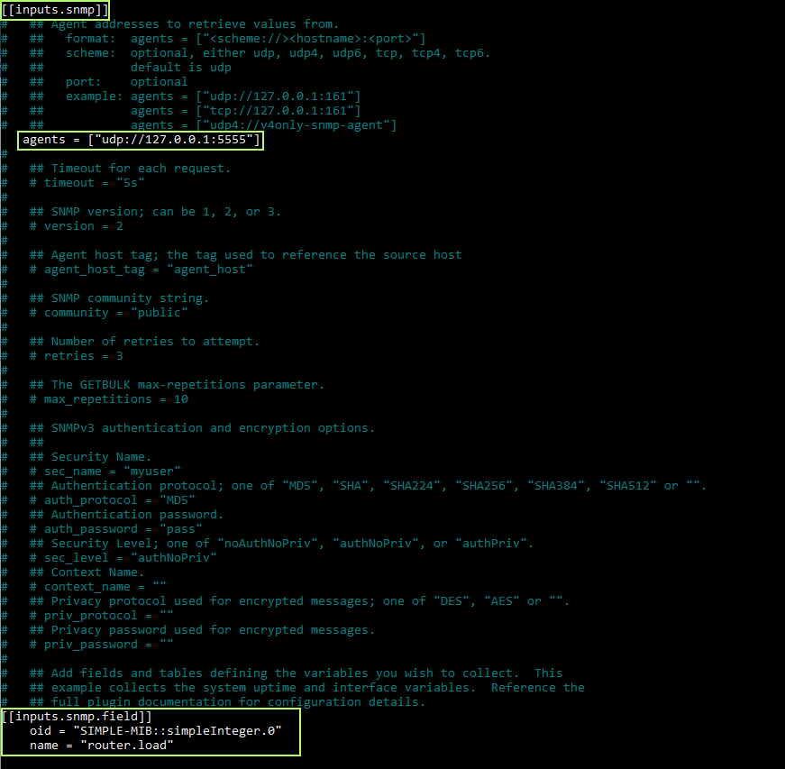

## Configure Telegraf to retrieve the metrics

In this step, we will configure telegraf.conf file to start retrieving metrics from the SNMP simulator.

In order to retrieve metrics, please make the changes below in **/etc/telegraf/telegraf.conf** so that we can enable SNMP in Telegraf:

```bash
$ sudo vim /etc/telegraf/telegraf.conf
```

* Uncomment [[inputs.snmp]]
* Add agents = ["udp://127.0.0.1:5555"]
* Add below lines for metric

``` json
[[inputs.snmp.field]]
oid = "SIMPLE-MIB::simpleInteger.0"
name = "router.load"
```



Please save the changes and restart telegraf service for the changes to take effect. To do so, run below command

```bash
$ sudo service telegraf restart
```

