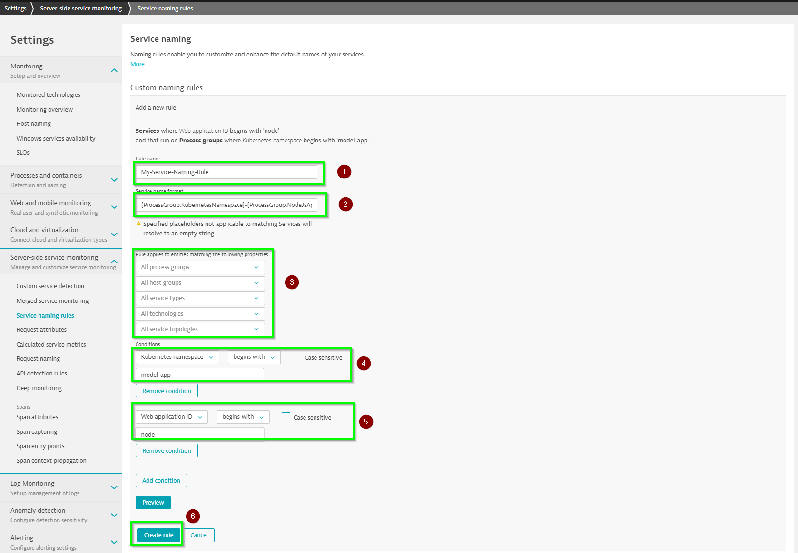

## Setup your service naming rule (add the Kubernetes namespace and the application names to the service)

1. Go to **Settings -> Server-side service monitoring -> Service naming rules**
2. Click **Add a new rule**
3. Provide a name say "My-Service-Naming-Rule", then set the Service name format as **{ProcessGroup:KubernetesNamespace}-{ProcessGroup:NodeJsAppName}**
4. Set the conditions based on Kubernetes namespace and application names (use **Add condition** to add more conditions)
5. Click **Create rule** once we have configured all the fields

> Note: Make sure you have defined the fields as below

