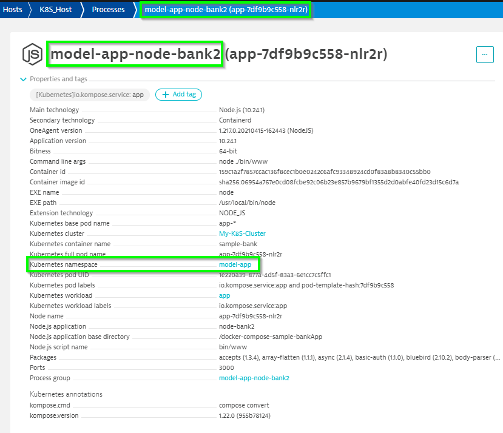
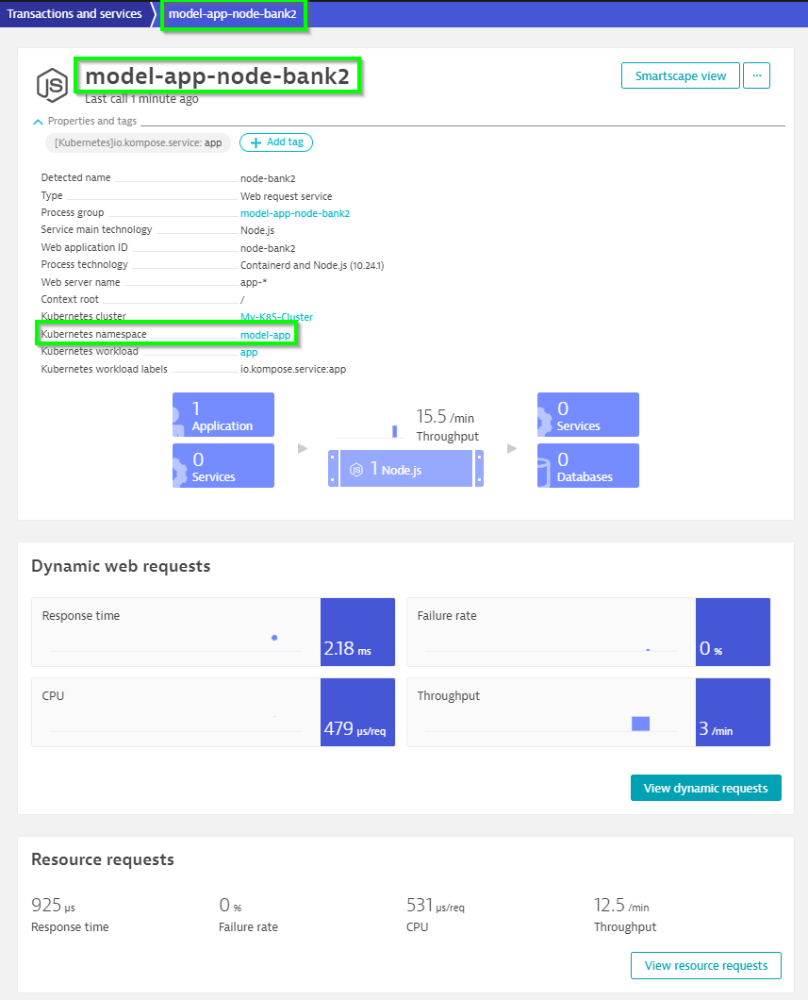
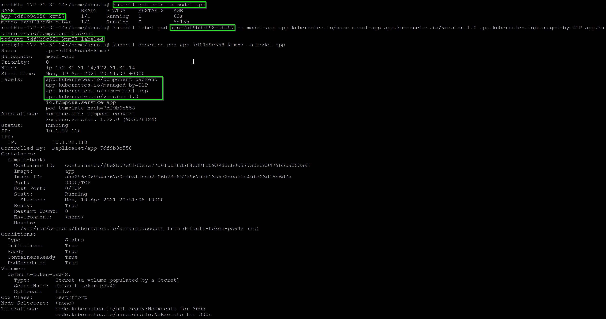

## Process and service names after the use of Dynatrace naming rules:

Go to **Hosts -> < Your-Kubernetes-Host > -> < Your-application-process >**

Select **Service running on the process that we chose in the previous step**

# Kubernetes labels in Dynatrace

Dynatrace automatically detects all labels attached to pods at application deployment time. In this step, we add few lables to the running application pod.

You should be able to view all the application pods running in your cluster by executing:

`kubectl get pods -n model-app`

Copy the application pod details and add the below labels using command:

`kubectl label pod my-app-pod -n model-app app.kubernetes.io/name=model-app app.kubernetes.io/version=1.0 app.kubernetes.io/managed-by=D1P app.kubernetes.io/component=backend`

We can validate the pod labels using the command:

`kubectl describe pod my-app-pod -n model-app`

**NOTE**: Replace the my-app-pod string with the actual pod name determined using earlier command.

