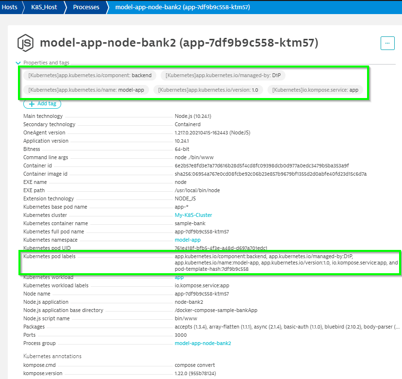
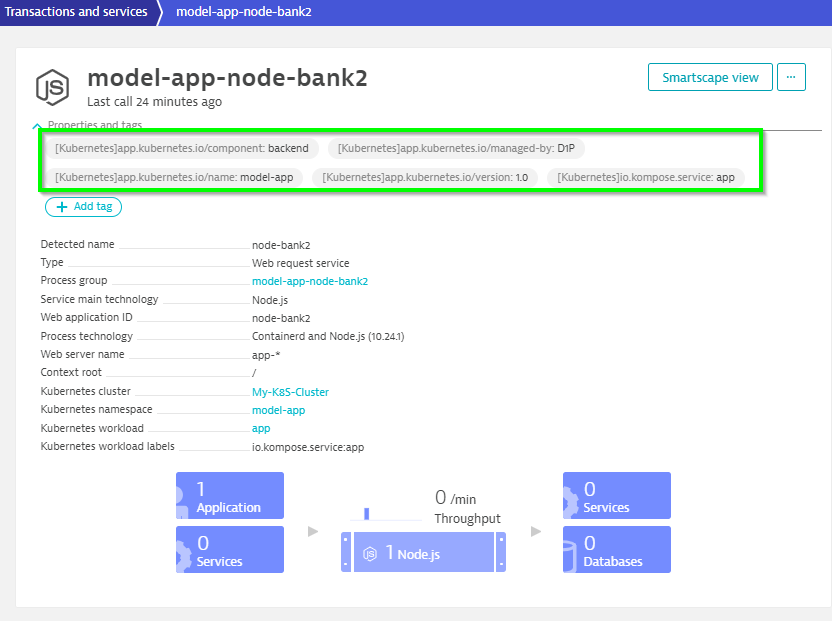
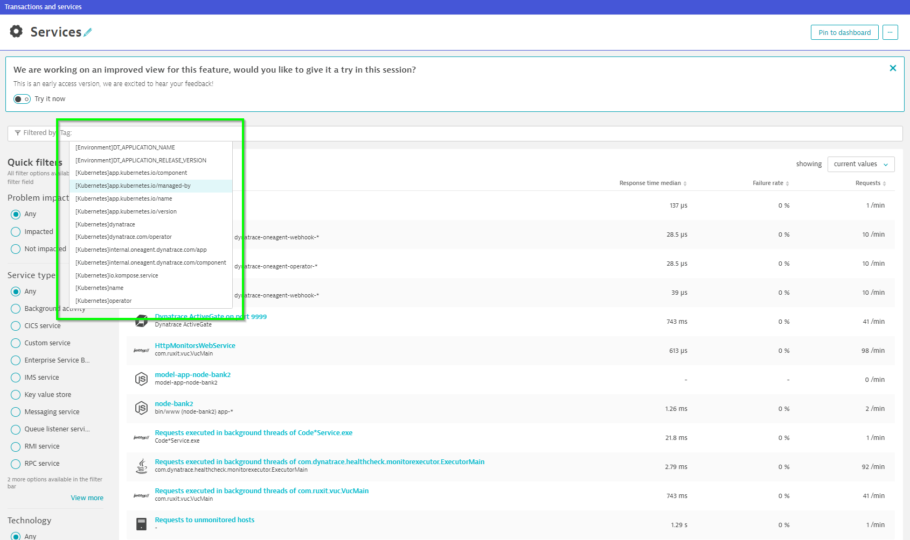
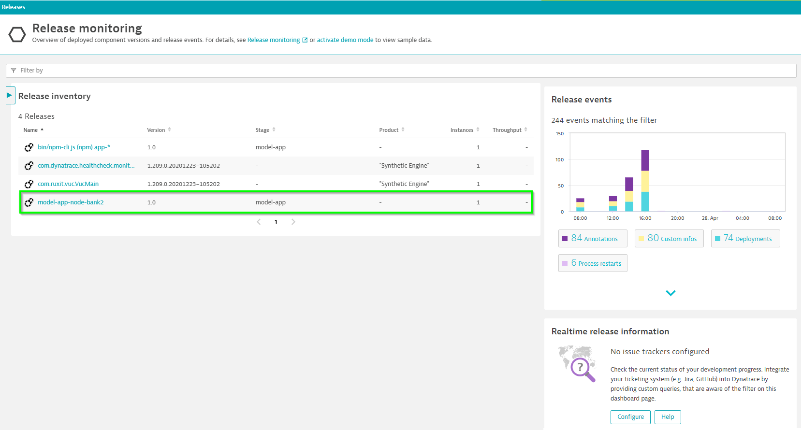
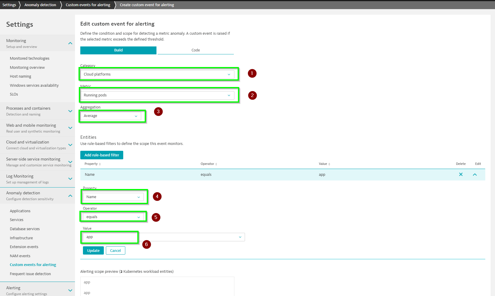
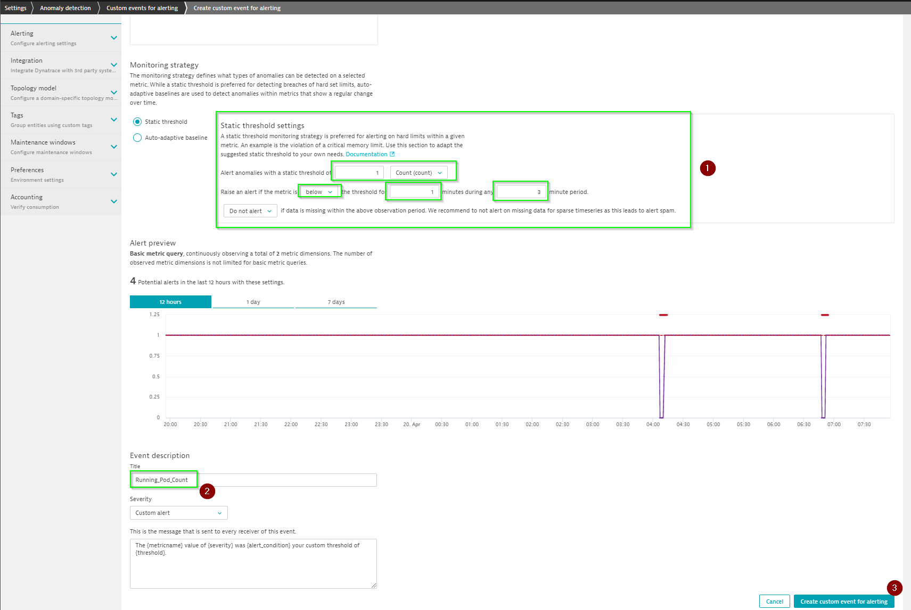

## Leverage Kubernetes labels in Dynatrace

Grant viewer role to the service account that is associated to your application pod. We will add view privileges to the default service account in your application namespace using the command:

`kubectl -n model-app create rolebinding default-view --clusterrole=view --serviceaccount=model-app:default`

**NOTE**: You can use any name for the string default-view

Your Kubernetes labels will be automatically attached as Kubernetes tags to all monitored Kubernetes processes and services in your Dynatrace environment as below.

These Kubernetes tags can be used in searches, alerting profiles and other places within Dynatrace like any other Dynatrace tags

# Release monitoring

Dynatrace detects versions of monitored processes based on multiple version detection strategies. For Kubernetes, labels from the deployed pods provide application and version metadata. Thus, Version, Kubernetes namespace and number of instance details show up in the real-time inventory section of the Release page which is available at **Releases** on the left menu.

# Availability alert for running pods

In Dynatrace, we make use of custom events to check the availability of running pods in your application. Follow the below steps to create the custom event.

1. Go to **Settings -> Anomaly Detection -> Custom events for alerting**
2. Click **Create custom events for alerting**
3. Select the Category as **Cloud Platforms**. Then, choose the Metric as **Running pods for Wokloads**.
4. Set the aggregation as **Average**
5. Create a rule based filter based on the Kubernetes workload name(use **Add rule-based filter** to add more filters)
6. Click **Create rule-based filter** once we have configured all the fields in this section
7. Set the static thresholds for the pod count
8. Give a name say **Running_Pod_Count** for the event in **Event Description** section
9. Once we have configured all the fields, click **Create custom events for alerting**

