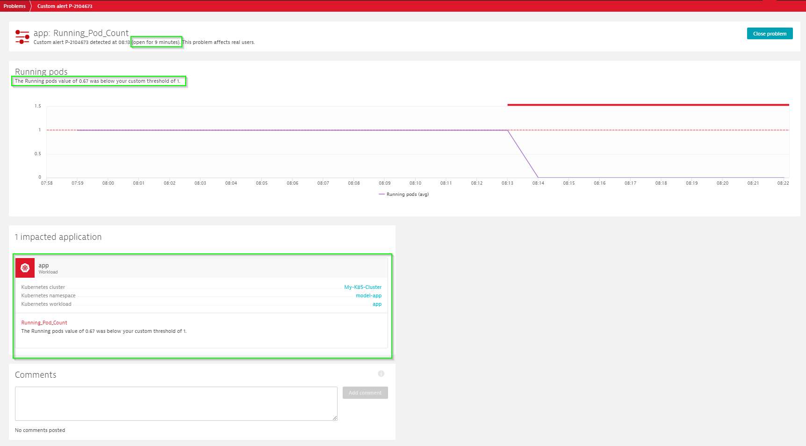
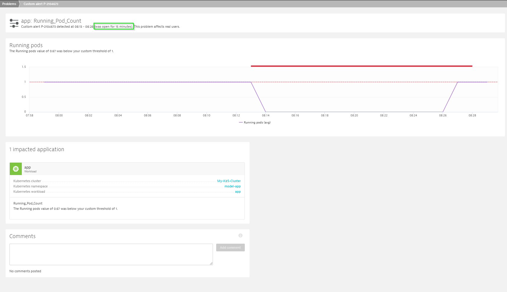

## Trigger custom events

To trigger an event, we can stop the running pods in the Kubernetes cluster using the below command:

`kubectl scale --replicas=0 deployment/app --namespace=model-app`

Problem gets opened in Dynatrace with information about the event.

Dynatrace AI engine checks the status of the event frequently and resolve the problem automatically as soon as the count of the running pods come back to normal.
To resolve the problem, we can scale up the running pods in the Kubernetes cluster using the below command:

`kubectl scale --replicas=1 deployment/app --namespace=model-app`

Problem gets resolved in Dynatrace.

