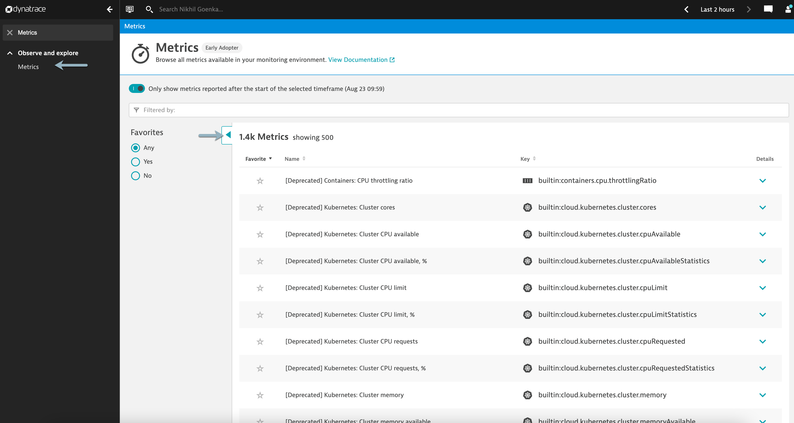
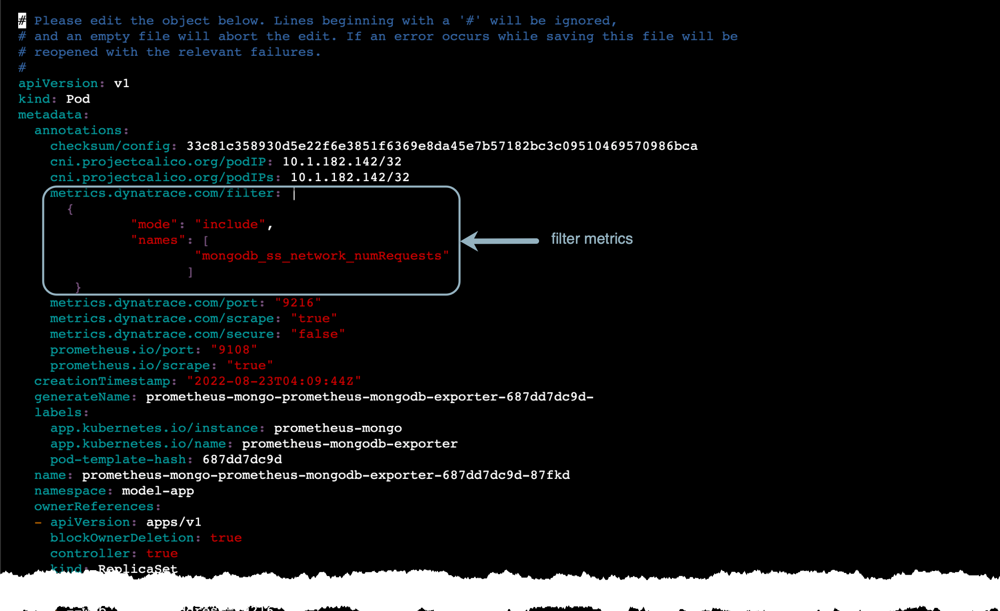

## Prometheus Metrics in Dynatrace
In this step, we will annotate the pods to start pushing the prometheus metrics to Dynatrace.
Identify the mongodb-exporter name by running the following command:
```
$ kubectl get pods -n model-app
```


Keep the exporter name handy in a notepad which you can refer to later. Further, annotate the mongodb-exporter or/and node-exporter so that oneagent running on the cluster push prometheus metrics to dynatrace tenant.

Copy the mongodb-exporter pod name and annotate them using command below. **Replace** the mongodb-exporter string with the actual pod name.
```bash
$ kubectl annotate pod mongodb-exporter metrics.dynatrace.com/scrape=true --namespace=model-app

$ kubectl annotate pod mongodb-exporter metrics.dynatrace.com/port=9216 --namespace=model-app

$ kubectl annotate pod mongodb-exporter metrics.dynatrace.com/secure=false --namespace=model-app
```

Once annotated, the metrics will now be pushed to dynatrace too. To view these metrics, navigate to **Metrics** screen within Dynatrace tenant.


By default, all the metrics collected by the annotated exporter(s) will be pushed to Dynatrace. However, you can limit the metrics by annotating the pod with filter key as below:
```bash
metrics.dynatrace.com/filter: |
{
"mode": "include",
"names": [
"metrics-name-1",
"metrics-name-2",
"metrics-name...n"
]
}
```

> Positive
: Replace the metrics-name-1, metrics-name-2, etc with the appropriate name which will ascertain only the configured metrics are pushed through.

Let us annotate our mongodb exporter pod to limit collection of say two metrics "mongodb_network_metrics_num_requests_total, mongodb_asserts_total". To do so, run the command as below:
```bash
$ kubectl edit pod <pod_name> -n model-app
```

Replace pod_name with the mongodb-exporter copied in the ealier steps. Further, add the below section in the manifest file:
```bash
metrics.dynatrace.com/filter: |
{
"mode": "include",
"names": [
"mongodb_ss_network_numRequests"
]
}
```



Once added, press ESC + :wq to quit the editor. The pod would now be annotated with the configured metrics and you will receive **only** these in Dynatrace,thereby, reducing your DDU consumption.

* **Note**: mode supports both **include** and **exclude** keyword. Also, the names accept wild card like (*mongo) or (mongo*) or (*mongo*) should you have multiple metrics with similar text pattern.

<!-- ------------------------ -->
