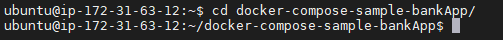

## Prerequisites

In this excerise, we will deploy the sample web application on your instance

### Deploy the Application using Docker-Compose

Use PuTTy (Windows), PowerShell (Windows) or Terminal (Mac), ssh into the instance using the following credentials:
**Username**: `d1prumworkshop`
**Password**:  `dynatrace`

Run `ssh d1prumworkshop@Instance_IP_address` on putty or command prompt to connect to your AWS instance.


Further become root user by executing the below command:
```
$ sudo su
```
:bulb: Password for root is **dynatrace**

Navigate to the docker-compose-bankApp folder using
```
$ cd /home/ubuntu/docker-compose-bankApp
```


Run the following command to deploy the application docker:
```
$ nohup docker-compose up &
```


Once the dockers are up and running, you will be able to access the application at http://AWS-IP:3000/ (Replace AWS-IP by the IP address of your machine)


Whilst the application is accessible, it is still not monitored by dynatrace. In the next steps, we will install oneagent to help dynatrace monitor it.

<!-- ------------------------ -->
