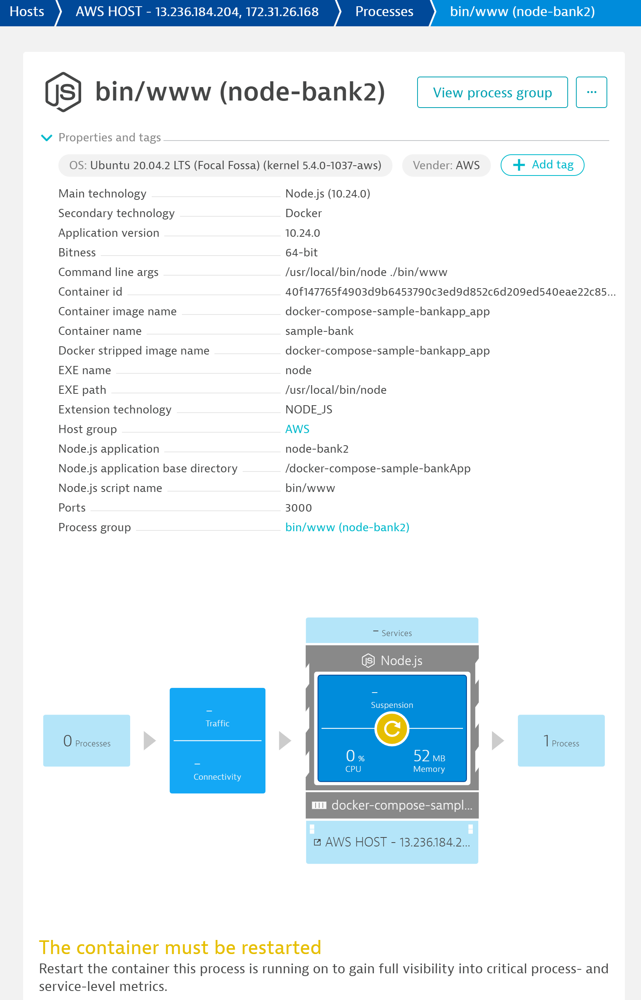
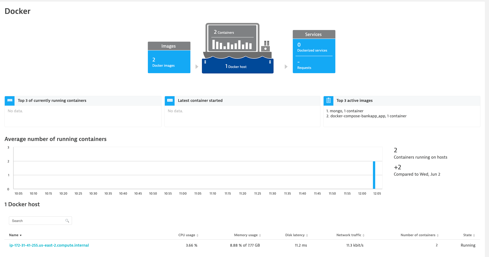
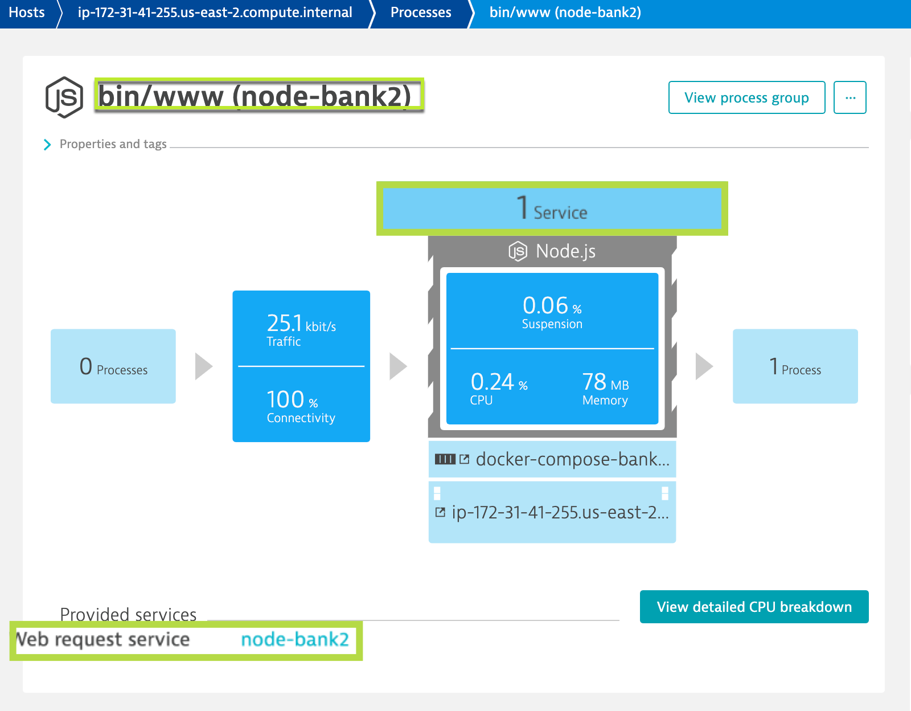
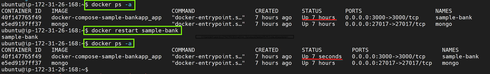
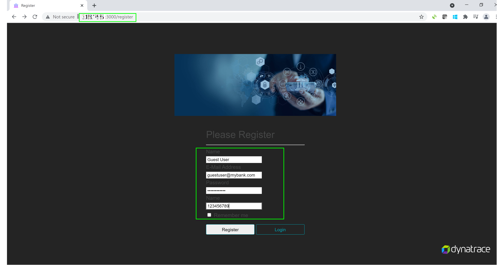

## OneAgent Application Injection

In this exercise, we will check the OneAgent injection into the application and verify if the injection of the JavaScript in the application UI.

### How to check application is monitored by OneAgent?

Dynatrace injects a Javascript into the application to mointor it and report user activities.  This script is loaded under HEAD tag of the application. So, navigate to the application UI and open the browser's DevTools to check the **Elements** and check the `<HEAD>` element locating the JavaScript. Search the script that contains the string `ruxitagentjs` in its file name.


This can also be validated by Dynatrace. In order to do so, navigate to **Host > ec2-instance > bin/www (node-bank2)** which is the Application Process.

You will discover that Dynatrace automatically monitors the host metrics and processes, running dockers, however, has not been able to pick the **services**




### Restarting Sample-Bank container

For Dynatrace to get Services (code-level visibility), the Application services need to be restarted. Since the application is containerized, the easiest way to do that is to restart the docker containers.

To list the running containers and restart the containers, run the commands as below:
```
$ docker ps -a

$ docker restart sample-bank
```
The above will restart the Sample Application, thereby, enabling Dynatrace to inject to get code-level visibility.

Navigate to **Host > ec2-instance > bin/www (node-bank)**  within tenant and you would be able to verify the services identified by Dynatrace automatically.


**NOTE**:
To check and verify that Sample Application container has been restarted, run
```
$ docker ps -a
```



### Accessing the application
Further, register an user on the application at http://AWS-IP:3000/register page with the following details:
Name: Guest User
E-Mail Address: guestuser@mybank.com
Password: GuestUser12@
Name: 123456789



As you have completed registering yourself on the application, now login into the app from http://AWS-IP:3000/login with the credentials as below:
E-Mail Address: guestuser@mybank.com
Password: GuestUser12@

<!-- ------------------------ -->
