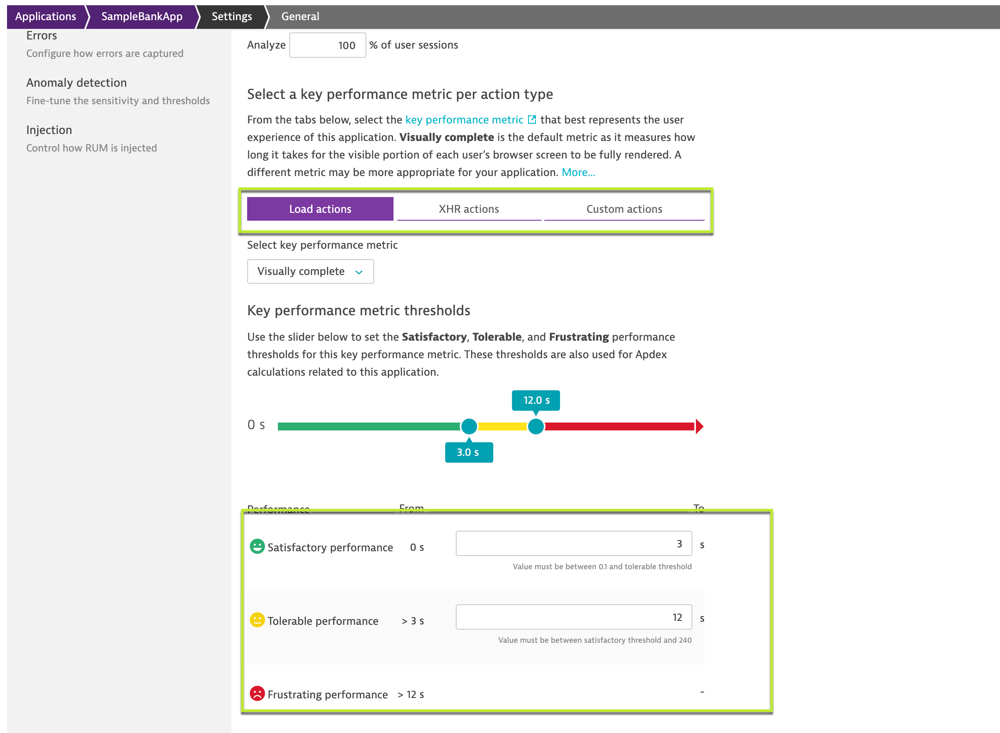

## Defining the Application

In this excerise, we will define the Application detection rule to route the traffic.

As a starting point, all monitoring data is encapsulated in a placeholder application called `My Web Application`. The reason being that this placeholder applicaiton is to allow for more flexibility, as it would be easier on how the applications should be organized.

### Application detection rule

Application detection rule would facilitate to create more applications, change existing application mapping, or if needed define more complex rules looking at URL's and not only on domains.

From the navigation menu, select **Settings > Web and mobile monitoring > Applications detection**. Under the **Define application detection rule** section, the list of defined rules are available in the sequential order and the top of list takes the priority over the following rules.

Select **Add detection rule** and select the rule applies to **New application** and provide a custom name for the application say `SampleBankApp` under the name text field.

Define which web requests are part of this application by selecting the condition as **If the URL** and scope to be *contains* with the `IP ADDRESS:3000`

### Application Performance

Dynatrace uses open standard rating for calculating the performance of software application named **Apdex**. Apdex helps to understand the user-experience and is classified based on application-specific thresholds broadly classified as "Satisfactory, Tolerable and Frustrating". These can be modified by navigating to **Applications > Application-name > Edit > General**.

<!-- ------------------------ -->
