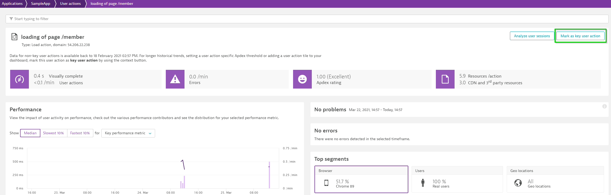

## User Tag

In this exercise, we will configure User-tagging rules so that dynatrace can identify the user sessions with unique names closely assigned with your application behavior.

Dynatrace provides multiple avenues to define the user-tag with CSS selector being one. In this exercise, we will use CSS selector. To help idenitfy the CSS selector, follow the steps as below:

1. Within your application page, select the string starting with Welcome on top-left of your screen as seen in the screenshot.

1. Further, using right click select option "Inspect".  

1. This would open Element tab in the developer tools, right-click on the element and select *Copy* option followed by *Copy selector*.  

1. Once you have identified the CSS selector , within your tenant navigate to application configuration page by following **Frontend > SampleBankApp application > Edit**

1. Select "Capturing" and click on "User tag"

1. Select "Add tag(identifier) rule"

1. Now moving to the application configuration page, "Select "CSS selector" and paste the value of CSS selector copied earlier (without #) as `body > div:nth-child(1) > p`

1. This would help dynatrace to retrieve the value of configured CSS selector. However, the CSS element has Welcome string prefixed to the username, so, to slice only the username, we will use regex funcitonality and filter the "Welcome" string. To do so, enable "Apply cleanup rule" and define the regex as **Welcome ([^!]*+)**

1. Lastly, click on "Add user tag rule"  and then on "Save changes"

### Key User Actions

Whilst dynatrace monitors and reports on all user-actions, there are some user-actions that are more critical to business like *member, withdraw, deposit, funds-transfer, etc.*. So for such use-cases, Dynatrace provides a feature to mark these user-actions as "Key User actions". Marking a request as key user action feature, enables you to achieve the following:

1. Customize apdex thresholds for these user actions
1. Create a SLO/SLA tile for the key-user actions
1. Allow you to report/create a dedicated dashboard tile (using custom chart)

In order to mark your request as key-request, follow the steps as below:

1. Navigate to the applications page and the select the application
1. Click view full details under the Top 3 user actions
1. Under Top 100 user actions, select a user action.
1. On the top-right corner of the User action details page, select Mark as key user action. The selected user action will now be displayed under Key user actions on the User action analysis page.

### Service Level Objectives
In this step, we will see how to create SLO in Dynatrace.

An SLO is a performance threshold measured for an Service Level Indicator (SLI) over a period of time. This is the bar against which the SLI is measured to determine if performance is meeting expectations. Using SLOs, you can review the current health status, error budgets, target and warning of your application and services.

Typically, the SLO pyramid for an application would look like below:

To configure your SLO, navigate to **Frontend > Application-name > Edit > Add a SLO** and follow the steps as below:

You can pin these SLOs on the dashboard, have alerts setup if the SLOs have breached. Also, these can be used to validate releases in your automation pipeline.

<!-- ------------------------ -->
