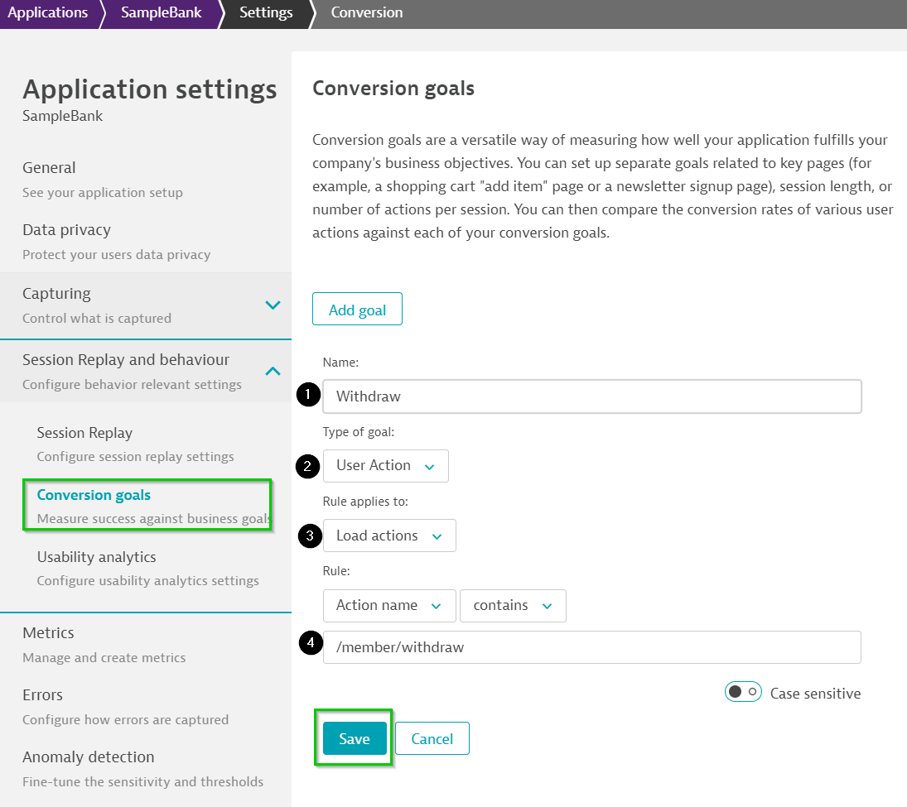

## Conversion Goal

In this excerise, we will define Conversion goal and monitor the user session which has met the goal defined.

Positive
: Conversion goals can be defined for reaching specific user actions or destination URLs and also for session information (for example, session duration longer than 5 minutes or sessions with more than 10 user actions. For this example, a user would need to complete at least 10 user actions in a single session to reach this conversion goal).

### Creating Conversion Goal

One of the important goal for an finance application would be to identify users who has looked for a specific finance service(s) and can thereby can prove to be important to the business. So, for such a use-case we can mark the Useraction as "Conversion Goal". To do so, follow the steps as below:

To define a conversion goal, navigate to the application settings by clicking on **Browse [...] > Edit**. Select **Behaviour analytics > Conversion goals** and click **Add goal** to set up the goal.

1. Start with defining the **Name** of the goal
1. Select respective **Type of goal** as `User Action`
1. followed by **Rule applies to:** to be `Load actions`
1. Define the **Rule:** to be `Action name > contains > /member/withdraw`
1. Click on the **Save** to save the defined conversion goal.

### Measuring Conversion Goal

1. Navigating to the **User session**.
1. Use the filter option to sort the user session which met the conversion goal defined by selecting **Conversion Goal**
1. Selecting the **Goal**.
1. Selecting the sepecific user session and navigating to the user actions, the defined user action can be easily identified either by applying filter or by the blue button

<!-- ------------------------ -->
