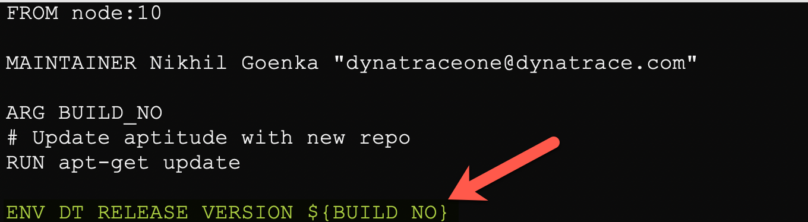
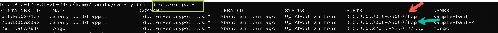
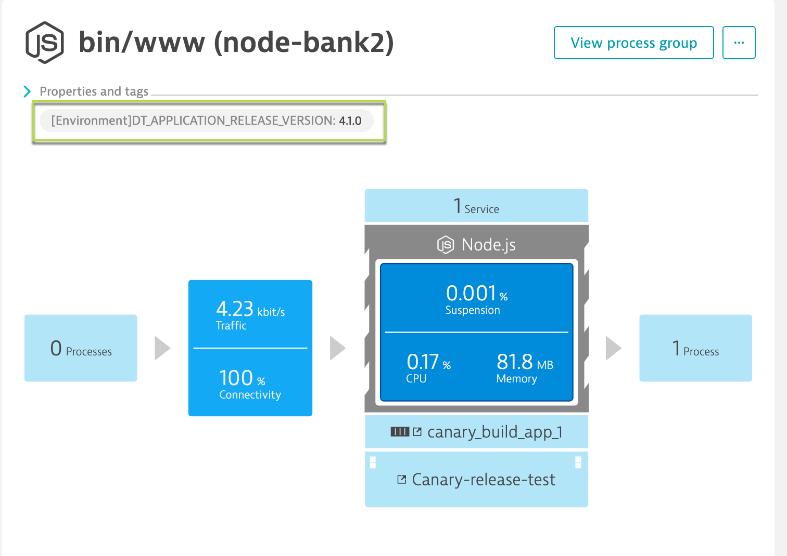
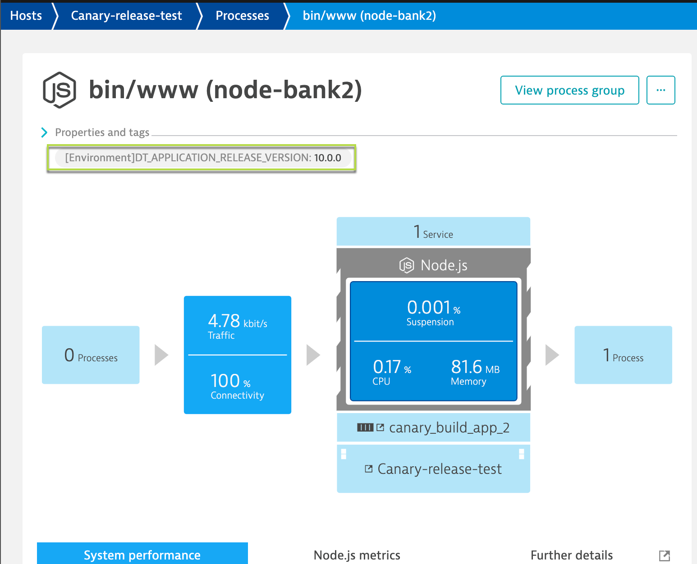
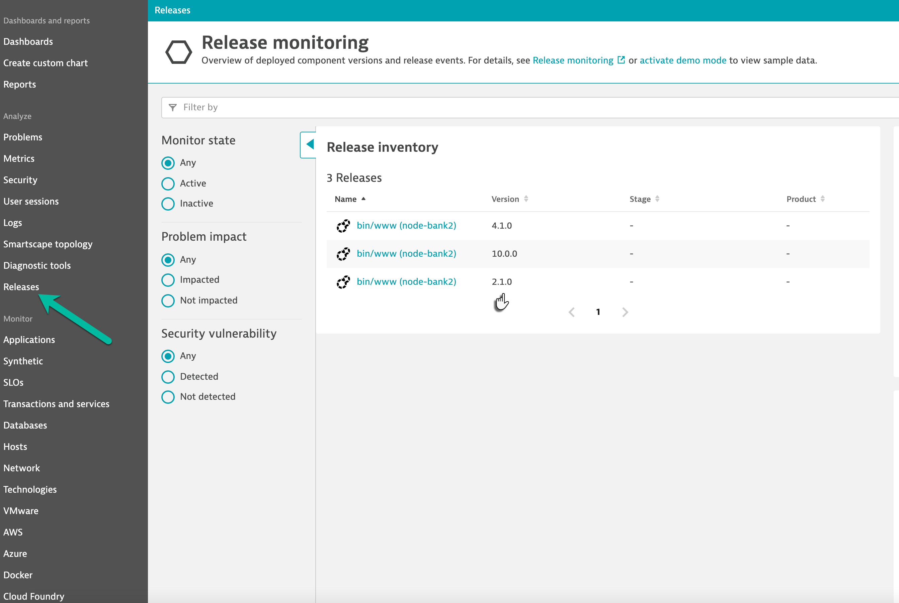
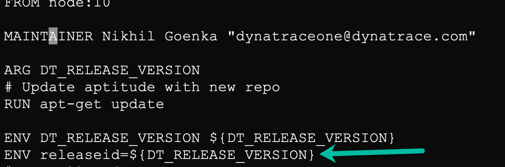
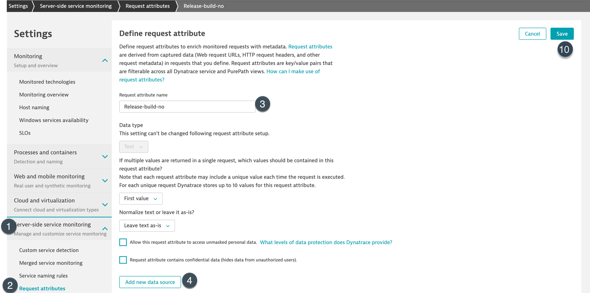
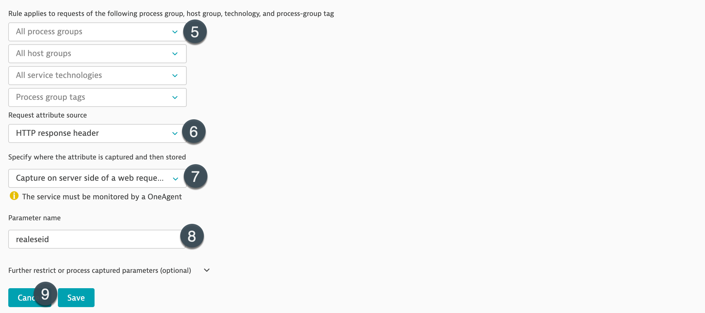
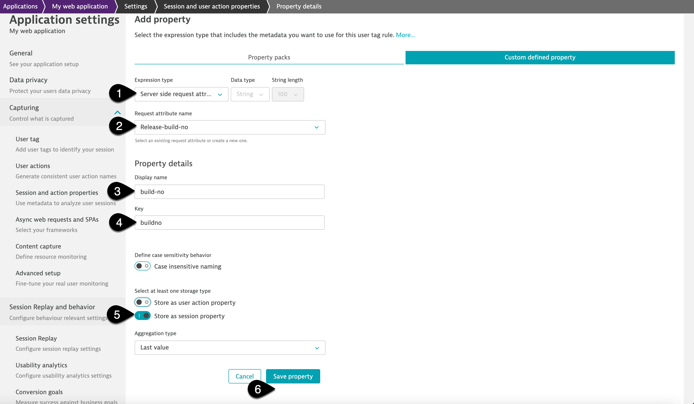

## Testing across releases

In this step, we will setup session property to support canary releases.

Dynatrace provides multiple options to help identify the release information of a service/application. For more details, refer to our documentation [here|https://www.dynatrace.com/support/help/shortlink/version-detection]
In this exercise, we will explore the avenue to pull release information using the ENVIRONMENT VARIABLES.

Connect to the EC2 instance by using the following credentials:
**Username**: d1prumworkshop
**Password**: dynatrace

Once connected, navigate to **canary_releases** directory by running the command below:
```
$ cd /home/ubuntu/docker-compose-bankApp/canary-release/
```

Now, let us stimulate canary environment for our sample-bank-app. To do so, we will set multiple environment variables.
1. Set an environment variable by running command `export DT_RELEASE_VERSION=4.0.1` - this would indicate Dynatrace that the build version is 4.0.1
1. Further, set another environment variables by running `export BUILD_NO=10.0.0` - this variable would be passed to docker as "DT_RELEASE_VERSION" while building it so as to inform dynatrace that the docker running this application is on 10.0.0 version.


1. Now, let us deploy the two versions of sampleBankApp by issuing
```
$ nohup docker-compose up &
```

You would be able to see that post this, there are two instances of sampleBankApp running on port 3008 and 3010.


### ⚠️ Troubleshooting steps

Negative
: If command `docker ps -a` not showing the two new instances of sampleBankApp and only showing the previous instance running on port 3000, please make sure to stop and remove the existing sampleBankApp. Then follow above step 3.
To **stop one or more Docker containers**, use the `docker stop container-name` command, followed by the container name you want to stop. In our case, run the below commands to stop the existing containers.
```
$ docker stop sample-bank
$ docker stop mongo
```
To **remove one or more Docker containers**, use the `docker rm container-name` command, followed by the container name you want to remove. In our case, run the below commands to remove the existing containers.
```
$ docker rm sample-bank
$ docker rm mongo
```

Within tenant, it is noticable dynatrace has identified the different app versions and has setup automatic tag on each of the processes/services





As well this information is automatically captured in the **Releases** page in Dynatrace providing a cleaner view of all the different versions running in your environment.



### Identifying the user session build information
In this step, we will setup session property so that we can identify build details for the user using the application.

For helping dynatrace identify details of the build-number, we would leverage session-properties. So, the first step would involve to push build details in the code.
That is already implemented in our samplebank as seen in the image below:


So, we will proceed with setting up the session-properties.

1. To do so, within dynatrace tenant navigate to **Settings>Server-side service Monitoring>Request attributes** and setup the request attribute as below:
Request attribute name: Release-build-no  
Request attribute source: HTTP response header  
Specify where the attribute is captured and then stored:  Capture on server-side of a web request 
Parameter name:  releaseid





1. Once the request attributes are set, let us leverage session properties to retrieve the build version on each useraction/property. To do so, follow the steps as below:
2.1 Select "Application" from the navigation menu and select "My web application"  
2.2 Click on "..." and select "Edit"  
2.3 Click on "Capturing" and select "Session and action properties"  
2.4 Select "Add property"  
2.5 Select **Server-side request attribute** from "Expression type" and select **Release-build-no** from the dropdown for Request-attribute name.  
2.6 Lastly, provide "Display name" as **build-no**, key as **buildno** and enable "Store as Session property" and click on "Save property"  



The above will help Dynatrace identify where the user-sessions have originated from and thus, tagging them. This further can help you to identify if there are any potential issues with a specific build.

<!-- ------------------------ -->
