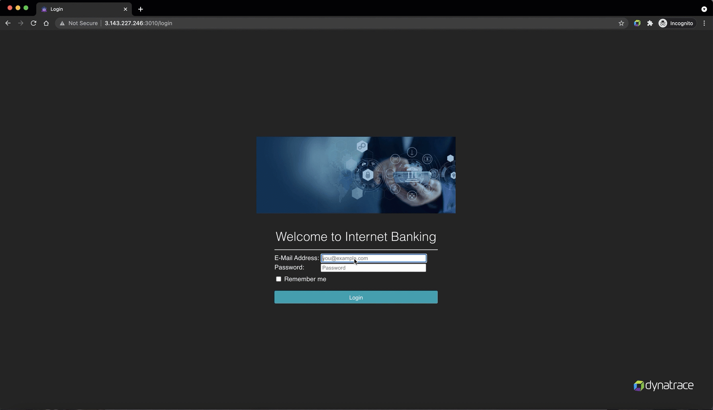
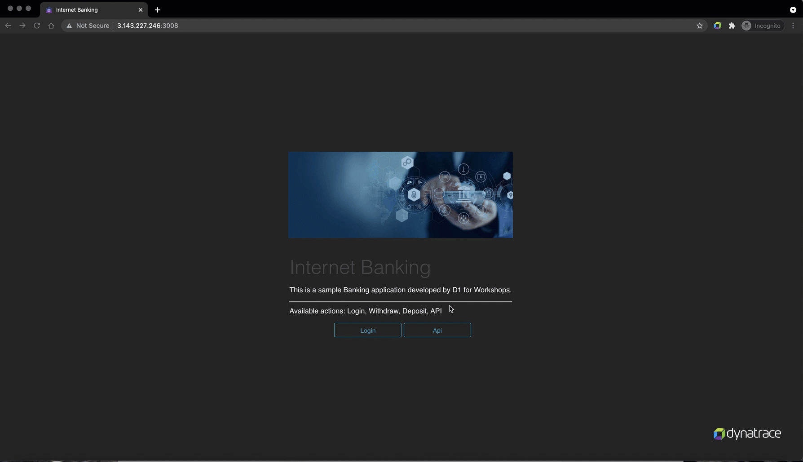
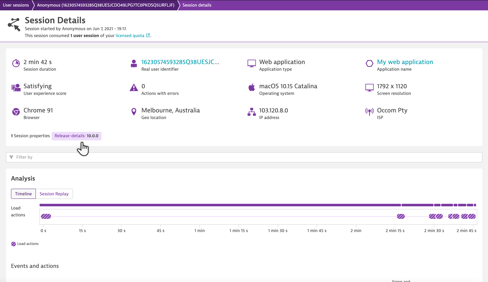
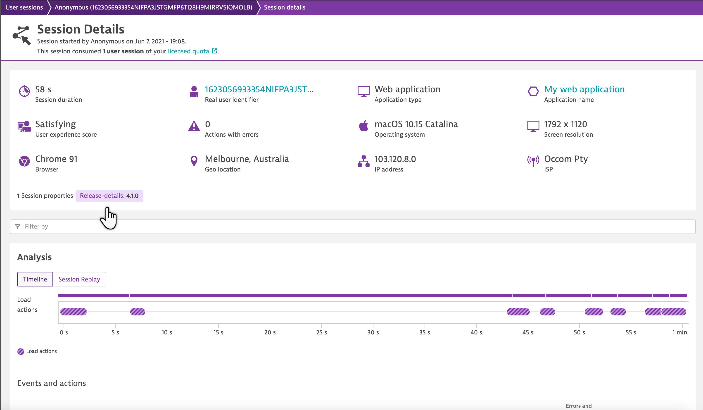

## Perform user-actions and identify the session build details

In this step, we will invoke some user-sessions from each application and see how Dynatrace can help identify the buildno

1. To do so, connect to application in an incognito window at http://AWS-IP:3010/register and register with following details:  
Name: Guest User  
E-Mail Address: guestuser@mybank.com  
Password: GuestUser12@  
Card No: 123456789  

1. Once registered, login into the application at http://AWS-IP:3010 in an incognito window with following credentials  
**Username**: guestuser@mybank.com  
**Password**: GuestUser12@  

1. Now perform some user-actions like deposit, withdraw on the application  
  

1. As mongodb is shared between the two applications, we can use the same credentials to connect to the application at http://AWS-IP:3008/login and perform similar user-sessions.  
  

Once the session are terminated, Dynatrace would tag the buildno for each of those sessions as session-properties, thereby, helping to identify the build from which the user-session was routed internally.  

<!-- ------------------------ -->
