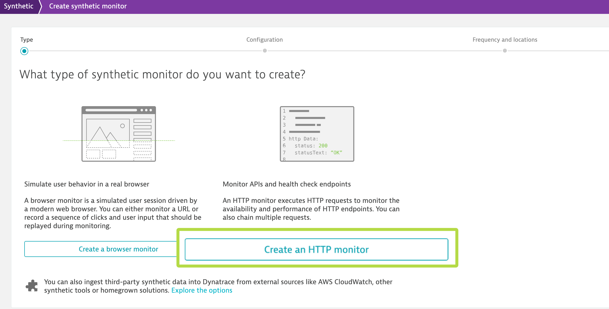
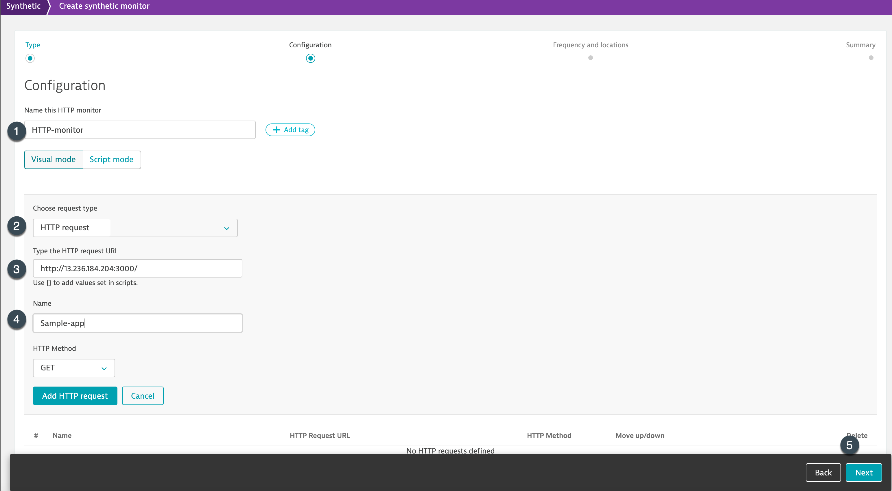

## HTTP Monitor

Within Dynatrace-tenant, navigate to "Synthetic" and click on "Create synthetic monitor". Further, click on "Create an HTTP monitor"

Further, create the http monitor with the following configuration:
1. Name of HTTP monitor : HTTP-monitor
1. Request type: HTTP
1. HTTP Request URL: `http://AWS-IP:3010/login` - Replace the AWS-IP with your machine IP
1. Name: Sample-app
1. 

1. HTTP monitors can be scheduled to run from Dynatrace's private synthetic location to fire HTTP request at the scheduled time. So, configure the HTTP monitor to run every **1 minute** from any **two** available locations.
