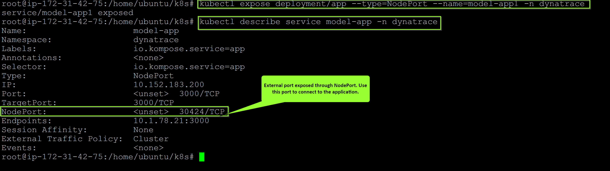

## Start the sample-application
Connect to your Kubernetes cluster using the following credentials:
**Username**: `d1prumworkshop`
**Password**: `dynatrace`

Now, become the root user by running `sudo su`
*Hint*: Password for sudo su is 'dynatrace'.

To start the sample-application pods, navigate to `/home/ubuntu/k8s` folder.

Under that folder you would be able to view the yaml files for front-end and mongodb deployment. In order to deploy the services and deployment, run the following commands:

```
$ cd /home/ubuntu/k8s/

$ kubectl create ns model-app

$ kubectl apply -n model-app -f app-deployment.yaml

$ kubectl apply -n model-app -f mongo-deployment.yaml

$ kubectl apply -n model-app -f mongo-service.yaml

$ kubectl apply -n model-app -f app-service.yaml
```

This would create the deployment and services for all components for the application.

Verify the service is up and running as expected using command below.
``` bash
$ kubectl describe service model-app -n model-app
```


Note down the Nodeport and connect to the application on browser using **http://AWS-IP:NodePort**

### ⚠️ Troubleshooting steps

Negative
: To **check status of pods**, run command below. You should get a **Running** as a return.<br>
`$ kubectl get pods -n dynatrace`

Negative
: To **check the logs**, run command below.<br>
`$ kubectl logs -f deployment/dynatrace-oneagent-operator -n dynatrace`

Negative
: To **delete secrets**, run command below. You might have included a wrong secret previously. <br>
`$ kubectl delete secret --all -n dynatrace`

Negative
: To **delete all pods**, run command below. This will cycle through the pods and you will have new pod instances.<br>
`$ kubectl delete --all pods -n dynatrace`

Negative
: To **check status of deployments**, run command below. You should get a **Running** as a return.<br>
`$ kubectl get deployments -n dynatrace`

Negative
: To **check status of services**, run command below. You should get a **Running** as a return.<br>
`$ kubectl get deployments -n dynatrace`

Negative
: To **delete a service**, run command below.<br>
`$ kubectl delete service <serviceName> -n dynatrace`

Negative
: Official troubleshooting page could be found [here](https://www.dynatrace.com/support/help/technology-support/cloud-platforms/google-cloud-platform/google-kubernetes-engine/installation-and-operation/full-stack/troubleshoot-oneagent-on-google-kubernetes-engine/)

<!-- ------------------------ -->
