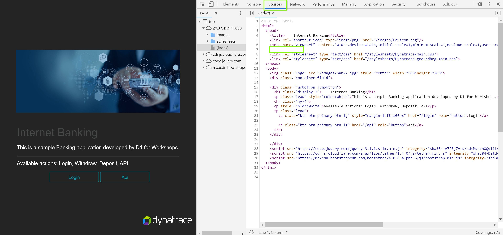
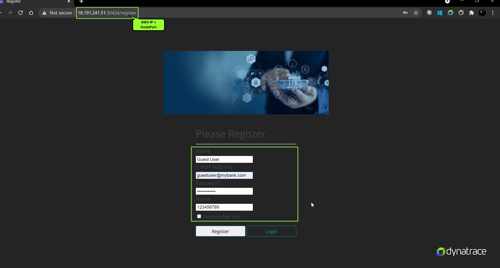

## OneAgent Application Injection

In this exercise, we will check the OneAgent injection into the application and verify the injection of the JavaScript in the application UI.

### How to check application is monitored by OneAgent?

Dynatrace injects a Javascript into the application to mointor it and report user activities.  This script is loaded under HEAD tag of the application. So, navigate to the application UI and open the browser's DevTools to check the **Sources** and cleck the `<HEAD>` element to locating the JavaScript. Search the script that contains the string `ruxitagentjs` in its file name.



This can also be validated by Dynatrace. In order to do so, navigate to **Host > ec2-instance > bin/www (node-bank2)** which is the Application Process.

You will discover that Dynatrace automatically monitors the host metrics and processes, running dockers, however, has not been able to pick the **services**


For restart, we would use `scale up/down` the deployment. To start with, we would first need to scale down the deployment using the following command:
```bash
$ kubectl scale --replicas=0 deployment/app --namespace=model-app
```

Followed by scaling up the deployment, by using:
```bash
$ kubectl scale --replicas=1 deployment/app --namespace=model-app
```

### Accessing the application

Further, register an user on the application at `http://Instance-IP:{NodePort}/register` page with the following details:

Name: Guest User
E-Mail Address**: guestuser@mybank.com
Password: GuestUser12@
Name: 123456789



As you have completed registering yourself on the application, now login into the app from `http://Instance-IP:{NodePort}/login` with the credentials as below:

E-Mail Address: guestuser@mybank.com
Password: GuestUser12@

<!-- ------------------------ -->
