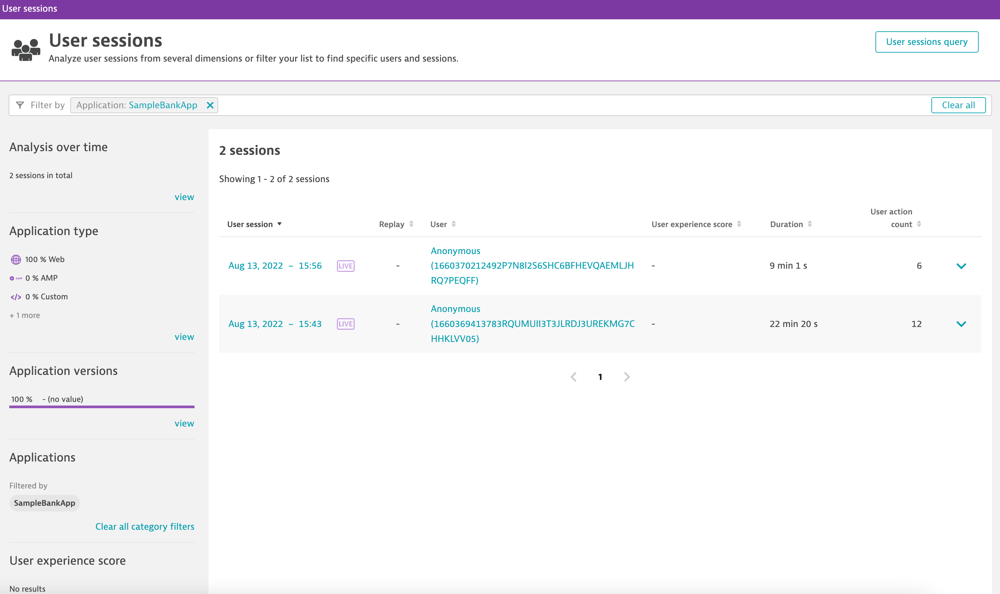
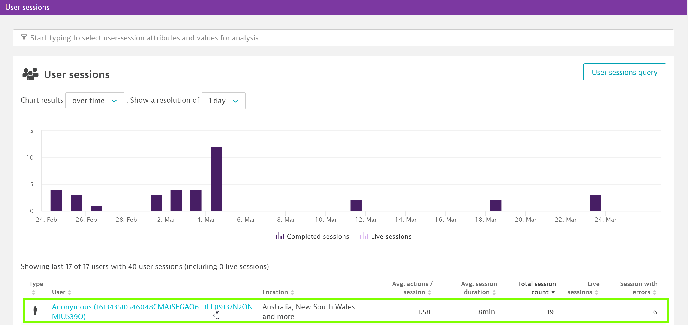
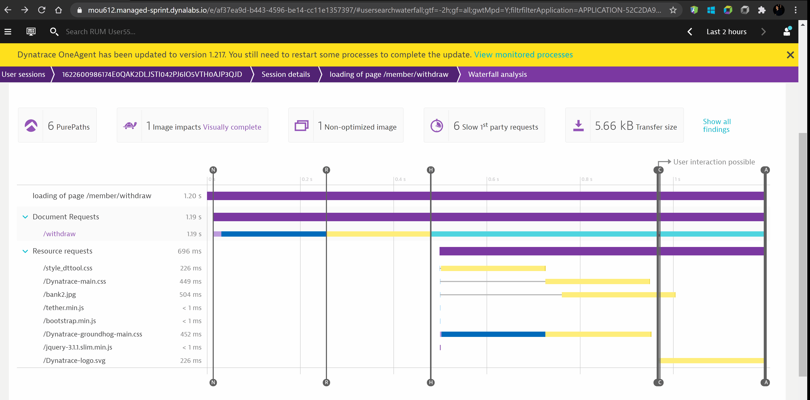
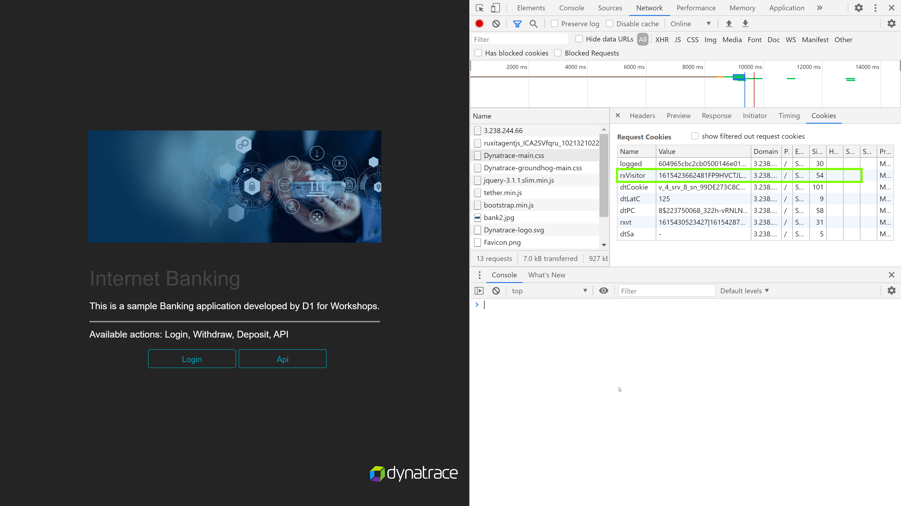

## RUM User Session Details

In this excerise, we will be highlighting "User Sessions" and different user actions captured in the user-session. We will also be looking into the waterfall model to view application load times.

An **user action** is an interaction with the web browser on an application that involves a/multiple calls to the web server that may/may-not potentially have multiple nested calls and an **user session** convers those set of user-actions.

1. Navigate to **Session Segmentation** from the burger menu on the left. Initially there may/may not be any user sessions

1. Create a user session by navigating through the sample application in browser window and then close the browser window when complete.

1. Navigate back to the Dynatrace tenant and view the the user action under **User sessions** screen.

1. Navigate to session details for further drill-down

For more details on how dynatrace defines an user-session, please refer to the [documentation link.](https://www.dynatrace.com/support/help/shortlink/user-session#when-does-a-user-session-start)

### Waterfall Analysis

Dynatrace captures user experience and performance data by monitoring individual user actions. Typically a user action begins with a click on an HTML control (for example, a button or link). The browser then loads the requested data, either by navigating to a new page or via an XHR/fetch call. JavaScript callbacks are then executed, the DOM tree is built or changed, and the web application is then once again ready for a new user action.

Select a user action - for example, in this case we will select **Loading of page /member/withdraw/** and perform a waterfall analysis

Positive
: Waterfall model can be extremely useful to debug/analyse a specific request that may have occured as a result of the user-action and trace it back to the backend call.
In the below example, we used waterfall analysis to analyse the error that occured while downloading a specific image in the application

### Verify real user identifer is equal to cookie value

Dynatrace creates multiple cookies in order to uniquely identify an user-session. One of such cookie that Dynatrace create on end-user's system is **rxVisitor** and is pivotal in identifying the user uniquely.

In order to verify the cookie information, navigate to **User Sessions** within your tenant and locate the user-session. Under the user-session screen, you will be able to identify the unique identifier as "Real User Identifier".

Navigate back to to the application within your browser and using chrome dev tools, find the cookie value and verify it matches with the real user identifier.

Positive
